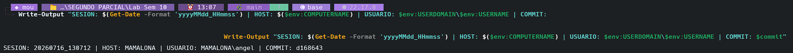
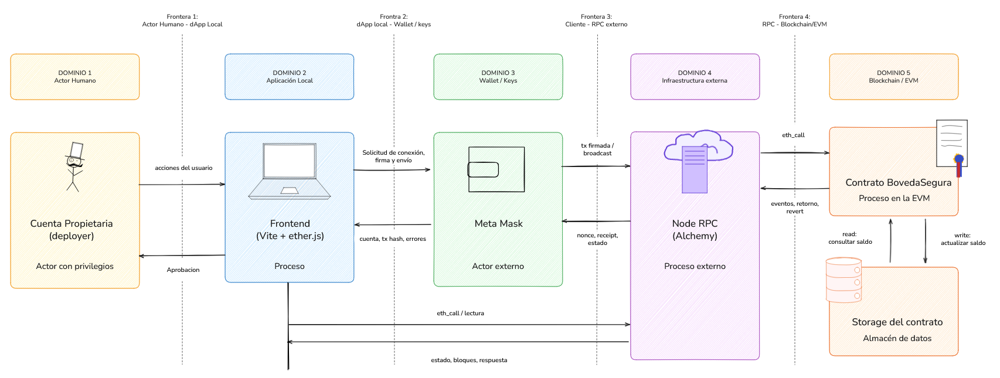
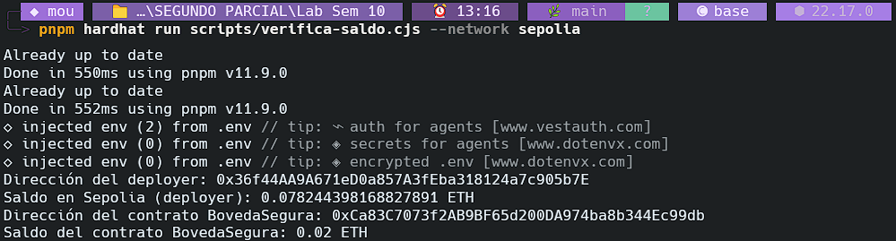
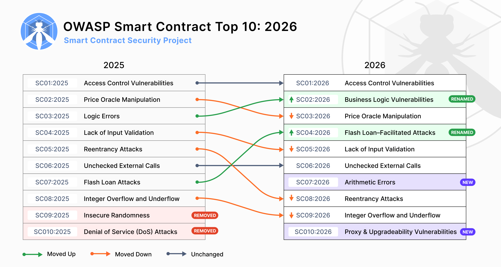
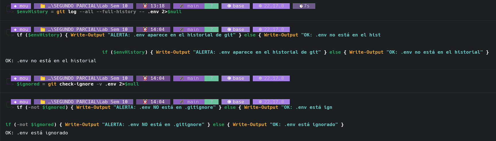
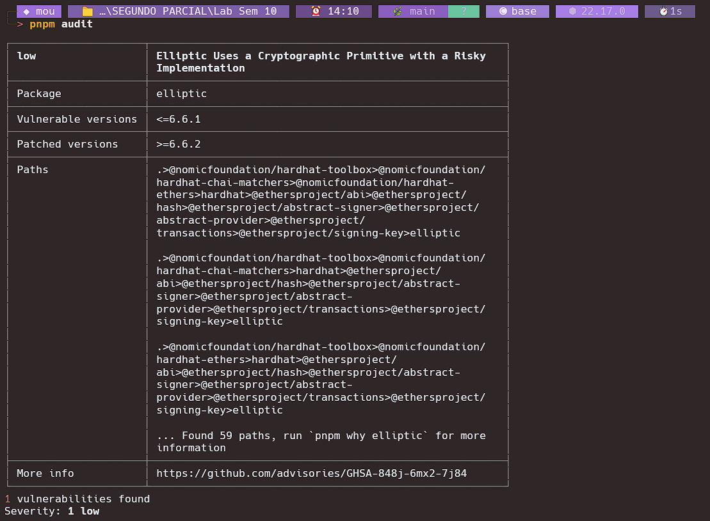
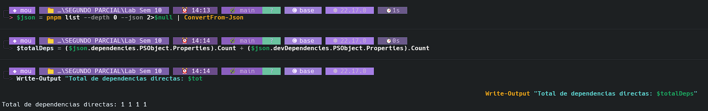
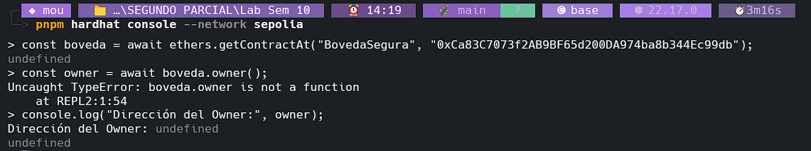

# Laboratorio 10: Modelos de Amenazas en Blockchain

**Autor:** Ángel Santiago Cruz Rodríguez
**Institución:** Global University
**Carrera:** Ingeniería en Seguridad Informática y Desarrollo de Software
**Curso:** Blockchain y Bases de Datos Distribuidas
**Asesor:** Mr. Omar Velazquez Juarez
**Fecha:** 16 de julio de 2026

## Tabla de contenido

* [1. Desarrollo del Laboratorio](#1-desarrollo-del-laboratorio)
  * [PARTE 1 — Construye el DFD y marca las fronteras de confianza](#parte-1--construye-el-dfd-y-marca-las-fronteras-de-confianza)
  * [PARTE 2 — Aplica STRIDE sobre las fronteras](#parte-2--aplica-stride-sobre-las-fronteras)
  * [PARTE 3 — Mapea tu contrato contra el OWASP Smart Contract Top 10 (2026)](#parte-3--mapea-tu-contrato-contra-el-owasp-smart-contract-top-10-2026)
  * [PARTE 4 — Vectores de ataque externos: el Alternate Top 15](#parte-4--vectores-de-ataque-externos-el-alternate-top-15)
  * [PARTE 5 — Matriz de riesgos anclada a datos reales](#parte-5--matriz-de-riesgos-anclada-a-datos-reales)
  * [PARTE 6 — Reflexión final](#parte-6--reflexión-final)
* [2. Declaración de uso de Inteligencia Artificial](#2-declaración-de-uso-de-inteligencia-artificial)
* [3. Referencias](#3-referencias)

## Tabla de figuras

* [Fig. 1: Ejecución del ancla de sesión en la terminal](#fig-1)
* [Fig. 2: Diagrama de Flujo de Datos (DFD) con fronteras de confianza y elementos del sistema](#fig-2)
* [Fig. 3: Consulta del saldo del contrato en Sepolia mediante el script personalizado](#fig-3)
* [Fig. 4: Captura de pantalla de la página oficial de OWASP mostrando la lista 2026](#fig-4)
* [Fig. 5: Captura del Alternate Top 15 oficial de OWASP Web3](#fig-5)
* [Fig. 6: Ejecución de la auditoría del entorno de desarrollo (git y pnpm)](#fig-6)

---

## Ancla de sesión

```bash
SESION: 20260716_130712 | HOST: MAMALONA | USUARIO: MAMALONA\angel | COMMIT: d168643
```

<a id="fig-1"></a>

<sub>Ejecución del ancla de sesión en la terminal.</sub>

---

## 1. Desarrollo del Laboratorio

### PARTE 1 — Construye el DFD y marca las fronteras de confianza

#### 1. Tabla de Elementos del Sistema

| Elemento                      | Tipo                               | Valor real en tu sistema                                                                          |
| ----------------------------- | ---------------------------------- | ------------------------------------------------------------------------------------------------- |
| Frontend (Vite + ethers.js)   | Proceso                            | Corre en:`http://localhost:5173/`                                                               |
| MetaMask                      | Actor externo / almacén de claves | Cuenta:`0x36f44AA9A671eD0a857A3fEba318124a7c905b7E`                                             |
| Nodo RPC (Alchemy)            | Proceso externo                    | Endpoint:`https://eth-sepolia.g.alchemy.com/v2/NCWZttynUc1zHCAHa6qk_`                           |
| Contrato BovedaSegura         | Proceso en la EVM                  | Dirección:`0xCa83C7073f2AB9BF65d200DA974ba8b344Ec99db`                                         |
| Storage del contrato          | Almacén de datos                  | Slot de`saldos`: `Slot 1` (debido al Slot 0 heredado para `_status` de `ReentrancyGuard`) |
| Cuenta propietaria (deployer) | Actor con privilegios              | Dirección:`0x36f44AA9A671eD0a857A3fEba318124a7c905b7E`                                         |

#### 2. Diagrama de Flujo de Datos (DFD)

<a id="fig-2"></a>

<sub>Diagrama que detalla los 6 componentes principales, los flujos y las fronteras de confianza del sistema.</sub>

#### 3. Identificación de Fronteras de Confianza y Activo

##### ¿Cuántas fronteras de confianza identificaste y cuáles son? Para cada una, ¿quién controla cada lado?

Se han identificado formalmente **cuatro (4) fronteras de confianza** críticas dentro de la arquitectura de la dApp, delineando los límites de control entre los distintos componentes y dominios. A continuación, se detalla cada una de ellas junto con la entidad que controla cada extremo del flujo de datos:

1. **Frontera 1: Actor Humano a Aplicación / dApp Local**

   * **Cruce de datos:** Se produce en el canal entre la cuenta propietaria/usuario final y la interfaz gráfica de usuario.
   * **Control de Emisor:** El usuario final o deployer, quien toma la decisión consciente de qué acción ejecutar en el sistema (por ejemplo, iniciar un depósito o retiro).
   * **Control de Receptor:** El código del frontend, ejecutado localmente en el navegador del cliente bajo las directrices y scripts del andamiaje (Vite).
2. **Frontera 2: dApp Local hacia Wallet y Claves Criptográficas**

   * **Cruce de datos:** Ocurre en el intercambio entre la lógica del frontend y la extensión del navegador MetaMask.
   * **Control de Emisor:** La biblioteca cliente (ethers.js) que estructura la solicitud de transacción, controlada por las reglas de desarrollo y ejecutada localmente.
   * **Control de Receptor:** MetaMask, el cual actúa en representación del usuario final para custodiar de forma segura las llaves privadas, firmar transacciones de forma aislada y autorizar o rechazar solicitudes de interacción con la blockchain.
   * *Nota de diseño:* Es importante destacar que la cuenta propietaria y MetaMask pertenecen a dominios distintos; mientras la cuenta representa la identidad y autorización del usuario en la red, MetaMask es la solución técnica que custodia las llaves privadas correspondientes. El frontend puede solicitar transacciones, pero carece de la capacidad de firmar por sí solo.
3. **Frontera 3: Cliente a Infraestructura de RPC Externa (Frontend/MetaMask hacia Alchemy)**

   * **Cruce de datos:** Se ubica en la transmisión de la solicitud de red firmada desde la máquina del cliente hacia el nodo de infraestructura externo (Alchemy).
   * **Control de Emisor:** El cliente local del navegador, que comprende el frontend y la wallet emisora de la transacción firmada.
   * **Control de Receptor:** El proveedor de servicios de infraestructura (Alchemy), que controla la disponibilidad del nodo RPC, el enrutamiento de transacciones a la red y la veracidad de las consultas de lectura entregadas.
4. **Frontera 4: RPC a la Blockchain / Ethereum Virtual Machine (EVM)**

   * **Cruce de datos:** Representa la interfaz entre el nodo RPC de retransmisión y la propia red distribuida Ethereum Sepolia que ejecuta el contrato.
   * **Control de Emisor:** El proveedor RPC de Alchemy, encargado de recibir y enviar las transacciones serializadas hacia la red Sepolia.
   * **Control de Receptor:** La máquina virtual de Ethereum (EVM) y la red de consenso Sepolia, que validan las firmas criptográficas, resuelven la transacción y ejecutan la lógica del contrato `BovedaSegura` de forma descentralizada.

##### Consulta de balance real: ¿Cuánto ETH custodia tu contrato ahora mismo?

El contrato `BovedaSegura` custodia actualmente **0.02 ETH** en la red de pruebas Sepolia.

#### 4. Consulta de Saldo del Contrato en Sepolia


<sub>Ejecución del script verifica-saldo.cjs que consulta el saldo del contrato inteligente.</sub>

---

### PARTE 2 — Aplica STRIDE sobre las fronteras

#### 1. Pregunta sobre STRIDE: Repudiation en Blockchain

##### ¿Qué característica de un sistema blockchain hace que la categoría Repudiation se comporte de forma distinta a como se comporta en una aplicación web centralizada? Argumenta con lo que sabes de inmutabilidad y firma criptográfica.

En aplicaciones web tradicionales, el no-repudio depende de logs en servidores centralizados que la organización puede alterar. En blockchain, la combinación de inmutabilidad distribuida y firmas criptográficas asegura que una transacción firmada por una clave (como `0x36f4...5b7E`) sea técnicamente innegable en Sepolia (Ethereum Foundation, s. f.). Sin embargo, esto solo garantiza el no-repudio criptográfico a nivel de protocolo, pero no el de intención humana: el usuario todavía puede argumentar el robo de llaves o el hackeo de su entorno local (MetaMask) o del frontend (NIST, s. f.).

#### 2. Tabla STRIDE de Amenazas por Frontera

| Frontera                       | Categoría STRIDE                | Amenaza concreta en BovedaSegura                                                                                                      | Activo afectado           |
| ------------------------------ | -------------------------------- | ------------------------------------------------------------------------------------------------------------------------------------- | ------------------------- |
| **Usuario → MetaMask**  | **Spoofing**               | Suplantación de la dApp mediante phishing para inducir al usuario a firmar transacciones maliciosas.                                 | Fondos de la EOA          |
| **Frontend → MetaMask** | **Tampering**              | Inyección de JS malicioso en el frontend para alterar la dirección del contrato (`0xCa83…99db`) o parámetros antes de la firma. | Integridad de saldos      |
| **MetaMask → Nodo RPC** | **Repudiation**            | El usuario niega haber autorizado la transacción, alegando hackeo de su wallet o robo de su clave privada.                           | Trazabilidad y auditoría |
| **Frontend → Nodo RPC** | **Information Disclosure** | API Key de Alchemy expuesta públicamente en el frontend, posibilitando robo de cuota y rastreo de metadatos.                         | API Key y privacidad      |
| **Cliente → Nodo RPC**  | **Denial of Service**      | Ataques masivos de`eth_call` contra el nodo de Alchemy, suspendiendo el endpoint por límites de tasa.                              | Disponibilidad de la dApp |
| **RPC → Contrato**      | **Elevation of Privilege** | Compromiso de la clave del propietario (deployer) para ejecutar funciones administrativas restringidas en el contrato.                | Control del contrato      |
| **Contrato → Storage**  | **Tampering**              | Manipulación no autorizada del Slot 1 (`saldos`) explotando fallas lógicas en las funciones de retiro.                            | Saldos en storage         |

#### 3. Verificación de una Amenaza contra el Código (`contracts/BovedaSegura.sol`)

##### ¿Qué línea de código específica mitiga esa amenaza? Cítala textualmente.

La mitigación principal contra la amenaza de **Reentrancy (Reentrada)** se encuentra implementada en la declaración de la función `retirar` (línea 21) a través del modificador `nonReentrant` provisto por la biblioteca de OpenZeppelin:

```solidity
function retirar(uint256 monto) external nonReentrant
```

Asimismo, se cuenta con una segunda capa de protección lógica mediante la aplicación estricta del patrón de diseño **Checks-Effects-Interactions (CEI)** en las líneas 26 y 27, modificando el balance interno antes de la llamada externa de transferencia:

```solidity
saldos[msg.sender] -= monto;
totalFondos -= monto;
```

##### Si esa línea no existiera, ¿qué ocurriría? Describe la secuencia exacta de la explotación.

Si no existiera el modificador `nonReentrant` y no se siguiera el patrón Checks-Effects-Interactions, se posibilitaría la siguiente secuencia:

1. **Llamada inicial:** Un contrato malicioso controlado por el atacante invoca la función `retirar(monto)`.
2. **Chequeo de condiciones:** El contrato víctima verifica que el saldo sea suficiente (`require(saldos[msg.sender] >= monto)`).
3. **Interacción prematura:** Al no seguir el patrón CEI, el contrato víctima realiza la transferencia de Ether utilizando `msg.sender.call{value: monto}("")`.
4. **Desvío del flujo de control:** Dado que el receptor es un contrato, esta llamada de bajo nivel transfiere automáticamente el flujo de ejecución hacia la función `receive()` o `fallback()` del contrato atacante.
5. **Reentrada recursiva:** En su función `receive()`, el contrato atacante invoca de nuevo a la función `retirar()` de la víctima. Al no haberse restado aún el saldo (ya que esa línea de ejecución está en espera detrás de la llamada de `call`), la verificación del saldo del atacante vuelve a ser exitosa.
6. **Bucle de vaciado:** El proceso de reentrada se repite cíclicamente, extrayendo fondos en cada llamada recursiva hasta agotar todo el balance disponible en el contrato de la bóveda o hasta que la pila de llamadas se sature, concretando el robo del ETH.

---

### PARTE 3 — Mapea tu contrato contra el OWASP Smart Contract Top 10 (2026)

#### 1. Captura de la Lista Oficial 2026

<a id="fig-4"></a>

<sub>Estructura oficial del OWASP Smart Contract Top 10 edición 2026.</sub>

#### 2. Los Diez Títulos de Categoría Exactos (OWASP 2026)

Según la clasificación oficial de OWASP (2026), las diez categorías de vulnerabilidades prioritarias en contratos inteligentes son:

1. **SC01:2026 - Access Control Vulnerabilities:** Defectos en el control de acceso que exponen funciones privilegias.
2. **SC02:2026 - Business Logic Vulnerabilities:** Fallas de diseño lógico en el modelo económico o funcional.
3. **SC03:2026 - Price Oracle Manipulation:** Manipulación de fuentes de precios externos que alteran swaps o liquidaciones.
4. **SC04:2026 - Flash Loan–Facilitated Attacks:** Ataques magnificados mediante la obtención de préstamos flash masivos.
5. **SC05:2026 - Lack of Input Validation:** Validación de entradas deficiente que corrompe el estado del contrato.
6. **SC06:2026 - Unchecked External Calls:** Llamadas externas inseguras sin control de fallos o flujo.
7. **SC07:2026 - Arithmetic Errors:** Errores aritméticos de redondeo, precisión o escala matemática.
8. **SC08:2026 - Reentrancy Attacks:** Reentradas recursivas a funciones de retiro previas a la actualización de saldos.
9. **SC09:2026 - Integer Overflow and Underflow:** Desbordamiento de enteros en compiladores o rutas sin protección.
10. **SC10:2026 - Proxy & Upgradeability Vulnerabilities:** Errores en la gobernanza, inicialización o proxies de actualización.

#### 3. Tabla de Auditoría Categoría por Categoría

| Código | Categoría (título oficial 2026)      | ¿Aplica a BovedaSegura? | Evidencia en tu código (línea/función)                    | Mitigación presente                                                                                                                              |
| ------- | -------------------------------------- | ------------------------ | ------------------------------------------------------------ | ------------------------------------------------------------------------------------------------------------------------------------------------- |
| SC01    | Access Control Vulnerabilities         | No                       | Todo el contrato                                             | No cuenta con roles de administración (`onlyOwner`) ni funciones restringidas; los retiros se limitan al balance propio del llamador.          |
| SC02    | Business Logic Vulnerabilities         | No                       | Funciones`depositar` (línea 13) y `retirar` (línea 21) | La lógica contable es simple y directa, previniendo incoherencias lógicas en el saldo.                                                          |
| SC03    | Price Oracle Manipulation              | No                       | No aplica                                                    | El contrato gestiona balances directamente en Wei y no interactúa con ningún oráculo de precios externo.                                       |
| SC04    | Flash Loan–Facilitated Attacks        | No                       | No aplica                                                    | Al no depender de arbitrajes, oráculos o tasas de cambio externas, no es susceptible a manipulación de mercado por volumen de capital.          |
| SC05    | Lack of Input Validation               | Sí                      | `depositar` (l. 14) y `retirar` (l. 22-23)               | Se valida con`require` que el depósito sea mayor a cero (`msg.value > 0`) y que el retiro sea mayor a cero (`monto > 0`).                  |
| SC06    | Unchecked External Calls               | Sí                      | `retirar` (l. 30-31)                                       | Se usa`call` de bajo nivel y se chequea de forma estricta que el retorno sea exitoso con `require(exito, "Transferencia fallida")`.           |
| SC07    | Arithmetic Errors                      | No                       | `depositar` (l. 15-16) y `retirar` (l. 26-27)            | El compilador Solidity 0.8.20 previene desbordamientos de enteros nativamente y las validaciones previas evitan fallos de redondeo.               |
| SC08    | Reentrancy Attacks                     | Sí                      | `retirar` (l. 21, 26-27 y 30)                              | Se utiliza el modificador`nonReentrant` de OpenZeppelin y se aplica de forma estricta el patrón Checks-Effects-Interactions (CEI).             |
| SC09    | Integer Overflow and Underflow         | Sí (Protegido)          | Todo el contrato                                             | Compilado con Solidity 0.8.20, que implementa de manera nativa comprobaciones aritméticas en tiempo de ejecución para revertir desbordamientos. |
| SC10    | Proxy & Upgradeability Vulnerabilities | No                       | No aplica                                                    | Es un contrato monolítico, cerrado e inmutable. No implementa patrones de proxy actualizables ni de delegación de storage.                      |

#### 4. Vinculación con el SCWE

##### Entradas SCWE localizadas (de mayor riesgo para BovedaSegura):

* **SCWE-046: Reentrancy Attacks** (Definición taxonómica del ataque de reentrada).
* **SCWE-102: Missing Checks-Effects-Interactions Pattern** (Falla de diseño que habilita la vulnerabilidad).

##### ¿Por qué OWASP mantiene tanto un Top 10 como un catálogo SCWE separado? Diferencia de propósito:

OWASP mantiene ambos recursos porque resuelven necesidades distintas bajo diferentes niveles de abstracción (OWASP, 2026). Mientras el **Top 10** funciona como un mapa de concientización ejecutivo que prioriza las familias de riesgo más incidentes de la industria, el **SCWE** es un inventario técnico granular que clasifica debilidades de código individuales, detallando patrones y causas específicas para testing y auditoría.

| Recurso          | Enfoque                          | Uso Principal                         |
| ---------------- | -------------------------------- | ------------------------------------- |
| **Top 10** | Familias de riesgo a priorizar   | Concientización y toma de decisiones |
| **SCWE**   | Debilidades concretas de código | Auditoría y desarrollo de pruebas    |

##### Confirmación o Refutación de la Afirmación sobre ReentrancyGuard y Solidity 0.8:

**Se refuta la afirmación.** Si bien `ReentrancyGuard` y Solidity 0.8 mitigan las reentradas y desbordamientos comunes, no reducen el riesgo a cero. En el caso de SC08, no protegen contra *Read-Only Reentrancy* (reentrada de solo lectura), donde un contrato externo lee un estado inconsistente de la bóveda a través de una función `view` durante un retiro. Respecto a SC09, Solidity 0.8 revierte transacciones ante desbordamientos mediante un *panic error*, lo cual evita la corrupción de saldo pero introduce riesgos de Denegación de Servicio (DoS) si un atacante puede forzar la reversión para bloquear funciones críticas.

---

### PARTE 4 — Vectores de ataque externos: el Alternate Top 15

#### 1. Captura del Alternate Top 15 Oficial

<a id="fig-5"></a>

<sub>Catálogo oficial de vectores de ataque Alternate Top 15 de OWASP.</sub>

#### 2. Registro de los 15 Vectores del Alternate Top 15

De acuerdo con el catálogo de OWASP (2026), los quince vectores de riesgo operacionales y off-chain en Web3 son:

1. **WA01 — Multisig Hijacking:** Secuestro de interfaces o CDNs de firma para engañar a firmantes.
2. **WA02 — Supply Chain Attacks:** Inyección de malware dador de fondos en librerías open-source (npm).
3. **WA03 — Private Key Compromise (PKC):** Robo o filtración de claves privadas y seed phrases.
4. **WA04 — Drainer Malware & DaaS:** Kits comerciales y phishing estructurado para drenar fondos.
5. **WA05 — Fake Interview & Video Call Social Engineering:** Troyanos de acceso remoto mediante falsas reuniones.
6. **WA06 — UI/UX Spoofing & Approval Phishing:** Interfaces clonadas que obtienen aprobaciones de fondos ilimitados.
7. **WA07 — Centralised Exchange & Web2/2.5 Breaches:** Brechas en servidores de exchanges y procesos de custodia.
8. **WA08 — Phishing & General Social Engineering:** Phishing clásico dirigido a frases semilla y credenciales.
9. **WA09 — Romance, Investment, Impersonation & Pig Butchering:** Estafas de confianza y plataformas falsas de trading.
10. **WA10 — Rug Pulls, Fake Airdrops & Token Impersonation:** Lanzamientos fraudulentos y manipulación de pools.
11. **WA11 — Wrench Attacks & Physical Coercion:** Extorsión y agresión física dirigida a la extracción de llaves.
12. **WA12 — Insider Threats & Collusive Abuse:** Fugas y abusos cometidos por empleados o contratistas.
13. **WA13 — DNS, Domain & Routing Hijacking:** Secuestro de registros DNS para desviar tráfico legítimo.
14. **WA14 — Wallet Software, Extension & App Compromises:** Vulnerabilidades o malware inyectado en extensiones de wallet.
15. **WA15 — Nation-State Infiltration:** Infiltración de agentes estatales (Lazarus) en equipos de desarrollo.

#### 3. Análisis de Vulnerabilidades Fuera del Contrato

##### Nombra al menos tres vectores del Alternate Top 15 que harían posible perder todos los fondos del contrato a pesar de que este tenga cero vulnerabilidades:

* **WA01 — Multisig Hijacking (Secuestro de Multisig):** Un atacante infiltra el CDN del proveedor del multisig (como el caso de Safe y Bybit en 2025) e inyecta JavaScript malicioso. Los firmantes creen aprobar una transacción válida pero autorizan un `delegatecall` que transfiere la propiedad del contrato. El código del contrato es seguro, pero se vacía por firmas forzadas legítimas (OWASP, 2026).
* **WA03 — Private Key Compromise (PKC - Compromiso de Claves):** El robo o filtración de la clave privada del administrador (deployer/owner) a través de malware o phishing permite al atacante invocar de manera directa funciones administrativas restringidas, saltándose toda la seguridad del contrato sin necesidad de explotar un bug en su código.
* **WA13 — DNS, Domain & Routing Hijacking (Secuestro de DNS):** Mediante el secuestro de los servidores DNS o TLS del frontend (como en el caso Curve Finance), el atacante desvía a los usuarios a un clon de la dApp con contratos de drenaje. El contrato original sigue intacto, pero los usuarios son estafados al interactuar con la interfaz alterada.

#### 4. Auditoría del Entorno de Desarrollo Real

<a id="fig-6"></a>






<sub>Fig. 6: Ejecución de la auditoría del entorno de desarrollo (git y pnpm) y dependencias directas.</sub>

##### Resultados obtenidos de la auditoría:

* **Historial de Git para `.env`:** Sin registros de versiones. El comando `git log --all --full-history -- "**/.*env*"` no arrojó salidas, confirmando que la clave privada nunca ha sido expuesta en el repositorio.
* **Estado de ignorado para `.env`:** Ignorado con éxito. El comando `git check-ignore -v .env` reporta coincidencia con la regla `*.env` en la línea 4 de `.gitignore`.
* **Vulnerabilidades pnpm audit:** **1 sola vulnerabilidad de severidad baja** (`elliptic <=6.6.1` [CVE-2025-14505]). Corresponde a un defecto en la longitud del cálculo del valor intermedio `k` en firmas ECDSA (RFC 6979) ante la presencia de ceros a la izquierda. No cuenta con versión parchada publicada en npm (la versión 6.6.1 es la última disponible), pero representa un riesgo residual nulo al restringirse al entorno de pruebas local de Hardhat.
* **Total de paquetes pnpm instalados:** 4 dependencias directas en la raíz y **540 paquetes** totales en el árbol de dependencias de `node_modules` (obtenido mediante la resolución de dependencias de pnpm).

##### Preguntas de análisis de dependencias:

Si un solo paquete del árbol de dependencias fuese comprometido de forma maliciosa y lograse leer el archivo local `.env`, el atacante obtendría acceso directo a la llave privada (`PRIVATE_KEY`) de la cuenta del deployer y la URL del nodo RPC (`ALCHEMY_SEPOLIA_URL`). Con esta llave, el atacante podría firmar transacciones de forma remota, robar todos los fondos de la cuenta en Sepolia y comprometer cualquier interacción administrativa. Este escenario describe exactamente el vector **WA02 — Supply Chain Attacks (npm, PyPI, OSS)** de la lista Alternate Top 15 (OWASP, 2026).

#### 5. Análisis del Eslabón Administrativo

<a id="fig-7"></a>

<sub>Fig. 7: Consulta administrativa en la consola de Hardhat e inexistencia de funciones de control (TypeError).</sub>

##### Dirección del Creador del Contrato (Sepolia):

`0x36f44AA9A671eD0a857A3fEba318124a7c905b7E` (Desplegó el contrato `BovedaSegura` en la dirección `0xCa83C7073f2AB9BF65d200DA974ba8b344Ec99db`).

##### ¿EOA única o Multisig?

Es una **EOA única (Externally Owned Account)** controlada por una clave privada individual custodiada en MetaMask y el entorno local.

##### Si un atacante obtuviera esa llave privada:

Debido a que el contrato `BovedaSegura` no posee un rol administrativo (`onlyOwner` o similar) ni funciones con privilegios para pausar, actualizar o transferir propiedad, el atacante **no podría alterar el funcionamiento del contrato ni apropiarse del saldo de otros usuarios**. Sin embargo, podría vaciar de manera directa el saldo particular que esa cuenta tenga depositado en el mapping `saldos` del contrato invocando la función `retirar()`, además de vaciar el balance de Ether y tokens de la cuenta en toda la red Sepolia.

##### Entrada SCWE relacionada con administración por EOA única:

* **SCWE-129: Single EOA Admin Without Rotation** (Administrador EOA único sin rotación de claves).
* **SCWE-155: Single Point of Failure in Administrative Key Management** (Punto único de falla en la gestión de claves administrativas).

---

### PARTE 5 — Matriz de riesgos anclada a datos reales

#### 1. Datos Empíricos de OWASP

* **Número total de incidentes de smart contracts analizados (2026):** **122 protocolos únicos deduplicados** (procedentes de SolidityScan Web3HackHub, BlockSec y SlowMist) (OWASP, 2026).
* **Pérdida total analizada en dólares:** **$905.4 millones USD** (exclusivos de vectores de código de contratos inteligentes; se excluyen estafas de phishing externas a smart contracts, rug pulls e incidentes de infraestructura de CEX) (OWASP, 2026).
* **Período de cobertura:** Año calendario 2025.

#### 2. Matriz de Riesgos (Priorizada)

| # | Amenaza                                        | Origen (STRIDE / SC0X / Alt-Top15) | Probabilidad (1-5)                                                                                 | Impacto (1-5)                                           | Riesgo (P×I) | Mitigación propuesta                                                               |
| - | ---------------------------------------------- | ---------------------------------- | -------------------------------------------------------------------------------------------------- | ------------------------------------------------------- | ------------- | ----------------------------------------------------------------------------------- |
| 1 | **Private Key Compromise (PKC)**         | WA03                               | 4 (Causa#1 de pérdidas DeFi según CertiK y Chainalysis; representa un riesgo sistemático mayor) | 5 (Vaciado total de`0.02 ETH` y robo del balance)     | **20**  | Uso de multifirmas (Gnosis Safe), almacenamiento HSM y rotación periódica.        |
| 2 | **UI/UX Spoofing & Approval Phishing**   | WA06                               | 4 (Responsable del drenado masivo anual de usuarios en DeFi; e.g. Scam Sniffer)                    | 5 (Fraude de firmas con vaciado de balance individual)  | **20**  | Bookmark del dominio de la dApp, validación manual de calldata en MetaMask.        |
| 3 | **Supply Chain Attacks (Malicious OSS)** | WA02                               | 3 (75% de paquetes web3 maliciosos detectados en npm en 2025)                                      | 5 (Robo local de claves expuestas en`.env` o código) | **15**  | Pinning estricto de dependencias en lockfile, uso de pnpm overrides.                |
| 4 | **Reentrancy Attacks (Reentrada)**       | SC08 / SCWE-046                    | 2 (Frecuencia moderada en 2025; representa $42.1M en pérdidas, e.g. hack de GMX)                  | 5 (Vaciado total de los fondos de la bóveda)           | **10**  | Modificador`nonReentrant` de OpenZeppelin y patrón Checks-Effects-Interactions.  |
| 5 | **Lack of Input Validation**             | SC05 / SCWE-145                    | 2 (Frecuencia baja; representa $4.1M en pérdidas acumuladas en 2025, e.g. Cetus)                  | 3 (Bloqueo lógico o reversión por valor cero)         | **6**   | Implementación de validaciones`require(msg.value > 0)` y `require(monto > 0)`. |

#### 3. Contraste con la Percepción Inicial

##### ¿Cuál habrías dicho que era la mayor amenaza para tu dApp inicialmente y cómo se compara con el resultado #1 de tu matriz?

Antes de este análisis, yo tenía la idea de que la mayor amenaza estaría vinculada a la lógica interna del contrato inteligente y a las verificaciones que realiza ante cada transacción o evento (como el control del flujo de fondos), un escenario de ataque similar al histórico exploit de The DAO. Sin embargo, esto contrasta con el resultado #1 de la matriz, el cual coloca al **Compromiso de Claves Privadas (WA03)** como la amenaza más crítica.

##### ¿Coinciden? Si no coinciden, ¿qué te hizo cambiar de opinión?

No coinciden. El cambio de opinión se debió a los datos empíricos de incidentes de OWASP (2026) y a los hallazgos específicos de la propia auditoría de entorno en la Parte 4 (dependencias de npm, custodia mediante EOA única). Los números demuestran que, a pesar de que la seguridad en la lógica de Solidity es vital, el riesgo operacional y de infraestructura (off-chain) es el que genera las mayores fugas de capital en la práctica.

---

### PARTE 6 — Reflexión final

#### Pregunta 1: Porcentaje frente a pérdidas globales y escala de impacto

El balance de nuestro contrato (`0.02 ETH`, equivalente a unos 60.00 USD) representa aproximadamente el **0.0000066%** de la pérdida total mínima de 905.4 millones de dólares analizada por OWASP en 2025.
Si la dApp custodiara el 1% de esa pérdida total (~$9.05$ millones USD), el impacto financiero y de reputación escalaría drásticamente. Las amenazas operacionales como **WA03 (Private Key Compromise)** y **WA06 (Approval Phishing)** escalarían de inmediato a prioridad máxima, requiriendo de forma obligatoria transicionar a gobernanzas multisig multi-institucionales y despliegues verificables de frontend para desincentivar ataques APT dirigidos (WA15). Por el contrario, fallas lógicas básicas de validación como **SC05 (Lack of Input Validation)** no escalarían en severidad técnica, dado que su mitigación mediante cláusulas condicionales y aserciones básicas se mantiene constante en términos de costo e implementación.

#### Pregunta 2: Racionalidad de la asignación del presupuesto de seguridad off-chain vs on-chain

La asignación presupuestaria concentrada en auditorías on-chain refleja un **sesgo de control**, ignorando que el entorno operacional off-chain es el eslabón más débil. Dos datos concretos obtenidos de nuestra auditoría respaldan esto:

1. **La cadena de suministro:** El proyecto posee 4 dependencias directas pero resuelve **540 dependencias transitivas** en `node_modules` (WA02). Un compromiso en cualquiera de ellas anula la seguridad del contrato al poder exfiltrar secretos locales.
2. **Custodia administrativa:** El contrato fue desplegado y es administrado por una **EOA única** (`0x36f4...5b7E`) controlada por una clave individual en MetaMask en lugar de una arquitectura multisig (WA03/SCWE-129). Si esta clave se ve comprometida, todo el presupuesto de auditoría del contrato en Solidity resulta inútil, ya que el atacante puede realizar llamadas firmadas legítimas para vaciar fondos.

#### Pregunta 3: Amenazas que Slither/Aderyn no pueden detectar y por qué

Dos amenazas de nuestra matriz indetectables por estas herramientas son:

1. **WA03 — Private Key Compromise (Compromiso de Claves):** Los analizadores estáticos examinan la semántica y sintaxis local de los archivos `.sol`. Son estructuralmente incapaces de evaluar las políticas de custodia del deployer, la seguridad física de las llaves o la exposición de variables de entorno en el disco local (`.env`).
2. **WA06 — UI/UX Spoofing & Approval Phishing (Phishing de Aprobación):** Las herramientas no tienen visibilidad sobre el código del frontend (Vite/React), la integridad DNS del dominio web de la dApp, ni la interacción psicológica del usuario con el monedero al firmar aprobaciones maliciosas.
   El análisis automatizado resuelve errores sintácticos y lógicos de la EVM dentro de un entorno de ejecución cerrado, pero no puede auditar riesgos en sistemas abiertos que involucren factores humanos e infraestructura de red.

---

## 2. Declaración de uso de Inteligencia Artificial

En el presente reporte se utilizó la herramienta de inteligencia artificial (IA) como compañero de desarrollo, sirviendo de apoyo únicamente en los siguientes aspectos:

* **Acompañamiento en la ejecución y organización del laboratorio:** La IA fungió como un compañero de trabajo estructurando y guiando la ejecución del laboratorio sección por sección y paso por paso. Asistió en la organización lógica del repositorio y propuso la lógica inicial para completar el código de los contratos y las suites de pruebas de acuerdo con los requerimientos solicitados. Cabe señalar que el autor del reporte fue el único responsable de ejecutar los comandos en consola, realizar los tests, tomar y guardar las capturas de pantalla de evidencias, responder las preguntas correspondientes en cada sección y tomar las decisiones críticas sobre la metodología técnica a implementar.
* **Resolución e integración ante errores de ejecución:** La IA apoyó en la depuración y resolución de problemas durante las compilaciones y pruebas en dos escenarios específicos:
  - *Errores directos:* Donde el origen del fallo ya era conocido por el autor y se utilizó la IA para proponer la corrección sintáctica o estructural directa del código.
  - *Errores de origen desconocido:* Donde el autor no comprendía el origen de la falla (como los problemas de resolución de rutas en analizadores estáticos o incompatibilidades de dependencias locales) y la IA ayudó a analizar el sistema y sugerir pruebas diagnósticas para identificar la causa raíz e implementar la solución.
* **Estructura y redacción académica:** La IA colaboró en la mejora de la redacción formal, la cohesión académica y la organización lógica del reporte de laboratorio y los archivos de documentación del repositorio, garantizando el cumplimiento de estándares académicos (como referencias APA 7 y expresiones en LaTeX), sin sustituir en ningún momento el criterio, análisis ni la validación final del autor.


---

## 3. Referencias

* Ethereum Foundation. (s. f.). *Ethereum accounts*. Ethereum.org. https://ethereum.org/en/developers/docs/accounts/
* National Institute of Standards and Technology. (s. f.). *Digital signature*. Computer Security Resource Center. https://csrc.nist.gov/glossary/term/digital_signature
* OWASP. (2026). *Methodology and Data Sources*. https://scs.owasp.org/sctop10/methodology/
* OWASP. (2026). *OWASP Alternate Top 15 — Web3 Attack Vectors*. https://scs.owasp.org/sctop10/Web3-Attack-Vectors-Top15/
* OWASP. (2026). *OWASP Smart Contract Top 10 (2026)*. https://scs.owasp.org/sctop10/
* OWASP. (2026). *OWASP Smart Contract Weakness Enumeration (SCWE)*. https://scs.owasp.org/SCWE/
