# Laboratorio 5: Arquitectura y Economía de la EVM

**Autor:** Ángel Santiago Cruz Rodríguez  
**Institución:** Global University  
**Carrera:** Ingeniería en Seguridad Informática y Desarrollo de Software  
**Curso:** FI42 - Blockchain y Bases de Datos Descentralizadas  
**Asesor:** Mr. Omar Velazquez Juarez  
**Fecha:** 14 de julio de 2026

---

## Tabla de contenido

* [1. Desarrollo del Laboratorio](#1-desarrollo-del-laboratorio)
  * [PARTE 1 — La EVM como máquina de estados](#parte-1--la-evm-como-m%C3%A1quina-de-estados)
  * [PARTE 2 — Bytecode, Opcodes e Initcode](#parte-2--bytecode-opcodes-e-initcode)
  * [PARTE 3 — Costo de las áreas de datos: Storage vs Memory](#parte-3--costo-de-las-%C3%A1reas-de-datos-storage-vs-memory)
  * [PARTE 4 — El problema de parada y el gas como solución](#parte-4--el-problema-de-parada-y-el-gas-como-soluci%C3%B3n)
  * [PARTE 5 — EIP-1559: calcula el costo real de una transacción](#parte-5--eip-1559-calcula-el-costo-real-de-una-transacci%C3%B3n)
  * [PARTE 6 — Merkle Patricia Trie: verifica sin descargar toda la cadena](#parte-6--merkle-patricia-trie-verifica-sin-descargar-toda-la-cadena)
  * [PARTE 7 — Reflexión final](#parte-7--reflexi%C3%B3n-final)
* [2. Declaración de uso de Inteligencia Artificial](#2-declaraci%C3%B3n-de-uso-de-inteligencia-artificial)
* [3. Referencias](#3-referencias)

## Tabla de figuras

* [Figura 1: Panel de Compilation Details con Bytecode y Opcodes](#fig-1)
* [Figura 2: Transacción de creación y detalles del initcode en consola](#fig-2)
* [Figura 3: Ejecución de calcularEnMemoria(10)](#fig-3)
* [Figura 4: Segunda ejecución de incrementarStorage()](#fig-4)
* [Figura 5: Código fuente de BucleGas.sol en Remix](#fig-5)
* [Figura 6: Transacción de creación de BucleGas](#fig-6)
* [Figura 7: Ejecución de bucle(10)](#fig-7)
* [Figura 8: Ejecución de bucle(100)](#fig-8)
* [Figura 9: Ejecución de bucle(1000)](#fig-9)
* [Figura 10: Error Out-of-Gas en consola de Remix](#fig-10)
* [Figura 11: Verificación de acumulador después del fallo](#fig-11)
* [Figura 12: Lista de transacciones en Etherscan](#fig-12)
* [Figura 13: Detalle de transacción con campos EIP-1559](#fig-13)
* [Figura 14: Sección expandida de gas en Etherscan](#fig-14)
* [Figura 15: Salida del script merkle.py](#fig-15)
* [Figura 16: Vista general del bloque en Etherscan](#fig-16)
* [Figura 17: Vista expandida del bloque con campos criptográficos](#fig-17)

---

## 1. Desarrollo del Laboratorio

### PARTE 1 — La EVM como máquina de estados

#### 1. Diferencia entre EOA y Cuenta de Contrato

Una **Externally Owned Account (EOA)** está controlada por una clave privada perteneciente a un usuario humano o sistema externo. Su campo `codeHash` contiene el hash del valor vacío (no posee código ejecutable) y su `storageRoot` está vacío. Una EOA puede iniciar transacciones de forma autónoma firmándolas con su clave privada [(Wood, 2022)](#ref-yellow-paper).

Una **cuenta de contrato**, en contraste, está controlada por su propio código bytecode almacenado en la cadena. No posee clave privada y, por lo tanto, no puede iniciar transacciones de forma autónoma; solo responde a llamadas entrantes. El campo que la distingue es precisamente el `codeHash` no vacío — que referencia el bytecode almacenado permanentemente en su dirección — y un `storageRoot` poblado con datos en su árbol de almacenamiento persistente [(Antonopoulos & Wood, 2018)](#ref-antonopoulos-2018).

**¿Qué campo tiene una cuenta de contrato que una EOA no tiene?** La cuenta de contrato posee código ejecutable referenciado por un `codeHash` no vacío y un `storageRoot` con datos persistentes en su propio Merkle Patricia Trie de almacenamiento. Una EOA carece de ambos elementos.

#### 2. Estado resultante σ' ante un fallo Out-of-Gas

Ethereum almacena **estados**, no transacciones como registros finales. Cada transacción es una función de transición `σ' = Υ(σ, T)` donde `σ` es el estado actual y `T` es la transacción. Cuando una transacción falla por agotamiento de gas a mitad de ejecución, el resultado es `σ' = σ`: el estado **no cambia**. La transacción se revierte por completo gracias al principio de atomicidad, como si nunca hubiera ocurrido. Sin embargo, dos efectos persisten: el `nonce` del emisor se incrementa y se cobra el gas consumido hasta el punto de fallo.

La razón es que la EVM es transaccional en sentido estricto: una transacción es "todo o nada". Si no puede completarse dentro del presupuesto de gas disponible, no debe dejar el estado global en una condición parcial o inconsistente. Esta garantía de atomicidad es crítica para la seguridad de los contratos inteligentes, pues impide que errores de cálculo dejen fondos atrapados o estados corruptos [(Ethereum Foundation, 2023a)](#ref-ethereum-evm).

---

### PARTE 2 — Bytecode, Opcodes e Initcode

#### 1. Compilación e inspección del bytecode

Se compiló el contrato `EstadoEVM.sol` en Remix IDE utilizando el compilador Solidity `0.8.19` con optimización habilitada (200 runs). Los primeros 40 caracteres del campo `object` del bytecode son:

```
608060405234801561001057600080fd5b506102
```

Esta secuencia hexadecimal representa las instrucciones de bajo nivel que la EVM ejecutará. La diferencia entre el código Solidity y el bytecode se explica por el proceso de compilación: Solidity es un lenguaje de alto nivel, mientras que la EVM únicamente comprende secuencias de opcodes en hexadecimal. El compilador `solc` actúa como traductor, convirtiendo las abstracciones del lenguaje en instrucciones atómicas.

#### 2. Identificación de Opcodes

| Opcode | Posición en la secuencia | Costo en gas |
| :--- | :--- | :--- |
| `PUSH1` | 1 (primer opcode) | 3 gas |
| `MSTORE` | 3 (tras PUSH1 0x80, PUSH1 0x40) | 3 gas + expansión de memoria |
| `SSTORE` | ~99 (dentro de funciones de escritura) | 20,000 gas (slot 0 a no-cero) / 5,000 gas (no-cero a no-cero) |

El opcode `PUSH1` aparece como primer opcode del initcode, cargando el valor `0x80` en la pila para preparar el patrón estándar de inicialización de memoria libre (*free memory pointer*). `MSTORE` sigue inmediatamente para almacenar ese puntero en la posición `0x40` de memoria. `SSTORE` aparece más adelante, dentro de las funciones de escritura persistente, y es el opcode de mayor costo en la EVM por la naturaleza permanente del almacenamiento que modifica [(EVM.codes, 2023)](#ref-evm-codes).

<div style="text-align: left; margin: 15px 0;">
  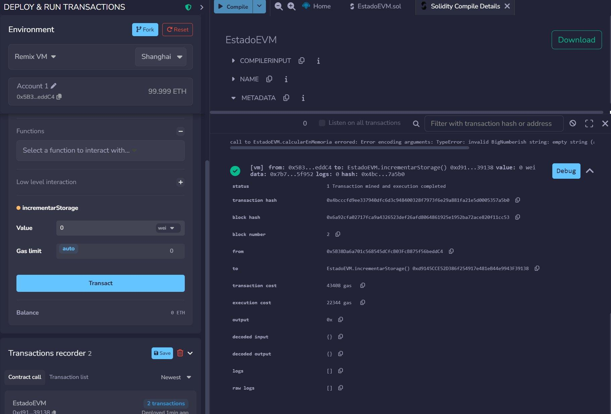
  <br /><sub><a id="fig-1"></a><strong>Figura 1:</strong> Panel de Compilation Details con Bytecode y Opcodes</sub>
</div>

#### 3. Initcode vs Runtime Bytecode

El campo `input` de la transacción de creación contiene el **initcode** completo, que se divide en dos partes diferenciadas. El initcode de despliegue (*creation code*) incluye la lógica del constructor y el código encargado de copiar y devolver el runtime bytecode. Se ejecuta una sola vez — en el momento del despliegue — y su propósito es inicializar el estado del contrato y entregar el runtime al estado global de Ethereum.

El **runtime bytecode** es lo que el initcode retorna y queda almacenado permanentemente en la dirección del contrato. Es el código que se ejecutará cada vez que una EOA u otro contrato invoque alguna función del contrato. El initcode se ejecuta una única vez porque su único propósito es inicializar el contrato; una vez que el contrato existe en su dirección, re-ejecutar el constructor rompería las garantías de inmutabilidad y determinismo que fundamentan la seguridad de Ethereum [(Antonopoulos & Wood, 2018)](#ref-antonopoulos-2018).

<div style="text-align: left; margin: 15px 0;">
  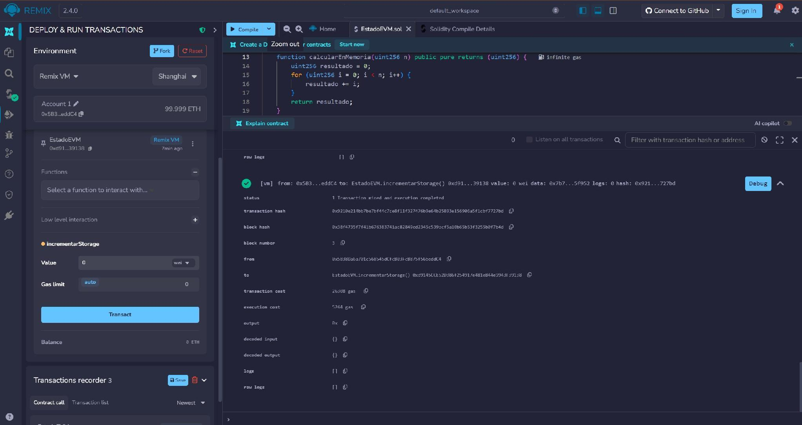
  <br /><sub><a id="fig-2"></a><strong>Figura 2:</strong> Transacción de creación y detalles del initcode en consola</sub>
</div>

---

### PARTE 3 — Costo de las áreas de datos: Storage vs Memory

Con el contrato `EstadoEVM` desplegado en Remix VM Shanghai, se ejecutaron cuatro llamadas para comparar empíricamente el costo de operar en las distintas áreas de datos de la EVM.

#### 1. Mediciones de Gas Registradas

| # | Función ejecutada | Transaction Cost | Execution Cost |
| :-: | :--- | :-: | :-: |
| 1 | `incrementarStorage()` — 1.ª vez | 43,408 gas | 22,344 gas |
| 2 | `calcularEnMemoria(10)` | 2,290 gas | 2,290 gas |
| 3 | `calcularEnMemoria(50)` | 9,930 gas | 9,930 gas |
| 4 | `incrementarStorage()` — 2.ª vez | 26,308 gas | 5,244 gas |

#### 2. Análisis de Costos

**¿Cuánto más costosa es una escritura en Storage comparada con un cálculo en Memory?** La primera llamada a `incrementarStorage()` costó 43,408 gas, mientras que `calcularEnMemoria(10)` requirió solo 2,290 gas. Esto representa una diferencia de aproximadamente **19 veces más costosa** para Storage. La razón fundamental es que Storage es persistente en la blockchain: todos los nodos del mundo deben guardar e indexar ese dato indefinidamente, lo que justifica su alto costo. Memory, en contraste, es volátil y se descarta al finalizar la llamada [(Wood, 2022)](#ref-yellow-paper).

**La cuarta llamada (`incrementarStorage()` por segunda vez) costó menos gas que la primera.** La primera escritura llevó el slot `contadorStorage` de cero a uno (slot "frío"), operación que el opcode `SSTORE` penaliza con ~20,000 gas porque implica crear un nuevo dato en el estado global. La segunda escritura modificó un slot ya inicializado (de 1 a 2, slot "caliente"), con un costo reducido de ~5,000 gas. Esta distinción existe porque crear almacenamiento nuevo tiene un impacto mayor en el estado global que actualizarlo; EIP-2929 y EIP-3529 codificaron formalmente estos costos diferenciados [(Ethereum Foundation, 2023b)](#ref-ethereum-gas).

En los datos medidos: **43,408 gas** (primera) vs **26,308 gas** (segunda), una diferencia de ~17,100 gas.

**Problema económico y alternativa arquitectónica:** Si un sistema guarda cada petición de usuario en Storage on-chain, el costo crece linealmente sin techo: cada nuevo registro paga ~20,000 gas e infla el estado global (*state bloat*). Las alternativas arquitectónicas son: (1) emitir **Events/Logs** (~375 gas base), indexables off-chain pero no consultables desde contratos; (2) almacenamiento **off-chain** con IPFS o bases de datos tradicionales, guardando solo el hash en la cadena para integridad; (3) soluciones **L2/Rollups** que comprimen múltiples operaciones en una sola transacción on-chain [(Buterin, 2021)](#ref-buterin-2021).

<div style="text-align: left; margin: 15px 0;">
  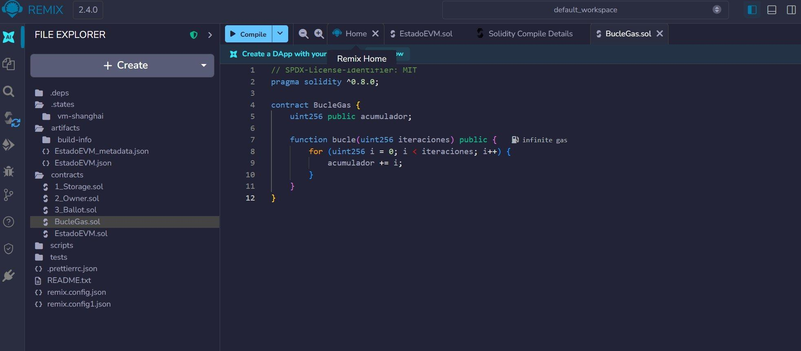
  <br /><sub><a id="fig-3"></a><strong>Figura 3:</strong> Ejecución de calcularEnMemoria(10)</sub>
</div>

<div style="text-align: left; margin: 15px 0;">
  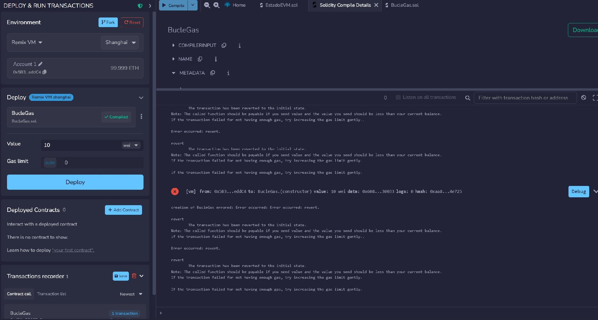
  <br /><sub><a id="fig-4"></a><strong>Figura 4:</strong> Segunda ejecución de incrementarStorage()</sub>
</div>

---

### PARTE 4 — El problema de parada y el gas como solución

Se creó y desplegó el contrato `BucleGas.sol` para medir empíricamente el costo por iteración de un bucle en Storage, y se simuló un error Out-of-Gas para comprender las garantías de atomicidad de la EVM.

<div style="text-align: left; margin: 15px 0;">
  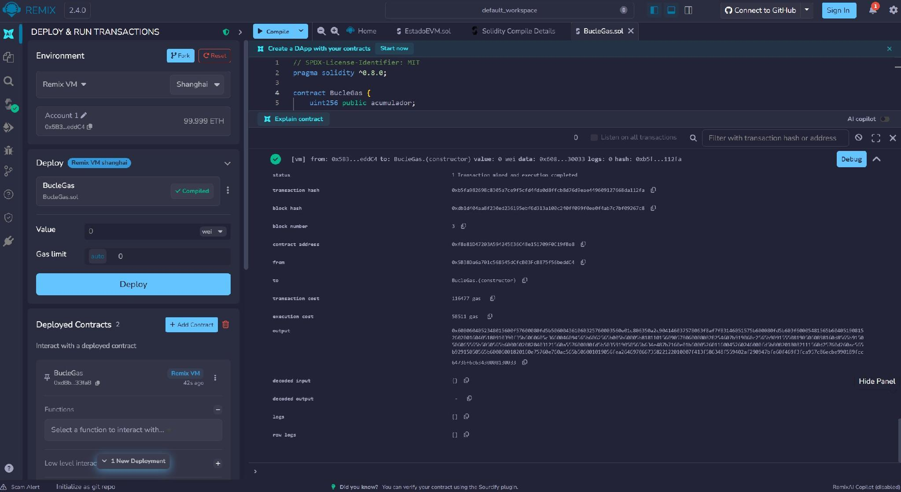
  <br /><sub><a id="fig-5"></a><strong>Figura 5:</strong> Código fuente de BucleGas.sol en Remix</sub>
</div>

<div style="text-align: left; margin: 15px 0;">
  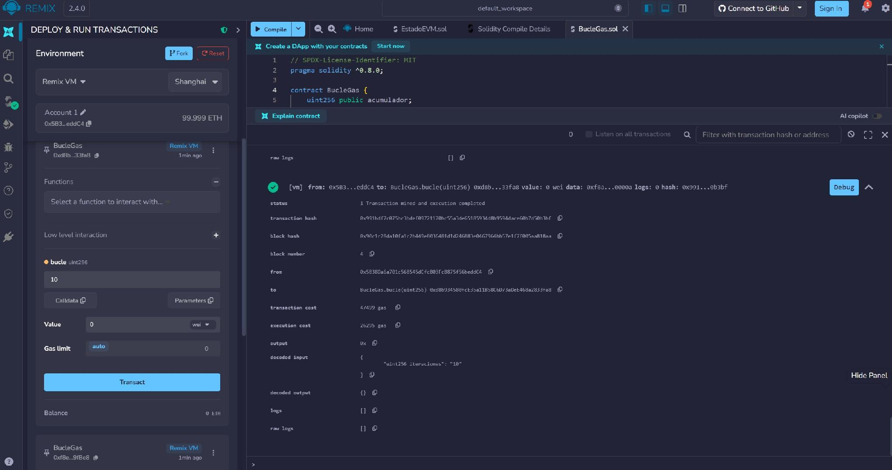
  <br /><sub><a id="fig-6"></a><strong>Figura 6:</strong> Transacción de creación de BucleGas</sub>
</div>

#### 1. Medición de Gas por Iteración

| Iteraciones | Transaction Cost | Gas por iteración |
| :---: | :-: | :-: |
| 10 | 47,499 gas | 4,749 gas/iter |
| 100 | 67,659 gas | 676 gas/iter |
| 1,000 | 440,271 gas | 440 gas/iter |

**¿Es constante el gas por iteración?** No es constante. Decrece al aumentar `n` porque existe un costo fijo por transacción (~21,000 gas de tarifa base más el overhead de entrada a la función) que se amortiza entre más iteraciones. Con pocas iteraciones, ese costo fijo representa la mayor parte del total; con muchas iteraciones, se diluye y el gas/iteración tiende al costo marginal del cuerpo del bucle (~420-440 gas/iteración) [(Wood, 2022)](#ref-yellow-paper).

<div style="text-align: left; margin: 15px 0;">
  
  <br /><sub><a id="fig-7"></a><strong>Figura 7:</strong> Ejecución de bucle(10)</sub>
</div>

<div style="text-align: left; margin: 15px 0;">
  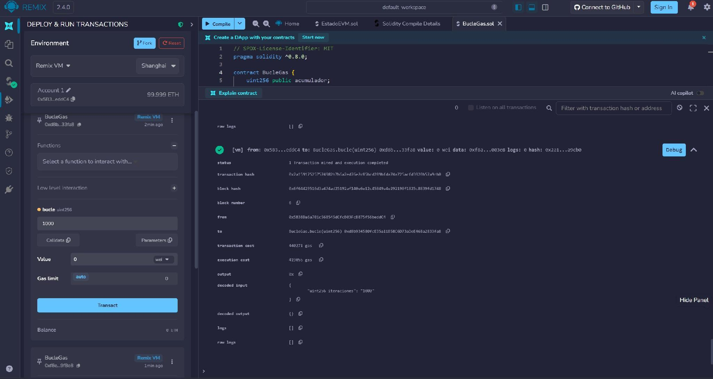
  <br /><sub><a id="fig-8"></a><strong>Figura 8:</strong> Ejecución de bucle(100)</sub>
</div>

<div style="text-align: left; margin: 15px 0;">
  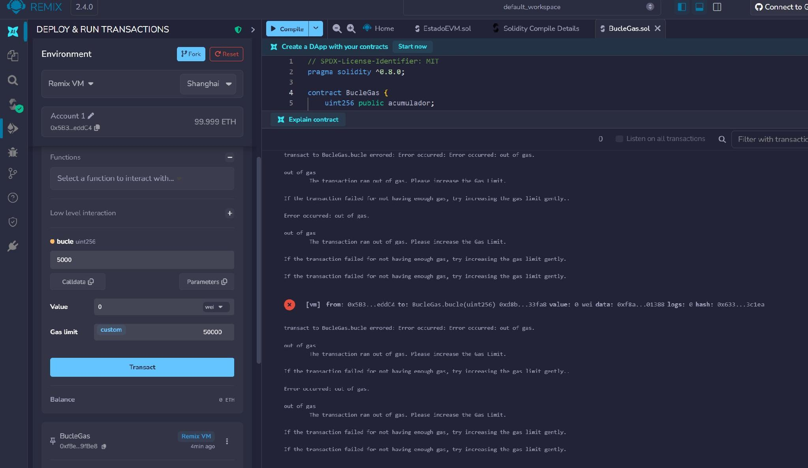
  <br /><sub><a id="fig-9"></a><strong>Figura 9:</strong> Ejecución de bucle(1000)</sub>
</div>

#### 2. Simulación Out-of-Gas

Se configuró el Gas Limit en **50,000** unidades y se ejecutó `bucle(5000)`, una combinación diseñada para agotar el presupuesto a mitad de ejecución.

**Mensaje de error obtenido:** `"transact to BucleGas.bucle errored: Error occurred: out of gas. The transaction ran out of gas. Please increase the Gas Limit."`

**Valor de `acumulador` después de la transacción fallida:** `0` (cero). Al verificar la variable `acumulador` mediante una llamada al getter público, el valor retornado fue exactamente 0, confirmando que ningún cambio de estado persistió.

**¿Por qué Ethereum cobra gas aunque la transacción haya fallado?** Desde la perspectiva del validador: el nodo ya gastó recursos computacionales reales — ciclos de CPU, memoria, electricidad — ejecutando la transacción hasta que se agotó el gas. Ese trabajo físico no puede "deshacerse". Cobrar el gas remunera ese esfuerzo y, sobre todo, previene abusos: si las transacciones fallidas fueran gratuitas, un atacante podría inundar la red con cómputo pesado sin coste alguno, ejecutando un ataque de denegación de servicio económicamente gratuito [(Ethereum Foundation, 2023a)](#ref-ethereum-evm).

**¿Cómo resuelve el gas el Problema de la Parada de Turing?** El Problema de la Parada, formulado por Alan Turing en 1936, demuestra que no existe ningún algoritmo general capaz de decidir, para cualquier programa y entrada arbitraria, si ese programa terminará o se ejecutará indefinidamente. En una blockchain pública donde miles de nodos deben ejecutar el mismo código, un contrato con un bucle infinito paralizaría simultáneamente toda la red.

El gas es la solución de ingeniería a este límite teórico. En lugar de intentar predecir si un programa termina (imposible según Turing), Ethereum acota su ejecución: cada opcode consume una cantidad determinada de gas y cada transacción lleva un límite de gas finito. Si el cómputo excede ese límite, la EVM lo detiene a la fuerza y revierte. Así, ninguna transacción puede ejecutarse indefinidamente: la terminación está garantizada no por resolver el Halting Problem, sino por imponer un presupuesto que necesariamente se agota [(Turing, 1936; Buterin, 2014)](#ref-turing-1936).

<div style="text-align: left; margin: 15px 0;">
  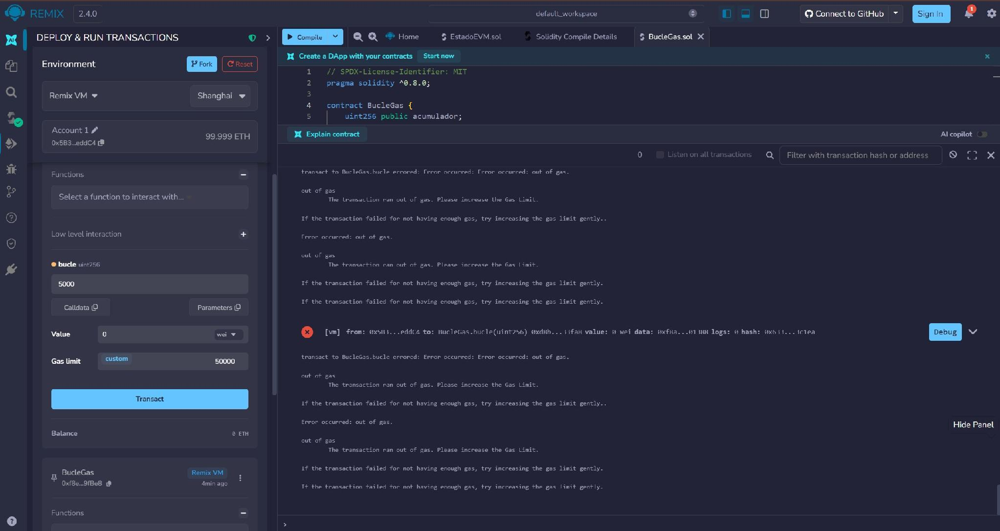
  <br /><sub><a id="fig-10"></a><strong>Figura 10:</strong> Error Out-of-Gas en consola de Remix</sub>
</div>

<div style="text-align: left; margin: 15px 0;">
  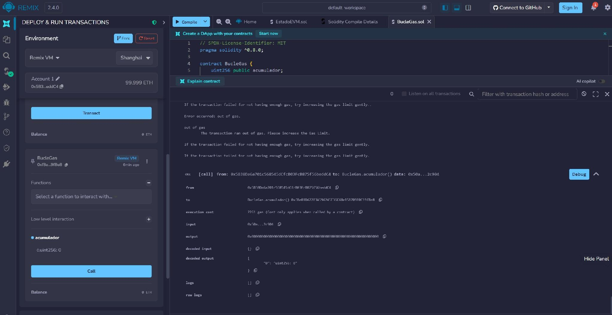
  <br /><sub><a id="fig-11"></a><strong>Figura 11:</strong> Verificación de acumulador después del fallo</sub>
</div>

---

### PARTE 5 — EIP-1559: calcula el costo real de una transacción

Se analizó una transacción real de tipo **Contract Interaction** en la red principal de Ethereum mediante Etherscan. La transacción seleccionada corresponde a una operación "Mint Public" del token ERC-721 IPO SPCX, registrada en el bloque **25,304,570** del 12 de junio de 2026.

#### 1. Campos de Gas de la Transacción Analizada

| Campo | Valor registrado |
| :--- | :--- |
| Gas Limit | 142,161 |
| Gas Used | 109,919 (77.32%) |
| Base Fee Per Gas | 0.147760315 Gwei |
| Max Priority Fee Per Gas | 0.03 Gwei |
| Max Fee Per Gas | 0.18 Gwei |
| Transaction Fee | 0.000019539236064485 ETH ($0.03) |

#### 2. Verificación Manual de la Fórmula EIP-1559

Aplicando la fórmula EIP-1559:

$$
\text{Tarifa efectiva por gas} = \text{Base Fee} + \text{Priority Fee} = 0.147760315 + 0.03 = 0.177760315 \text{ Gwei}
$$

$$
\text{Tarifa total} = \frac{0.177760315 \times 109,919}{1,000,000,000} = 0.00001953923\ldots \text{ ETH}
$$

El resultado coincide exactamente con el campo Transaction Fee reportado por Etherscan: `0.000019539236064485 ETH`, validando la fórmula [(EIP-1559, 2021)](#ref-eip-1559).

#### 3. Destino del ETH Pagado

* **ETH quemado (Base Fee):** `0.147760315 Gwei × 109,919 / 1e9 = 0.000016241666 ETH`. Etherscan confirma: *Burnt: 0.000016241666064485 ETH*. Esta cantidad se destruye permanentemente de la oferta circulante.
* **ETH recibido por el validador (Priority Fee):** `0.03 Gwei × 109,919 / 1e9 = 0.0000032975 ETH`.
* **Ahorro del usuario:** `Txn Savings = 0.000000246183935515 ETH`, ya que MaxFee (0.18 Gwei) superó a la tarifa efectiva (0.177760315 Gwei).

**¿Qué habría ocurrido si MaxFee = Base Fee sin margen?** Si el usuario hubiera fijado MaxFee Per Gas igual al Base Fee sin margen, y el Base Fee hubiera subido aunque sea mínimamente en el siguiente bloque, la transacción habría quedado pendiente en el mempool hasta que el Base Fee descendiera al nivel que cubriera el MaxFee, o habría expirado y sido descartada. EIP-1559 requiere que `MaxFee >= BaseFee + PriorityFee` del bloque para que la transacción sea incluida [(EIP-1559, 2021)](#ref-eip-1559).

**Bloque histórico de implementación:** El hard fork London, que implementó EIP-1559, se activó en el bloque **12,965,000** de la red principal de Ethereum, el 5 de agosto de 2021 [(Ethereum Foundation, 2021)](#ref-london-upgrade).

<div style="text-align: left; margin: 15px 0;">
  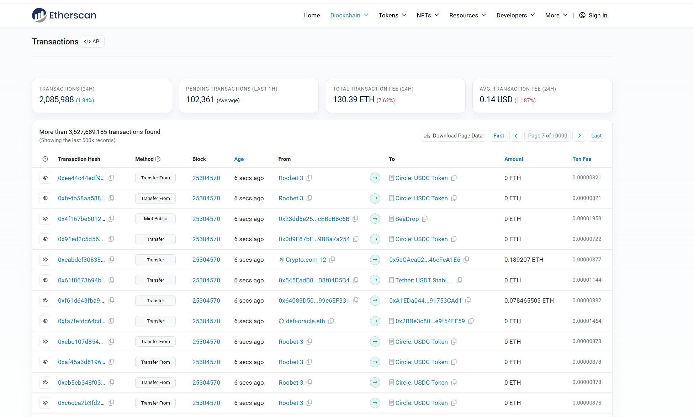
  <br /><sub><a id="fig-12"></a><strong>Figura 12:</strong> Lista de transacciones en Etherscan</sub>
</div>

<div style="text-align: left; margin: 15px 0;">
  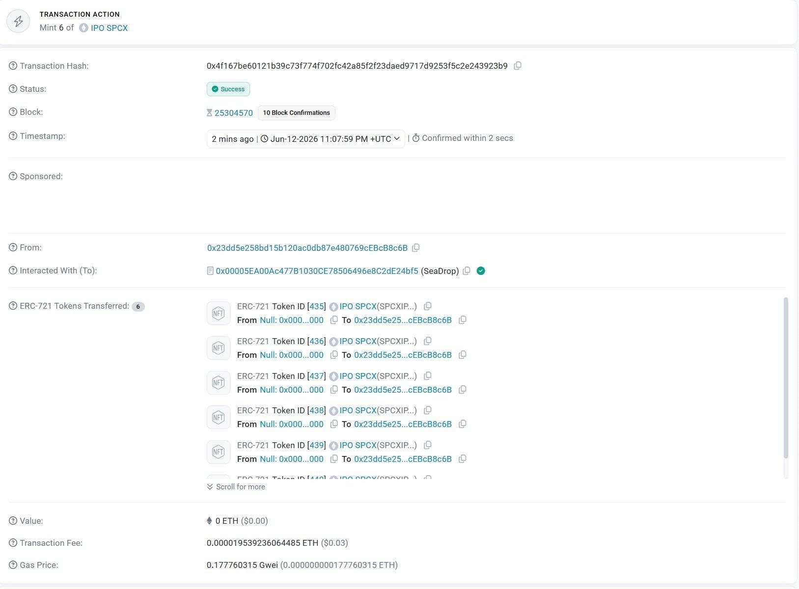
  <br /><sub><a id="fig-13"></a><strong>Figura 13:</strong> Detalle de transacción con campos EIP-1559</sub>
</div>

<div style="text-align: left; margin: 15px 0;">
  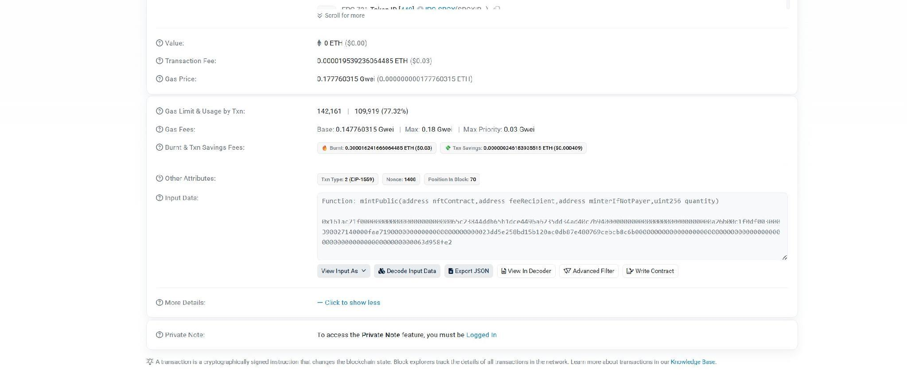
  <br /><sub><a id="fig-14"></a><strong>Figura 14:</strong> Sección expandida de gas en Etherscan</sub>
</div>

---

### PARTE 6 — Merkle Patricia Trie: verifica sin descargar toda la cadena

Se ejecutó el script Python `merkle.py` para simular la construcción y verificación de un árbol Merkle con cuatro transacciones ficticias.

#### 1. Salida del Script

```
=== MERKLE PATRICIA TRIE ===

Hojas (hashes de transacciones):
  TX[0]: c581b9d87df509a875ee...
  TX[1]: 52a3194df15263137d9b...
  TX[2]: 166e656a76384511a742...
  TX[3]: 6a9ea50a25e1e03085b6...

Niveles del arbol: 3
  Nivel 0: ['c581b9d87df5...', '52a3194df152...', '166e656a7638...', '6a9ea50a25e1...']
  Nivel 1: ['0ec6ebc64c55...', 'ce33afe80307...']
  Raiz: ['7f60ece4bb89...']

Raiz Merkle: 7f60ece4bb8979aeccf718a64b7e37d8f297081f6eade55383948561666a8af3

=== PRUEBA DE INCLUSION PARA TX[1] ===
? TX[1] esta en el arbol? True
Nodos consultados para verificar: 2 de 4 totales
```

**¿Cuántos nodos necesitó consultar el algoritmo para verificar TX[1]?** El algoritmo consultó únicamente **2 nodos** de un árbol con 4 transacciones totales: el hermano izquierdo de TX[1] (TX[0]) en el Nivel 0, y el hermano derecho del nodo padre en el Nivel 1. Con esos 2 hashes más el hash de TX[1], el algoritmo recalculó la raíz y verificó que coincidiera con la raíz conocida.

**¿Con 1,024 transacciones, cuántos nodos se necesitarían?** `log₂(1,024) = 10 nodos`. La complejidad algorítmica es **O(log n)**: logarítmica. Duplicar el número de transacciones solo añade un nodo más a la prueba. Un árbol de 1,048,576 transacciones (~1 millón) solo requiere 20 nodos para verificar cualquiera de ellas [(Merkle, 1980)](#ref-merkle-1980).

**¿Cómo verifica un nodo ligero sin descargar el bloque completo?** Un nodo ligero descarga únicamente los encabezados de bloque (no las transacciones completas). El encabezado contiene la **raíz Merkle de las transacciones** (`transactionsRoot`). Cuando necesita verificar una transacción: (1) solicita a un nodo completo la prueba de inclusión (los hashes hermanos del camino hasta la raíz); (2) con el hash de la transacción y los hashes de la prueba, recalcula la raíz paso a paso; (3) compara la raíz calculada con la `transactionsRoot` del encabezado; (4) si coinciden, la transacción es auténtica. Todo esto sin haber descargado las otras transacciones del bloque. Esta es la base del protocolo SPV (Simplified Payment Verification) [(Nakamoto, 2008)](#ref-nakamoto-2008).

<div style="text-align: left; margin: 15px 0;">
  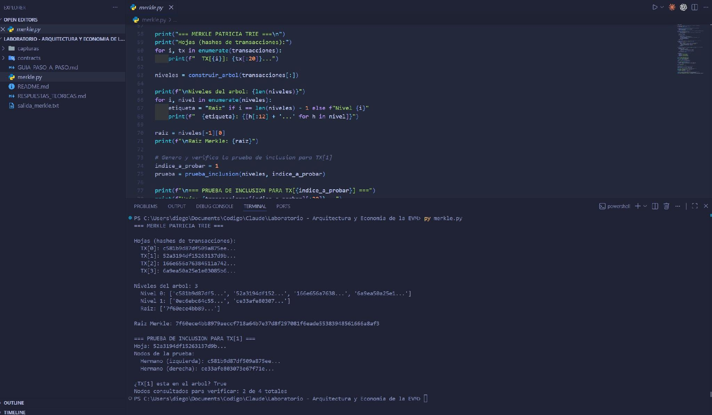
  <br /><sub><a id="fig-15"></a><strong>Figura 15:</strong> Salida del script merkle.py</sub>
</div>

#### 2. Datos Reales del Bloque en Etherscan

Se analizó el bloque **25,304,570** de la red principal de Ethereum en Etherscan. Los tres tries que componen el encabezado de un bloque Ethereum son:

| Trie | Campo en el header | Contiene |
| :--- | :--- | :--- |
| **State Trie** | `stateRoot` | Estado global de todas las cuentas de Ethereum (nonce, balance, storageRoot, codeHash). Representa el mundo completo después de aplicar el bloque. |
| **Transactions Trie** | `transactionsRoot` | Todas las transacciones incluidas en ese bloque en orden. Permite verificar que una transacción específica estuvo en el bloque. |
| **Receipts Trie** | `receiptsRoot` | Los recibos de cada transacción (estado éxito/fallo, gas usado acumulado, logs/eventos emitidos). Permite verificar resultados sin re-ejecutar. |

En la vista expandida de Etherscan para el bloque 25,304,570 se observan:
- **StateRoot:** `0x0dc111e42591a800ef5d880f22bd1078cc417f65f624d2e260aaeaaeb084f318`
- **WithdrawalsRoot:** `0x965b11f9dcc268d1e383b53cced0803a99d85cb07a7a40c14d143f4746ffa63c`

El `transactionsRoot` no aparece en la interfaz gráfica principal de Etherscan; su recuperación requiere una consulta RPC directa al nodo Ethereum mediante `eth_getBlockByNumber` [(Ethereum Foundation, 2023a)](#ref-ethereum-evm).

<div style="text-align: left; margin: 15px 0;">
  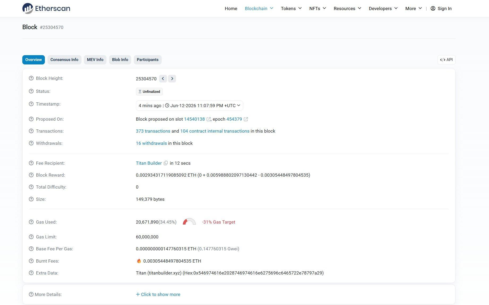
  <br /><sub><a id="fig-16"></a><strong>Figura 16:</strong> Vista general del bloque en Etherscan</sub>
</div>

<div style="text-align: left; margin: 15px 0;">
  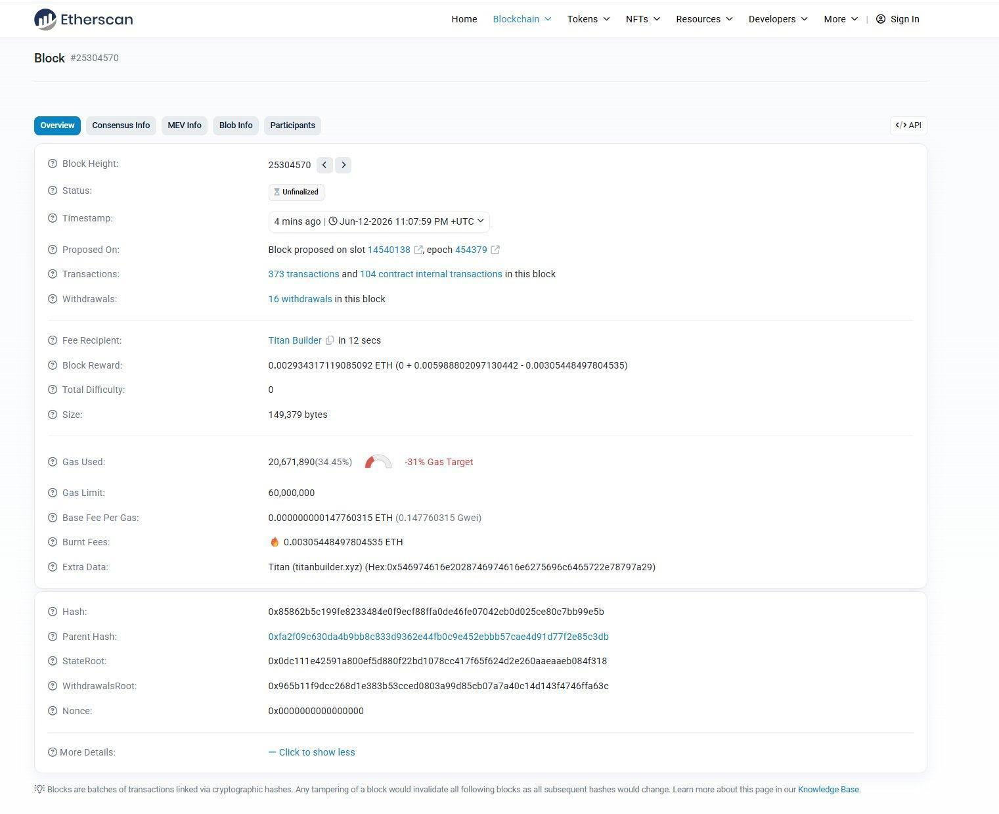
  <br /><sub><a id="fig-17"></a><strong>Figura 17:</strong> Vista expandida del bloque con campos criptográficos</sub>
</div>

---

### PARTE 7 — Reflexión final

#### Pregunta 1 — Costo adicional de diez escrituras en Storage

Usando los datos de gas obtenidos en la Parte 5: Base Fee = 0.147760315 Gwei, Priority Fee = 0.03 Gwei, Tarifa efectiva = 0.177760315 Gwei por gas.

**Caso 1 — Slots nuevos (cero a no-cero):**
$$
\text{Gas adicional} = 10 \times 20,000 = 200,000 \text{ gas}
$$
$$
\text{ETH adicional} = \frac{200,000 \times 0.177760315}{1,000,000,000} = 0.0000355520630 \text{ ETH} (\approx \$0.12 \text{ USD})
$$

**Caso 2 — Slots ya inicializados (no-cero a no-cero):**
$$
\text{Gas adicional} = 10 \times 5,000 = 50,000 \text{ gas}
$$
$$
\text{ETH adicional} = \frac{50,000 \times 0.177760315}{1,000,000,000} = 0.0000088880 \text{ ETH} (\approx \$0.03 \text{ USD})
$$

El costo puede variar entre **4× y 20×** según si los slots son nuevos o ya existían, evidencia directa de por qué optimizar el uso de Storage es crítico en el diseño de contratos inteligentes auditados [(EVM.codes, 2023)](#ref-evm-codes).

#### Pregunta 2 — ¿Por qué EIP-1559 hace inviable el ataque de transacciones fallidas?

En el modelo anterior de subasta de precio (pre-EIP-1559), el atacante podía enviar transacciones con fees bajos y el costo del ataque era controlable. Con EIP-1559, el ataque se vuelve económicamente inviable por tres razones:

1. **Quema del Base Fee:** Cada transacción, incluso las fallidas, paga y quema el Base Fee por todo el gas consumido. El ETH gastado se destruye permanentemente, no va a ningún actor que pueda ser aliado del atacante.
2. **Ajuste dinámico del Base Fee:** Si el atacante satura los bloques al 100% de capacidad, el Base Fee sube automáticamente un 12.5% por bloque. En pocos bloques, el costo por transacción crece exponencialmente, creando un impuesto progresivo que el propio atacante genera.
3. **Eliminación de mecanismos de recuperación:** El Base Fee se quema incondicionalmente, sin posibilidad de recuperación parcial [(EIP-1559, 2021)](#ref-eip-1559).

La combinación hace que el ataque sea autodestructivo: cada intento aumenta el costo del siguiente y el capital gastado desaparece de la red.

#### Pregunta 3 — ¿Por qué Ethereum es "quasi-Turing completo"?

La EVM posee el poder expresivo de una máquina de Turing: soporta bucles, condicionales, almacenamiento, recursión indirecta, y puede computar cualquier función computable en principio. Sin embargo, no puede ejecutar cómputo ilimitado: cada transacción está acotada por un límite de gas finito, lo que garantiza que toda ejecución termina. Esa cota es exactamente lo que la separa de una máquina de Turing "pura" que admite tiempo y cinta infinitos. Por eso se le denomina **"quasi-Turing completo"**: Turing-completa en expresividad, pero acotada por el gas en ejecución real [(Buterin, 2014)](#ref-buterin-2014).

La implicación para la seguridad de la red es fundamental: esta restricción garantiza que ningún programa puede colgar la red. En una blockchain pública donde miles de nodos deben ejecutar el mismo código, un contrato con un bucle infinito paralizaría todos los nodos simultáneamente — un ataque de denegación de servicio perfecto. El modelo de gas convierte ese ataque (imposible de prevenir teóricamente por el Problema de la Parada) en uno costoso e imposible en la práctica. El cómputo acotado hace que la red sea determinista, predecible y resistente a programas maliciosos o con errores de programación [(Turing, 1936; Wood, 2022)](#ref-turing-1936).

---

## 2. Declaración de uso de Inteligencia Artificial

En el presente reporte se utilizó la herramienta de inteligencia artificial Claude (Anthropic) como apoyo en los siguientes aspectos:

* **Formato y organización académica:** La IA apoyó en la estructuración de la tabla de contenido, tabla de figuras y formato general del documento siguiendo la metodología APA 7, así como en la expresión de cálculos matemáticos mediante notación LaTeX.
* **Redacción y claridad técnica:** Asistió en la redacción detallada de las justificaciones técnicas, particularmente en el análisis de costos de gas, la explicación del mecanismo EIP-1559 y la descripción del Merkle Patricia Trie.

La totalidad del desarrollo práctico — incluyendo la compilación y despliegue de contratos en Remix, la ejecución del script Python, la consulta de transacciones en Etherscan y la obtención de capturas de pantalla — fue realizada íntegramente por el estudiante. La IA no participó en ninguna actividad práctica del laboratorio ni sustituyó el análisis, la interpretación o el criterio personal del autor.

---

## 3. Referencias

* <span id="ref-antonopoulos-2018"></span>Antonopoulos, A. M., & Wood, G. (2018). *Mastering Ethereum: Building Smart Contracts and DApps*. O'Reilly Media.
* <span id="ref-buterin-2014"></span>Buterin, V. (2014). *Ethereum: A Next-Generation Smart Contract and Decentralized Application Platform*. Ethereum Foundation. [https://ethereum.org/en/whitepaper/](https://ethereum.org/en/whitepaper/)
* <span id="ref-buterin-2021"></span>Buterin, V. (2021). *Ethereum Scalability, Research and Collaboration Thread*. Ethereum Research. [https://ethresear.ch/](https://ethresear.ch/)
* <span id="ref-eip-1559"></span>Ethereum EIP-1559. (2021). *EIP-1559: Fee Market Change for ETH 1.0 Chain*. Ethereum Improvement Proposals. [https://eips.ethereum.org/EIPS/eip-1559](https://eips.ethereum.org/EIPS/eip-1559)
* <span id="ref-london-upgrade"></span>Ethereum Foundation. (2021). *London Upgrade*. [https://ethereum.org/en/history/#london](https://ethereum.org/en/history/#london)
* <span id="ref-ethereum-evm"></span>Ethereum Foundation. (2023a). *Ethereum Virtual Machine (EVM)*. [https://ethereum.org/en/developers/docs/evm/](https://ethereum.org/en/developers/docs/evm/)
* <span id="ref-ethereum-gas"></span>Ethereum Foundation. (2023b). *Gas and Fees: EIP-2929 and EIP-3529*. [https://ethereum.org/en/developers/docs/gas/](https://ethereum.org/en/developers/docs/gas/)
* <span id="ref-evm-codes"></span>EVM.codes. (2023). *EVM Opcodes Reference*. [https://www.evm.codes/](https://www.evm.codes/)
* <span id="ref-merkle-1980"></span>Merkle, R. C. (1980). Protocols for Public Key Cryptosystems. *Proceedings of the IEEE Symposium on Security and Privacy*. [https://doi.org/10.1109/SP.1980.10006](https://doi.org/10.1109/SP.1980.10006)
* <span id="ref-nakamoto-2008"></span>Nakamoto, S. (2008). *Bitcoin: A Peer-to-Peer Electronic Cash System*. [https://bitcoin.org/bitcoin.pdf](https://bitcoin.org/bitcoin.pdf)
* <span id="ref-turing-1936"></span>Turing, A. M. (1936). On Computable Numbers, with an Application to the Entscheidungsproblem. *Proceedings of the London Mathematical Society*, 42(1), 230-265. [https://doi.org/10.1112/plms/s2-42.1.230](https://doi.org/10.1112/plms/s2-42.1.230)
* <span id="ref-yellow-paper"></span>Wood, G. (2022). *Ethereum: A Secure Decentralised Generalised Transaction Ledger (Berlin Version)*. Ethereum Foundation. [https://ethereum.github.io/yellowpaper/paper.pdf](https://ethereum.github.io/yellowpaper/paper.pdf)
