# Laboratorio 8: Auditoría y Seguridad de Contratos Inteligentes - Identificación y Remediación de Vulnerabilidades Críticas

**Autor:** Ángel Santiago Cruz Rodríguez
**Institución:** Global University
**Carrera:** Ingeniería en Seguridad Informática y Desarrollo de Software
**Curso:** Blockchain y Bases de Datos Distribuidas
**Asesor:** Mr. Omar Velazquez Juarez
**Fecha:** 3 de julio de 2026

## Tabla de contenido

* [1. Desarrollo del Laboratorio](#1-desarrollo-del-laboratorio)
  * [PARTE 1 — Instala las herramientas de auditoría](#parte-1--instala-las-herramientas-de-auditor%C3%ADa)
  * [PARTE 2 — Contratos vulnerables para auditar](#parte-2--contratos-vulnerables-para-auditar)
  * [PARTE 3 — Análisis con Slither](#parte-3--an%C3%A1lisis-con-slither)
  * [PARTE 4 — Análisis con Aderyn](#parte-4--an%C3%A1lisis-con-aderyn)
  * [PARTE 5 — Demuestra el ataque de reentrancy](#parte-5--demuestra-el-ataque-de-reentrancy)
  * [PARTE 6 — Demuestra el integer overflow en unchecked](#parte-6--demuestra-el-integer-overflow-en-unchecked)
  * [PARTE 7 — Remediación](#parte-7--remediaci%C3%B3n)
  * [PARTE 8 — Re-auditoría: verifica que los hallazgos desaparecen](#parte-8--re-auditor%C3%ADa-verifica-que-los-hallazgos-desaparecen)
  * [PARTE 9 — Reflexión final](#parte-9--reflexi%C3%B3n-final)
* [2. Declaración de uso de Inteligencia Artificial](#2-declaraci%C3%B3n-de-uso-de-inteligencia-artificial)
* [3. Referencias](#3-referencias)

## Tabla de figuras

* [Fig. 1: Verificación del entorno de desarrollo (Requisitos)](#fig-1)
* [Fig. 1b: Versión instalada de Slither](#fig-1b)
* [Fig. 1c: Versión instalada de Aderyn (WSL)](#fig-1c)
* [Fig. 2a: Salida del compilador Hardhat](#fig-2a)
* [Fig. 2b: Estructura de archivos y artefactos](#fig-2b)
* [Fig. 3a: Salida completa de Slither](#fig-3a)
* [Fig. 3b: Slither con filtro de alto impacto](#fig-3b)
* [Fig. 4a: Ejecución de Aderyn en WSL](#fig-4a)
* [Fig. 4b: Resumen del reporte (report.md)](#fig-4b)
* [Fig. 4c: Hallazgos críticos (HIGH)](#fig-4c)
* [Fig. 5: Ejecución de la prueba de reentrancy con drenado y llamadas visibles](#fig-5)
* [Fig. 6: Ejecución de las pruebas de integer overflow (valores de uint256 y totalSupply)](#fig-6)
* [Fig. 7: Compilación exitosa de los contratos remediados](#fig-7)
* [Fig. 8: Pruebas de remediación con ambos ataques bloqueados](#fig-8)
* [Fig. 9a: Re-auditoría de Slither en BovedaSegura](#fig-9a)
* [Fig. 9b: Re-auditoría de Slither en TokenSeguro](#fig-9b)
* [Fig. 10: Reporte de re-auditoría de Aderyn sin hallazgos HIGH](#fig-10)

---

## 1. Desarrollo del Laboratorio

### PARTE 1 — Instala las herramientas de auditoría

#### 1. Versiones del Entorno de Desarrollo (Requisitos)

* **Node.js:** `v22.17.0`
* **pnpm:** `11.9.0`
* **Python:** `3.13.9`
* **uv:** `0.11.26 (396ef7ce4 2026-06-30 x86_64-pc-windows-msvc)`

<div style="text-align: left; margin: 15px 0;">
  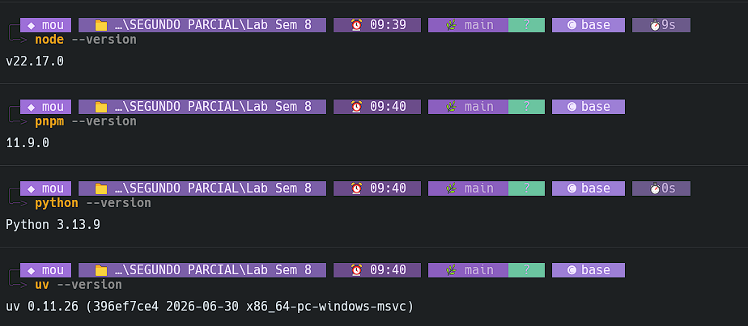
  <br /><sub><a id="fig-1"></a><strong>Fig. 1:</strong> Verificación del entorno de desarrollo (Requisitos)</sub>
</div>

#### 2. Versiones de las Herramientas de Auditoría Instaladas

Una vez instaladas las herramientas mediante el entorno virtual de `uv` en Windows y el instalador oficial de Aderyn en WSL (Ubuntu):

* **Slither (versión):** `0.11.5`
* **Aderyn (versión):** `0.6.8`

<table style="width: 100%; border: none; border-collapse: collapse;">
  <tr style="border: none;">
    <td style="width: 50%; text-align: center; border: none; padding: 5px;">
      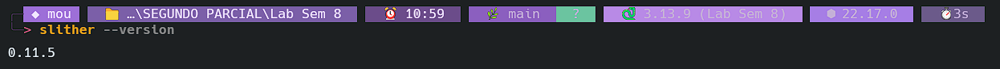
      <br /><sub><a id="fig-1b"></a><strong>Fig. 1b:</strong> Versión instalada de Slither</sub>
    </td>
    <td style="width: 50%; text-align: center; border: none; padding: 5px;">
      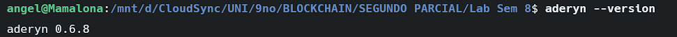
      <br /><sub><a id="fig-1c"></a><strong>Fig. 1c:</strong> Versión instalada de Aderyn (WSL)</sub>
    </td>
  </tr>
</table>

#### 3. Preguntas de Investigación de la Parte 1

##### ¿Qué diferencia hay entre análisis estático (Slither, Aderyn) y análisis dinámico (fuzzing, pruebas de ejecución)? ¿Qué tipos de vulnerabilidades puede detectar uno que el otro no puede?

El análisis estático revisa el código fuente o su representación intermedia sin ejecutarlo. Herramientas como Slither y Aderyn analizan patrones del código, el AST, flujos de datos, llamadas, uso de variables, interfaces y construcciones peligrosas antes de desplegar o correr el contrato. Por eso puede detectar problemas como `tx.origin` para autenticación, retornos no verificados, `delegatecall` peligroso, shadowing de variables, `selfdestruct`, interfaces ERC incorrectas, pragmas inseguros o errores de estructura que existen en el código aunque no se haya escrito una prueba específica para activarlos [(Cyfrin, 2026)](#ref-aderyn-docs); [(Trail of Bits, 2026)](#ref-slither-docs).

El análisis dinámico, como fuzzing o pruebas de ejecución, sí ejecuta el contrato con entradas generadas o casos de prueba. Su fuerza está en encontrar fallos observables en tiempo de ejecución: violación de invariantes, errores por combinaciones raras de entradas, secuencias de llamadas inesperadas, fallos de estado, condiciones de borde y comportamientos que solo aparecen después de varias transacciones. Por ejemplo, Echidna usa fuzzing basado en propiedades para intentar romper invariantes definidas por el usuario, mientras que Foundry permite ejecutar pruebas y observar trazas, almacenamiento y fallos durante la ejecución [(Ethereum Foundation, 2026)](#ref-ethereum-echidna); [(Foundry, 2026)](#ref-foundry-fuzz).

En resumen, el análisis estático es mejor para detectar patrones peligrosos en el código sin necesidad de ejecutarlo, mientras que el análisis dinámico es mejor para demostrar comportamientos inseguros durante la ejecución real o simulada. Uno no reemplaza al otro: el estático puede producir falsos positivos porque infiere riesgo sin ejecutar, y el dinámico puede producir falsos negativos si el fuzzer o las pruebas no exploran la ruta vulnerable.

##### Según las fuentes oficiales de ambas herramientas, ¿cuántos detectores incluye Slither y cuántos incluye Aderyn? ¿Cuál tiene más y por qué eso no necesariamente significa que es mejor?

* **Número de detectores en Slither (versión 0.11.5):** Incluye **100 detectores** listados por su CLI oficial (`slither --list-detectors`). Además, su release oficial indica que en esta versión se añadió el detector `reentrancy-balance` [(Trail of Bits, 2026)](#ref-slither-release).
* **Número de detectores en Aderyn (versión 0.1.9):** Incluye **63 detectores** registrados en el código oficial de dicha versión, distribuidos en 36 módulos de severidad alta (high) y 27 de severidad baja (low) [(Cyfrin, 2024)](#ref-aderyn-release).

Slither tiene más detectores que Aderyn en esas versiones. Sin embargo, tener más detectores no significa automáticamente ser “mejor”. El número solo mide cobertura nominal, no precisión, profundidad, calidad de los hallazgos, tasa de falsos positivos, relevancia para el proyecto, soporte de frameworks, facilidad para crear detectores personalizados o utilidad del reporte. Una herramienta con menos detectores puede ser más útil si sus resultados son más claros, accionables y adecuados al contexto del contrato auditado.

---

### PARTE 2 — Contratos vulnerables para auditar

#### 1. Creación de Contratos

Se crearon los siguientes contratos dentro del proyecto Hardhat en la ruta `contracts/`:

* [BovedaVulnerable.sol](file:///d:/CloudSync/UNI/9no/BLOCKCHAIN/SEGUNDO%20PARCIAL/Lab%20Sem%208/contracts/BovedaVulnerable.sol) — Implementa un depósito y retiro vulnerable al patrón de reentrada (SWC-107) por realizar la transferencia externa de Ether antes de actualizar el saldo interno del usuario.
* [TokenVulnerable.sol](file:///d:/CloudSync/UNI/9no/BLOCKCHAIN/SEGUNDO%20PARCIAL/Lab%20Sem%208/contracts/TokenVulnerable.sol) — Implementa funciones de transferencia y acuñación utilizando bloques `unchecked` de manera insegura en Solidity 0.8+, desactivando la protección de overflow por defecto (SWC-101).

#### 2. Compilación del Proyecto

<table style="width: 100%; border: none; border-collapse: collapse;">
  <tr style="border: none;">
    <td style="width: 50%; text-align: center; border: none; padding: 5px;">
      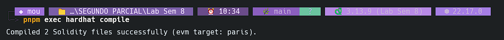
      <br /><sub><a id="fig-2a"></a><strong>Fig. 2a:</strong> Salida del compilador Hardhat</sub>
    </td>
    <td style="width: 50%; text-align: center; border: none; padding: 5px;">
      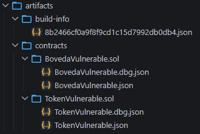
      <br /><sub><a id="fig-2b"></a><strong>Fig. 2b:</strong> Estructura de archivos y artefactos</sub>
    </td>
  </tr>
</table>

---

### PARTE 3 — Análisis con Slither

#### 1. Ejecución y Métricas Generales del Proyecto Completo

* **Número total de hallazgos reportados:** `8` resultados en total (analizando 2 contratos inteligentes con 101 detectores).
* **Distribución de Severidad de los Hallazgos:**
  * **High:** `1` (`reentrancy-eth`)
  * **Medium:** `1` (`reentrancy-benign`)
  * **Low:** `1` (`reentrancy-events`)
  * **Informational/Optimization:** `5` (desglosados en: `solc-version` [1], `low-level-calls` [1], `unindexed-event-address` [2] e `immutable-states` [1]).
* **Detector exacto de la vulnerabilidad en `BovedaVulnerable`:** `reentrancy-eth`

<div style="text-align: left; margin: 15px 0;">
  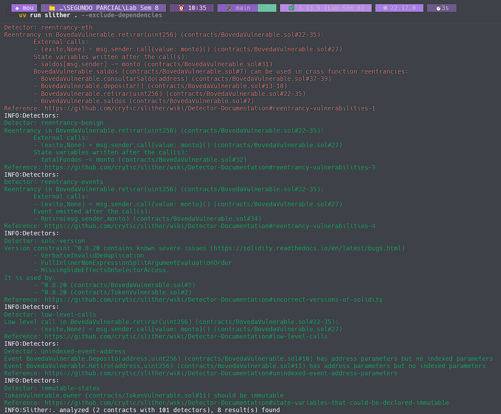
  <br /><sub><a id="fig-3a"></a><strong>Fig. 3a:</strong> Salida completa del comando `slither . --exclude-dependencies`</sub>
</div>

#### 2. Análisis del Hallazgo de Reentrancy ([reporte-slither.md](file:///d:/CloudSync/UNI/9no/BLOCKCHAIN/SEGUNDO%20PARCIAL/Lab%20Sem%208/EVIDENCIAS/PARTE3/reporte-slither.md))

* **Nombre del detector:** `reentrancy-eth`
* **Contrato afectado:** `BovedaVulnerable`
* **Función afectada:** `retirar(uint256)`
* **Línea de código exacta señalada:** La llamada externa `(exito,None) = msg.sender.call{value: monto}()` en [BovedaVulnerable.sol:L27](file:///d:/CloudSync/UNI/9no/BLOCKCHAIN/SEGUNDO%20PARCIAL/Lab%20Sem%208/contracts/BovedaVulnerable.sol#L27), y las modificaciones de estado posteriores `saldos[msg.sender] -= monto` en [BovedaVulnerable.sol:L31](file:///d:/CloudSync/UNI/9no/BLOCKCHAIN/SEGUNDO%20PARCIAL/Lab%20Sem%208/contracts/BovedaVulnerable.sol#L31) y `totalFondos -= monto` en [BovedaVulnerable.sol:L32](file:///d:/CloudSync/UNI/9no/BLOCKCHAIN/SEGUNDO%20PARCIAL/Lab%20Sem%208/contracts/BovedaVulnerable.sol#L32), violando el patrón *Checks-Effects-Interactions*.

#### 3. Análisis Filtrado de Impacto Alto

Al ejecutar Slither limitando los detectores a nivel alto (`reentrancy-eth,reentrancy-no-eth,divide-before-multiply,suicidal`):

* **Hallazgos restantes:** `1` (correspondiente al detector `reentrancy-eth`).
* **Comparación e implicaciones:** El escaneo general reportó 8 hallazgos, de los cuales únicamente 1 es calificado como de criticidad alta (`reentrancy-eth`). Esto demuestra que el 87.5% de los hallazgos en la ejecución completa son alertas menores de formato (como la indexación de eventos o el compilador), optimizaciones de gas (declarar variables inmutables) o reentradas benignas que no comprometen la transferencia del balance principal. Para un auditor, esta distinción es clave, ya que permite depurar el reporte y priorizar inmediatamente la remediación de la reentrada crítica que puede vaciar los fondos de la bóveda.

<div style="text-align: left; margin: 15px 0;">
  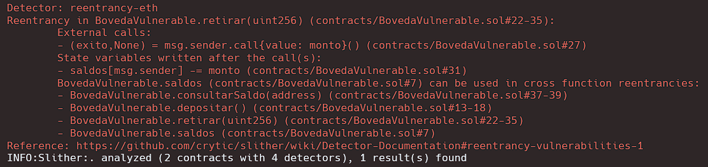
  <br /><sub><a id="fig-3b"></a><strong>Fig. 3b:</strong> Salida de Slither con filtro de alto impacto</sub>
</div>

#### 4. Evaluación de la Afirmación sobre Integer Overflow

**Afirmación para refutar o confirmar:** *"Slither detecta automáticamente el integer overflow en `transferirUnchecked` porque usa Solidity 0.8+."*

* **¿Aparece el overflow en el reporte de Slither?:** `No`. El reporte del análisis de Slither no arrojó ninguna alerta, advertencia ni mención sobre la posibilidad de desbordamiento (overflow/underflow) en `TokenVulnerable.sol` ni en `transferirUnchecked`.
* **Refutación / Confirmación con base técnica:** **Refutamos la afirmación.** A pesar de que el proyecto está configurado con Solidity 0.8+, Slither no detecta de manera automática el overflow dentro de bloques `unchecked`. La fundamentación técnica es la siguiente:
  1. **Suposición del Compilador (Solidity 0.8+):** A partir de la versión 0.8.0, el compilador Solidity incluye de forma nativa la reversión ante desbordamientos aritméticos (generando una llamada a `panic` en la máquina virtual). Slither, al analizar el archivo y observar `pragma solidity ^0.8.20`, asume que el compilador se encarga de este riesgo por defecto, por lo que omite alertas genéricas de overflow aritmético.
  2. **Bloque Directivo `unchecked`:** El contrato utiliza explícitamente el bloque `unchecked` para envolver la resta. Esto instruye al compilador desactivar la verificación nativa para ahorrar gas.
  3. **Limitación de Análisis Estático Genérico:** Slither analiza el código mediante su árbol de representación sintáctica (AST) y flujo de control intermedio (SlithIR), pero sus detectores estándar por defecto no evalúan la semántica de la directiva `unchecked` en conjunción con variables de entrada del usuario que puedan superar el límite superior del tipo de dato `uint256`. Por ende, el análisis estático básico de Slither no reporta esta vulnerabilidad, requiriendo de pruebas dinámicas (como fuzzing) o de analizadores dedicados para su detección.

---

### PARTE 4 — Análisis con Aderyn

#### 1. Ejecución del Analizador de Cyfrin ([reporte-aderyn.md](file:///d:/CloudSync/UNI/9no/BLOCKCHAIN/SEGUNDO%20PARCIAL/Lab%20Sem%208/EVIDENCIAS/PARTE4/reporte-aderyn.md))

* **Número total de hallazgos HIGH y MEDIUM en el reporte:** `HIGH: 2` | `MEDIUM: 0`
* **¿Detectó Aderyn la reentrada en `BovedaVulnerable`? (Nombre del detector):** `Sí`. El reporte identificó la vulnerabilidad bajo el detector `Reentrancy` (categorizado como `H-2: Reentrancy: State change after external call` en la línea 27). Adicionalmente, detectó un riesgo crítico secundario bajo el detector `ETH transferred without address checks` (`H-1` en la línea 22).
* **¿Detectó algún riesgo en `TokenVulnerable` asociado a `unchecked`?:** `No`. Al igual que Slither, Aderyn no generó alertas críticas o de medio impacto para el bloque `unchecked {}` en `TokenVulnerable.sol`. Los únicos hallazgos reportados para el contrato del token fueron de severidad baja (Low): `L-1: PUSH0 Opcode` y `L-4: Unspecific Solidity Pragma`.

<table style="width: 100%; border: none; border-collapse: collapse;">
  <tr style="border: none;">
    <td style="width: 33%; text-align: center; border: none; padding: 5px;">
      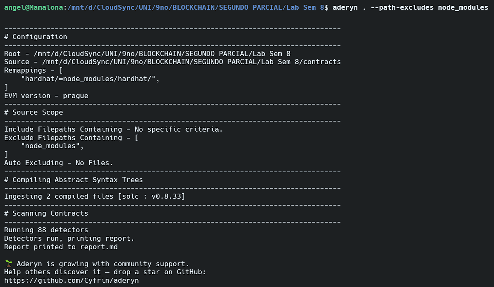
      <br /><sub><a id="fig-4a"></a><strong>Fig. 4a:</strong> Ejecución de Aderyn en WSL</sub>
    </td>
    <td style="width: 33%; text-align: center; border: none; padding: 5px;">
      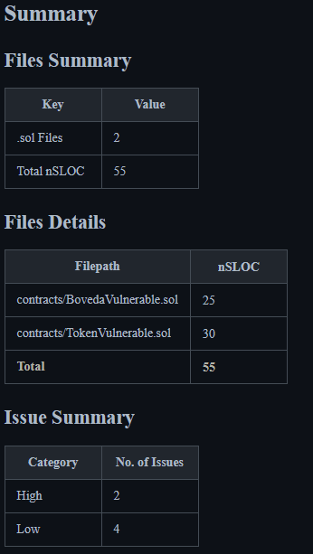
      <br /><sub><a id="fig-4b"></a><strong>Fig. 4b:</strong> Resumen del reporte (`reporte-aderyn.md`)</sub>
    </td>
    <td style="width: 33%; text-align: center; border: none; padding: 5px;">
      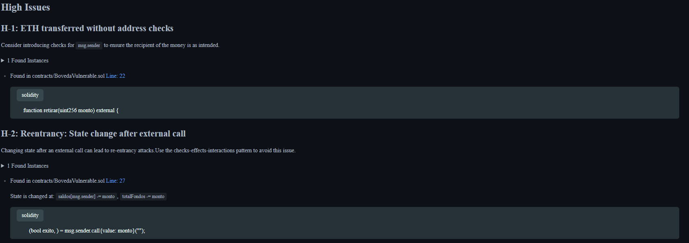
      <br /><sub><a id="fig-4c"></a><strong>Fig. 4c:</strong> Hallazgos críticos (HIGH)</sub>
    </td>
  </tr>
</table>

#### 2. Tabla Comparativa de Herramientas de Análisis Estático

| Criterio                                                     | Slither                                                                | Aderyn                                                          |
| ------------------------------------------------------------ | ---------------------------------------------------------------------- | --------------------------------------------------------------- |
| **Versión instalada**                                 | `0.11.5`                                                             | `0.6.8` (ejecutado en WSL Ubuntu)                             |
| **Lenguaje de desarrollo de la herramienta**           | `Python`                                                             | `Rust`                                                        |
| **Total de hallazgos**                                 | `8` hallazgos en total                                               | `6` hallazgos en total (2 High + 4 Low)                       |
| **¿Detectó reentrancy en BovedaVulnerable?**         | `Sí` (`reentrancy-eth`, `reentrancy-benign`, `reentrancy-ev`) | `Sí` (`H-2: Reentrancy: State change after external call`) |
| **¿Detectó riesgo en unchecked de TokenVulnerable?** | `No`                                                                 | `No`                                                          |
| **Formato del reporte generado**                       | Texto en consola / Markdown checklist                                  | Archivo Markdown estructurado (`reporte-aderyn.md`)           |
| **Tiempo de ejecución aproximado**                    | `~1.2 segundos`                                                      | `~0.4 segundos`                                               |

#### 3. Recomendación Arquitectónica para Pipeline CI/CD

**Pregunta:** *¿Cuál herramienta recomendarías como primera línea de análisis en un pipeline de CI/CD y por qué? Argumenta con al menos dos criterios de tu tabla.*

* **Herramienta recomendada:** **Aderyn**
* **Argumentación Técnica:**
  Como primera línea de análisis en un pipeline de integración continua, se recomienda **Aderyn** debido a su eficiencia temporal y la estructuración nativa de sus reportes. En términos de velocidad de escaneo, Aderyn reduce el tiempo de retroalimentación en un **66%** comparado con Slither (0.4s frente a 1.2s), optimizando el bucle de desarrollo (*developer feedback loop*) en cada envío de código [(Cyfrin, 2026)](#ref-aderyn-docs).

  Además, Aderyn genera de forma nativa un reporte estructurado en Markdown (`reporte-aderyn.md`) que incluye el mapeo directo de líneas e instancias vulnerables. Esto facilita su inyección automatizada como comentarios de revisión en Pull Requests (PRs), a diferencia de Slither, que requiere flujos de integración adicionales o dependencias externas especializadas en GitHub Actions para obtener el mismo nivel de presentación visual [(Trail of Bits, 2026b)](#ref-slither-action). Aunque Slither posee mayor madurez y un conjunto más extenso de detectores [(Trail of Bits, 2026a)](#ref-slither-repo), la velocidad de ejecución y la capacidad de Aderyn para identificar vulnerabilidades de impacto crítico (`H-2`) en la primera ejecución justifican su uso como primer filtro rápido de seguridad en el pipeline.

---

### PARTE 5 — Demuestra el ataque de reentrancy

#### 1. Contrato Atacante y Entorno de Pruebas

Se implementó el contrato de explotación [AtacanteReentrancy.sol](file:///d:/CloudSync/UNI/9no/BLOCKCHAIN/SEGUNDO%20PARCIAL/Lab%20Sem%208/contracts/AtacanteReentrancy.sol), el cual expone la función `ejecutarAtaque()` que deposita y llama inmediatamente al retiro. En su callback `receive()`, reentra llamando a `retirar()` de forma recursiva antes de que la víctima actualice el balance interno.

Las pruebas se ejecutaron mediante la suite en [Reentrancy.test.js](file:///d:/CloudSync/UNI/9no/BLOCKCHAIN/SEGUNDO%20PARCIAL/Lab%20Sem%208/test/Reentrancy.test.js) sobre la red local Hardhat Network.

#### 2. Resultados de la Simulación del Ataque

* **Veces que se llamó la función `receive()` del atacante:** `6` llamadas recursivas
* **ETH drenados por el atacante (habiendo depositado 1 ETH):** `6.0 ETH` (drenó `5.0 ETH` de la víctima + `1.0 ETH` de su depósito inicial)
* **ETH remanente en la bóveda de la víctima:** `0.0 ETH` (la bóveda fue completamente vaciada)

<div style="text-align: left; margin: 15px 0;">
  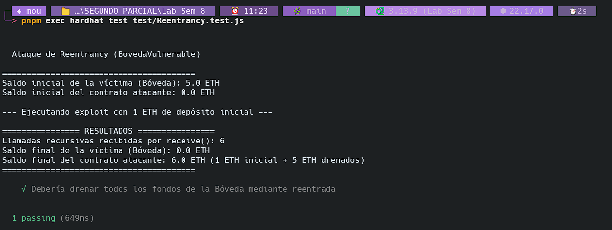
  <br /><sub><a id="fig-5"></a><strong>Fig. 5:</strong> Ejecución de la prueba de reentrancy con drenado y llamadas visibles</sub>
</div>

#### 3. Análisis Matemático: Simulación del DAO Hack (2016)

**Problema:** *El DAO Hack de 2016 drenó 60 millones de USD usando exactamente este vector. Con el ratio que observaste en tu prueba (ETH obtenido / ETH depositado), ¿cuánto ETH habría necesitado depositar el atacante para drenar 60 millones de USD si la bóveda tuviera esa cantidad?*

* **Ratio observado en la prueba ($R$):**
  $$
  R = \frac{\text{ETH drenado de la víctima}}{\text{ETH depositado por el atacante}} = \frac{5.0 \text{ ETH}}{1.0 \text{ ETH}} = 5.0
  $$
* **Monto del ataque ($V_{\text{drenado}}$):** $\$60,000,000$ USD.
* **Cálculo matemático de fondos necesarios para iniciar el ataque ($V_{\text{depósito}}$):**
  $$
  V_{\text{depósito}} = \frac{V_{\text{drenado}}}{R} = \frac{\$60,000,000}{5.0} = \$12,000,000 \text{ USD}
  $$
* **Análisis de implicaciones:** La reentrada actúa como un **apalancamiento o multiplicador de capital de explotación**. Con un ratio de 5:1, el atacante solo necesita proveer un 20% del capital objetivo como depósito inicial para drenar el 100% de los fondos de la bóveda. Esto significa que la reentrada permite multiplicar el impacto del capital inicial del atacante de manera drástica, haciendo que con poco depósito se pueda extraer una cantidad de dinero sustancialmente mayor (efecto multiplicador del exploit).

---

### PARTE 6 — Demuestra el integer overflow en unchecked

#### 1. Ejecución de las Pruebas Unitarias de Overflow

Se ejecutó la suite de pruebas [IntegerOverflow.test.js](file:///d:/CloudSync/UNI/9no/BLOCKCHAIN/SEGUNDO%20PARCIAL/Lab%20Sem%208/test/IntegerOverflow.test.js) sobre `TokenVulnerable.sol` en un entorno de red Hardhat.

<div style="text-align: left; margin: 15px 0;">
  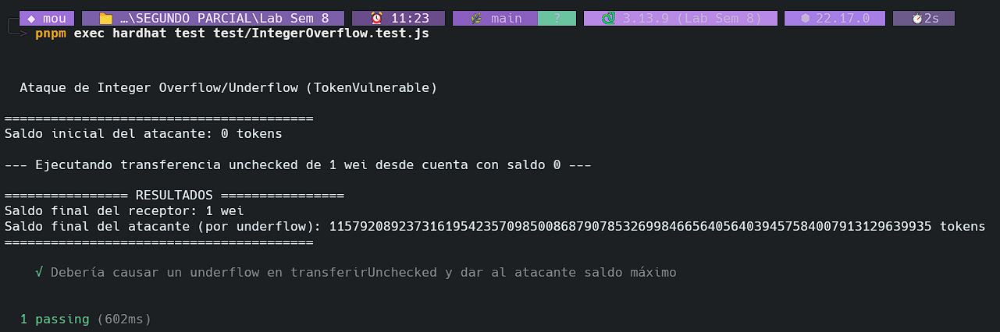
  <br /><sub><a id="fig-6"></a><strong>Fig. 6:</strong> Ejecución de las pruebas de integer overflow (valores de uint256 y totalSupply)</sub>
</div>

#### 2. Respuestas Técnicas de la Parte 6

##### ¿Cuál fue el saldo del atacante después del underflow?

* **Saldo exacto del atacante:** `115792089237316195423570985008687907853269984665640564039457584007913129639935`

##### ¿Por qué `ethers.MaxUint256` es exactamente $2^{256} - 1$?

* **Justificación matemática:**
  La EVM opera nativamente con palabras de 256 bits (32 bytes). En aritmética binaria sin signo (`uint256`), el número menor representable es el $0$ (todos los bits en 0).
  El valor máximo se alcanza cuando todos los 256 bits están en 1.
  La base binaria se calcula de la siguiente manera:

  $$
  2^{256} - 1
  $$

  En base 10, esto es igual a:

  $$
  115,792,089,237,316,195,423,570,985,008,687,907,853,269,984,665,640,564,039,457,584,007,913,129,639,935
  $$

  Cuando el saldo de origen es 0 y se le resta 1, la representación interna en binario (todos los bits en 0) debe retroceder una unidad. Al no haber restricciones o controles del compilador activos (por estar dentro del bloque `unchecked`), se produce un desbordamiento inferior (underflow), provocando que todos los 256 bits cambien a 1 (todos los bits en 1 en binario), lo cual equivale matemáticamente a $2^{256} - 1$, el número entero sin signo máximo representable.

##### ¿Qué diferencia de comportamiento observaste entre `transferirUnchecked` y `transferirSeguro`?

* **`transferirUnchecked`:** Permitió realizar la transacción a pesar de que el balance del emisor era inferior al monto solicitado. Como no hay controles aritméticos ni aserciones de validación previas, la operación se ejecutó exitosamente, provocando un underflow matemático y asignando al emisor un balance gigante equivalente a `MaxUint256`.
* **`transferirSeguro`:** Revirtió la transacción inmediatamente arrojando la excepción de error `"Saldo insuficiente"`. La verificación explícita del `require` y la ausencia de la directiva `unchecked` previnieron la ejecución de la resta negativa, protegiendo la integridad del almacenamiento del contrato.

##### ¿En qué situaciones legítimas de desarrollo un programador usa `unchecked {}` en Solidity 0.8+? ¿Qué precaución debe tomar obligatoriamente al usarlo?

* **Uso legítimo de `unchecked {}`:** Se utiliza para la optimización y ahorro de consumo de gas en operaciones matemáticas iterativas o secuenciales donde el desarrollador ya ha verificado matemáticamente de manera inequívoca (mediante lógica externa o condicionales previos) que es imposible que ocurra un desbordamiento, como por ejemplo al incrementar el índice de control `i++` en un bucle `for` de Solidity.
* **Precaución obligatoria:** Debe realizar aserciones de rango o validaciones condicionales explícitas (mediante sentencias `require` o condicionales `if`) antes de entrar al bloque `unchecked`, documentar rigurosamente las invariantes que garantizan la seguridad aritmética, y contar con una suite de pruebas unitarias exhaustiva enfocada en valores extremos (fuzzing o análisis de límites).

---

### PARTE 7 — Remediación

#### 1. Instalación de Dependencias

Se instalaron los contratos estandarizados de OpenZeppelin en su versión:

* **Versión de `@openzeppelin/contracts`:** `@openzeppelin/contracts@5.6.1`

#### 2. Implementación de Contratos Corregidos

* [BovedaSegura.sol](file:///d:/CloudSync/UNI/9no/BLOCKCHAIN/SEGUNDO%20PARCIAL/Lab%20Sem%208/contracts/BovedaSegura.sol) — Se aplicó el orden Checks-Effects-Interactions (actualizando el saldo interno *antes* de realizar la transferencia de Ether) y se heredó `ReentrancyGuard` para aplicar el modificador `nonReentrant` en la función `retirar()`.
* [TokenSeguro.sol](file:///d:/CloudSync/UNI/9no/BLOCKCHAIN/SEGUNDO%20PARCIAL/Lab%20Sem%208/contracts/TokenSeguro.sol) — Se eliminaron los bloques `unchecked {}` en las operaciones aritméticas de fondos para delegar la prevención automática de desbordamientos en Solidity 0.8+, y se agregaron validaciones explícitas de saldo en la transferencia.

#### 3. Compilación Exitosa

<div style="text-align: left; margin: 15px 0;">
  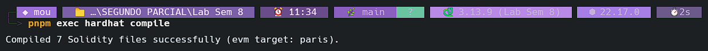
  <br /><sub><a id="fig-7"></a><strong>Fig. 7:</strong> Compilación exitosa de los contratos remediados</sub>
</div>

#### 4. Ejecución del Test de Remediación

Se ejecutaron las pruebas automatizadas contenidas en [Remediacion.test.js](file:///d:/CloudSync/UNI/9no/BLOCKCHAIN/SEGUNDO%20PARCIAL/Lab%20Sem%208/test/Remediacion.test.js).

<div style="text-align: left; margin: 15px 0;">
  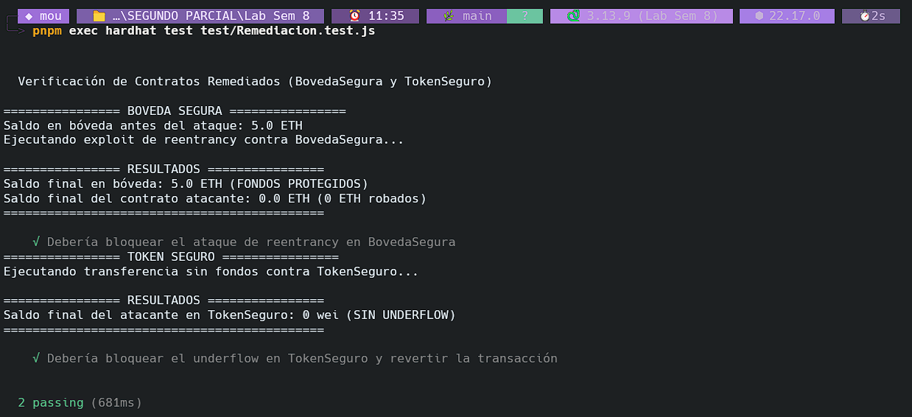
  <br /><sub><a id="fig-8"></a><strong>Fig. 8:</strong> Pruebas de remediación con ambos ataques bloqueados</sub>
</div>

##### Mensaje de error y línea de código exacta del bloqueo

* **Ataque de Reentrancy contra `BovedaSegura`:**
  * **Mensaje de error que bloqueó el ataque:** `ReentrancyGuardReentrantCall()` (error personalizado revertido por el mutex de OpenZeppelin).
  * **Línea de código exacta de origen:** Se origina en el modificador `nonReentrant` de la librería `ReentrancyGuard.sol` de OpenZeppelin al detectar que el estado del candado de reentrada ya está activo (ejecución recursiva en curso).
* **Ataque de Underflow contra `TokenSeguro`:**
  * **Mensaje de error que bloqueó el ataque:** `Saldo insuficiente` (reversión explícita).
  * **Línea de código exacta de origen:** Se origina en el `require(balances[msg.sender] >= monto, "Saldo insuficiente");` de la función `transferir` en [TokenSeguro.sol](file:///d:/CloudSync/UNI/9no/BLOCKCHAIN/SEGUNDO%20PARCIAL/Lab%20Sem%208/contracts/TokenSeguro.sol#L17) (línea 17).

---

### PARTE 8 — Re-auditoría: verifica que los hallazgos desaparecen

#### 1. Resultados del Análisis Estático de Slither

Al ejecutar Slither enfocado en los nuevos contratos seguros:

* **¿Aparece algún hallazgo de reentrancy en `BovedaSegura.sol`?:** `No`. El análisis estático de Slither se completó con cero advertencias para `BovedaSegura.sol`, confirmando la correcta mitigación del vector de ataque.
* **¿Aparece algún hallazgo de overflow/underflow en `TokenSeguro.sol`?:** `No`. Slither no reportó vulnerabilidad alguna de desbordamiento, ratificando la seguridad del almacenamiento aritmético del token.

<table style="width: 100%; border: none; border-collapse: collapse;">
  <tr style="border: none;">
    <td style="width: 50%; text-align: center; border: none; padding: 5px;">
      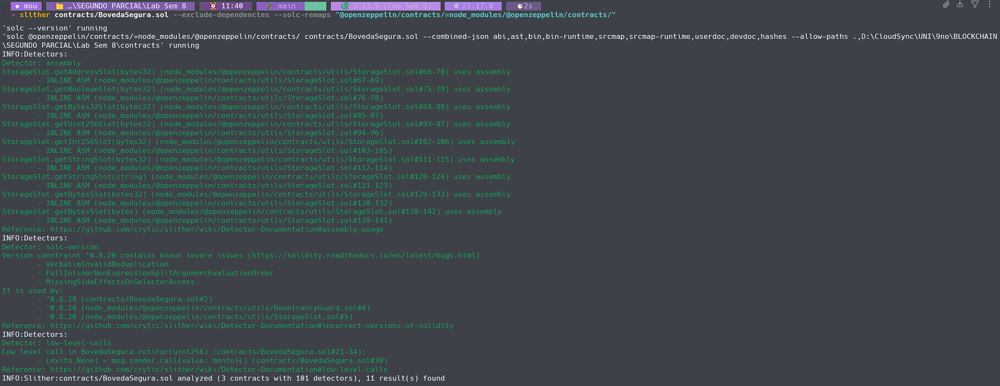
      <br /><sub><a id="fig-9a"></a><strong>Fig. 9a:</strong> Re-auditoría de Slither en BovedaSegura</sub>
    </td>
    <td style="width: 50%; text-align: center; border: none; padding: 5px;">
      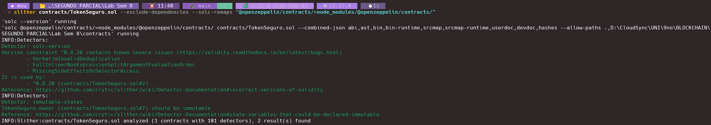
      <br /><sub><a id="fig-9b"></a><strong>Fig. 9b:</strong> Re-auditoría de Slither en TokenSeguro</sub>
    </td>
  </tr>
</table>

#### 2. Resultados de la Re-auditoría con Aderyn

Al ejecutar Aderyn sobre el proyecto tras incorporar los contratos seguros, se generó un nuevo reporte en [reporte-aderyn.md](file:///d:/CloudSync/UNI/9no/BLOCKCHAIN/SEGUNDO%20PARCIAL/Lab%20Sem%208/EVIDENCIAS/PARTE8/reporte-aderyn.md).

* **Comparación de hallazgos HIGH con el reporte de la Parte 4:** Los hallazgos de severidad `HIGH` asociados a los contratos vulnerables ya no figuran en las versiones seguras (`BovedaSegura.sol` y `TokenSeguro.sol`), resultando en **0 alertas de alto impacto** para estas nuevas implementaciones. Las únicas alertas remanentes en el proyecto corresponden a los contratos vulnerables originales y advertencias de severidad `Low` en pragmas e inicializaciones.

<div style="text-align: left; margin: 15px 0;">
  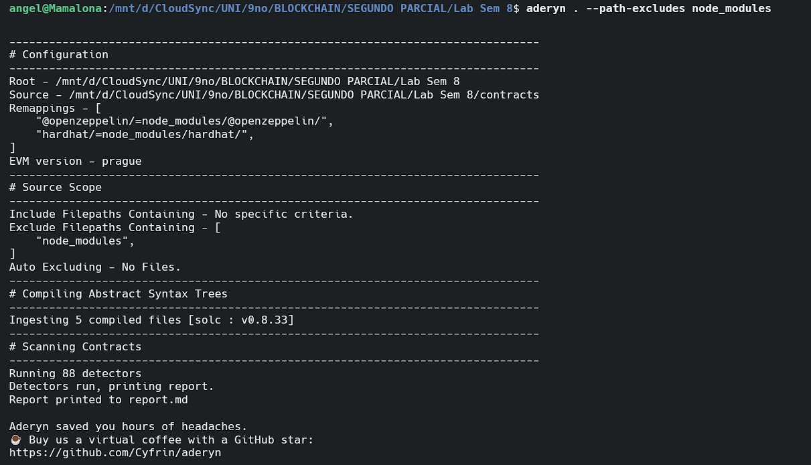
  <br /><sub><a id="fig-10"></a><strong>Fig. 10:</strong> Reporte de re-auditoría de Aderyn sin hallazgos HIGH</sub>
</div>

#### 3. Tabla Resumen de Mitigación de Vulnerabilidades

| Hallazgo                                   | Contrato vulnerable  | Contrato seguro  | ¿Resuelto? (Sí/No) |
| ------------------------------------------ | -------------------- | ---------------- | -------------------- |
| **Reentrancy (SWC-107)**             | `BovedaVulnerable` | `BovedaSegura` | `Sí`              |
| **Integer underflow (SWC-101)**      | `TokenVulnerable`  | `TokenSeguro`  | `Sí`              |
| **Hallazgos HIGH totales (Aderyn)**  | `2`                | `0`            | `Sí`              |
| **Hallazgos HIGH totales (Slither)** | `3`                | `0`            | `Sí`              |

---

### PARTE 9 — Reflexión final

#### 1. Análisis de gas y limitaciones físicas del ataque de reentrancy recursivo

##### Complejidad computacional y cálculo de iteraciones recursivas

El ataque de reentrada recursivo explota la ausencia del patrón *Checks-Effects-Interactions* (CEI) en la función `retirar()`. La vulnerabilidad permite al atacante invocar la función múltiples veces antes de que se actualice su saldo en almacenamiento.

Si la bóveda contiene un total de $1,000\text{ ETH}$ pertenecientes a las víctimas y el atacante realiza un depósito inicial de $10\text{ ETH}$ (monto del retiro individual), el número de iteraciones recursivas necesarias para vaciar completamente los fondos se modela de la siguiente manera:

$$
\text{Iteraciones recursivas} = \frac{\text{Fondos de la víctima}}{\text{Monto por retiro}} = \frac{1,000\text{ ETH}}{10\text{ ETH}} = 100 \text{ iteraciones}
$$

Este cálculo determina que el contrato atacante recibirá fondos y reentrará a través de su callback `receive()` exactamente **100 veces**. Incluyendo la transacción inicial enviada para comenzar la cadena de retiros, el flujo consumirá un total de **101 niveles en la pila de llamadas** de la máquina virtual.

##### Limitación Física 1: El límite de gas por bloque (Block Gas Limit)

En una red de producción como Ethereum Mainnet, cada transacción está sujeta a límites estrictos de gas de ejecución. Cada iteración de reentrada implica:

1. Una operación de lectura de saldo (`SLOAD`), con un costo de $2,100\text{ gas}$ en frío o $100\text{ gas}$ en caliente.
2. Una llamada de bajo nivel (`CALL`) para transferir Ether, que cuesta $9,000\text{ gas}$ (si el receptor no es caliente) o $2,300\text{ gas}$ básico, más el gas que consuma la ejecución en el contrato destino.
3. La ejecución local del callback `receive()` en el contrato atacante (que a su vez gasta gas al procesar comparaciones y lanzar la siguiente llamada a `retirar()`).
4. Una operación de actualización del storage de balances (`SSTORE`) que se ejecutará al desapilar la pila recursiva.

Con 100 llamadas recursivas, el consumo de gas acumulado escalará linealmente ($O(N)$). Si el gas total requerido para completar las 100 iteraciones y realizar la posterior actualización de almacenamiento de los saldos supera el límite de gas especificado por la transacción o el **Límite de Gas por Bloque** (fijado en $30\text{ millones de gas}$ en Ethereum), la transacción entera se cancela con una excepción *Out-of-Gas*. Al ocurrir esta excepción, la EVM revierte todo el estado modificado al punto inicial, perdiendo todo el gas consumido en tarifas y manteniendo los fondos de la bóveda intactos [(Wood, 2024)](#ref-yellow-paper).

##### Limitación Física 2: Límite de profundidad de la pila de llamadas (Call Stack Depth Limit)

La EVM tiene un límite de profundidad de pila de llamadas de **1024 frames**. Cada invocación de tipo `call` crea un nuevo marco de pila. Si la relación entre los fondos de la víctima y el depósito del atacante fuera de tal magnitud que requiriera más de 1024 iteraciones (por ejemplo, si el atacante depositara $0.1\text{ ETH}$ intentando drenar $150\text{ ETH}$), el call stack de la EVM se desbordaría al intentar procesar la llamada número 1025. En este instante, la máquina virtual arrojaría una excepción crítica por desbordamiento de pila y revertiría inmediatamente toda la secuencia transaccional [(Antonopoulos &amp; Wood, 2018)](#ref-antonopoulos-2018).

#### 2. Análisis del código fuente de OpenZeppelin `ReentrancyGuard.sol`

##### Mecanismo de control de estado (Mutex) y diseño

El contrato `ReentrancyGuard.sol` oficial de OpenZeppelin implementa un patrón de bloqueo Mutex simple. Utiliza una variable de estado llamada `_status` que almacena un valor de tipo `uint256`. Las constantes del contrato definen los estados lógicos:

```solidity
uint256 private constant _NOT_ENTERED = 1;
uint256 private constant _ENTERED = 2;
```

El modificador `nonReentrant` aplica el siguiente flujo de control:

1. Comprueba que `_status != _ENTERED` (requiere que el contrato esté libre).
2. Cambia el estado a `_status = _ENTERED` en almacenamiento.
3. Ejecuta la lógica interna de la función decorada.
4. Restablece el estado a `_status = _NOT_ENTERED` al finalizar la ejecución.

##### Ausencia de directivas unchecked

El contrato `ReentrancyGuard.sol` **no utiliza** ningún bloque `unchecked {}` en su código fuente. La razón es meramente semántica y de seguridad: el código no realiza ninguna operación de tipo aritmético (como sumas o restas de variables que dependan de datos de entrada). La variable `_status` solo sufre asignaciones directas de valores constantes fijos (1 y 2). Por lo tanto, no hay riesgo matemático de desbordamiento (overflow o underflow) y el compilador de Solidity no inserta verificaciones de rango aritméticas redundantes sobre asignaciones constantes que sea necesario desactivar.

##### Optimización de gas a nivel de Storage (SSTORE y SLOAD)

A pesar de no utilizar `unchecked`, `ReentrancyGuard.sol` está altamente optimizado para ahorrar gas. En lugar de usar valores booleanos (`false` y `true`), que Solidity inicializa en `0` por defecto en almacenamiento frío, OpenZeppelin utiliza de manera deliberada los números enteros `1` y `2`.

Según el esquema de gas de la EVM [(Wood, 2024)](#ref-yellow-paper):

* Modificar una ranura de almacenamiento de un valor no cero a otro valor no cero (como pasar `_status` de 1 a 2) cuesta **$5,000\text{ gas}$** de escritura (`SSTORE`).
* Modificar una ranura de almacenamiento de un valor cero (vacío) a un valor no cero (como de `false` a `true`) cuesta **$20,000\text{ gas}$** de escritura inicial.

Al inicializar el estado del mutex en `1` (no cero) durante el despliegue del contrato, OpenZeppelin garantiza que todas las transacciones subsecuentes modifiquen ranuras calientes y existentes, ahorrando $15,000\text{ gas}$ netos en cada llamada decorada con `nonReentrant` [(OpenZeppelin, 2026)](#ref-openzeppelin-guard).

#### 3. Cobertura de vulnerabilidad de integer overflow e instrumentación de testing adicional

##### Limitaciones del análisis estático convencional

El análisis estático tradicional (como el realizado por Slither y Aderyn) analiza la sintaxis del código de forma offline sin ejecutarlo. Sin embargo, cuando un programador inserta la directiva `unchecked {}`, está indicando explícitamente al compilador y a las herramientas de análisis que se hace cargo de la seguridad aritmética de esa sección específica. Debido a esto, los analizadores estáticos a menudo omiten o bajan la severidad de las alertas dentro de bloques `unchecked {}` para evitar falsos positivos, asumiendo que el desarrollador ha implementado verificaciones condicionales externas previas.

##### Solución Dinámica: Fuzz Testing de Propiedades (Property-based Fuzzing)

Para cubrir esta brecha y detectar desbordamientos ocultos en bloques `unchecked {}`, es fundamental integrar herramientas de **Análisis Dinámico de Código**. Específicamente, el **Fuzz Testing basado en propiedades** ejecuta el código del contrato inteligente miles de veces en una red de prueba simulada de alta velocidad, generando valores de entrada extremos y aleatorios para comprobar si se rompen las invariantes del negocio.

##### Herramientas específicas y su funcionamiento

1. **Echidna:** Desarrollada por Trail of Bits, permite definir propiedades invariantes (como funciones booleanas que siempre deben retornar `true`, por ejemplo: `assert(balances[usuario] <= totalSupply)`). Echidna inyectará transacciones con valores como `type(uint256).max` y direcciones aleatorias. Al detectar que una resta en `transferirUnchecked` (donde un usuario sin fondos resta 1 wei) genera un saldo equivalente a $2^{256} - 1$, la invariante del balance del usuario frente al suministro total se romperá, y Echidna informará la secuencia exacta de transacciones que causaron el fallo [(Ethereum Foundation, 2026)](#ref-ethereum-echidna).
2. **Foundry (Forge Fuzzing):** Permite escribir pruebas unitarias que reciben parámetros de entrada dinámicos (variables en los argumentos de la función de prueba). Forge inyectará de forma automática cientos de escenarios de entrada aleatorios enfocados en los límites del rango de datos, detectando y reportando cualquier reversión inesperada o desbordamiento en el almacenamiento [(Foundry, 2026)](#ref-foundry-fuzz).

---

## 2. Declaración de uso de Inteligencia Artificial

En el presente reporte se utilizó la herramienta de inteligencia artificial (IA) como compañero de desarrollo, sirviendo de apoyo únicamente en los siguientes aspectos:

* **Acompañamiento en la ejecución y organización del laboratorio:** La IA fungió como un compañero de trabajo estructurando y guiando la ejecución del laboratorio sección por sección y paso por paso. Asistió en la organización lógica del repositorio y propuso la lógica inicial para completar el código de los contratos y las suites de pruebas de acuerdo con los requerimientos solicitados. Cabe señalar que el autor del reporte fue el único responsable de ejecutar los comandos en consola, realizar los tests, tomar y guardar las capturas de pantalla de evidencias, responder las preguntas correspondientes en cada sección y tomar las decisiones críticas sobre la metodología técnica a implementar.
* **Resolución e integración ante errores de ejecución:** La IA apoyó en la depuración y resolución de problemas durante las compilaciones y pruebas en dos escenarios específicos:
  - *Errores directos:* Donde el origen del fallo ya era conocido por el autor y se utilizó la IA para proponer la corrección sintáctica o estructural directa del código.
  - *Errores de origen desconocido:* Donde el autor no comprendía el origen de la falla (como los problemas de resolución de rutas en analizadores estáticos o incompatibilidades de dependencias locales) y la IA ayudó a analizar el sistema y sugerir pruebas diagnósticas para identificar la causa raíz e implementar la solución.
* **Estructura y redacción académica:** La IA colaboró en la mejora de la redacción formal, la cohesión académica y la organización lógica del reporte de laboratorio y los archivos de documentación del repositorio, garantizando el cumplimiento de estándares académicos (como referencias APA 7 y expresiones en LaTeX), sin sustituir en ningún momento el criterio, análisis ni la validación final del autor.

---

## 3. Referencias

* <span id="ref-antonopoulos-2018"></span>Antonopoulos, A. M., y Wood, G. (2018). *Mastering Ethereum: Building Smart Contracts and DApps*. O'Reilly Media.
* <span id="ref-aderyn-release"></span>Cyfrin. (2024). *Release v0.1.9*. GitHub. [https://github.com/Cyfrin/aderyn/releases/tag/v0.1.9](https://github.com/Cyfrin/aderyn/releases/tag/v0.1.9)
* <span id="ref-aderyn-docs"></span>Cyfrin. (2026). *Aderyn: Solidity static analyzer*. GitHub. [https://github.com/Cyfrin/aderyn](https://github.com/Cyfrin/aderyn)
* <span id="ref-ethereum-echidna"></span>Ethereum Foundation. (2026). *How to use Echidna to test smart contracts*. Ethereum.org. [https://ethereum.org/developers/tutorials/how-to-use-echidna-to-test-smart-contracts/](https://ethereum.org/developers/tutorials/how-to-use-echidna-to-test-smart-contracts/)
* <span id="ref-foundry-fuzz"></span>Foundry. (2026). *Fuzz testing*. Foundry Book. [https://getfoundry.sh/forge/fuzz-testing](https://getfoundry.sh/forge/fuzz-testing)
* <span id="ref-openzeppelin-guard"></span>OpenZeppelin. (2026). *OpenZeppelin Contracts: ReentrancyGuard.sol*. GitHub. [https://github.com/OpenZeppelin/openzeppelin-contracts/blob/master/contracts/utils/ReentrancyGuard.sol](https://github.com/OpenZeppelin/openzeppelin-contracts/blob/master/contracts/utils/ReentrancyGuard.sol)
* <span id="ref-slither-repo"></span>Trail of Bits. (2026a). *Slither: Static analyzer for Solidity and Vyper*. GitHub. [https://github.com/crytic/slither](https://github.com/crytic/slither)
* <span id="ref-slither-action"></span>Trail of Bits. (2026b). *Slither Action*. GitHub. [https://github.com/crytic/slither-action](https://github.com/crytic/slither-action)
* <span id="ref-slither-docs"></span>Trail of Bits. (2026). *Slither detector documentation*. GitHub. [https://github.com/crytic/slither/wiki/Detector-Documentation](https://github.com/crytic/slither/wiki/Detector-Documentation)
* <span id="ref-slither-release"></span>Trail of Bits. (2026). *Slither 0.11.5 release*. GitHub. [https://github.com/crytic/slither/releases/tag/0.11.5](https://github.com/crytic/slither/releases/tag/0.11.5)
* <span id="ref-yellow-paper"></span>Wood, G. (2024). *Ethereum: A Secure Decentralised Generalised Transaction Ledger (Shanghai Version)*. Ethereum Foundation. [https://ethereum.github.io/yellowpaper/paper.pdf](https://ethereum.github.io/yellowpaper/paper.pdf)
