# Laboratorio 9: Desarrollo de dApps - Integración Frontend con Web3

**Autor:** Ángel Santiago Cruz Rodríguez
**Institución:** Global University
**Carrera:** Ingeniería en Seguridad Informática y Desarrollo de Software
**Curso:** Blockchain y Bases de Datos Distribuidas
**Asesor:** Mr. Omar Velazquez Juarez
**Fecha:** 9 de julio de 2026

## Tabla de contenido

* [1. Desarrollo del Laboratorio](#1-desarrollo-del-laboratorio)
  * [PARTE 1 — Inicializa el proyecto frontend](#parte-1--inicializa-el-proyecto-frontend)
  * [PARTE 2 — Detecta y conecta MetaMask](#parte-2--detecta-y-conecta-metamask)
  * [PARTE 3 — Lee el estado del contrato](#parte-3--lee-el-estado-del-contrato)
  * [PARTE 4 — Envía transacciones firmadas](#parte-4--envía-transacciones-firmadas)
  * [PARTE 5 — Maneja eventos del proveedor](#parte-5--maneja-eventos-del-proveedor)
  * [PARTE 6 — Escucha eventos del contrato](#parte-6--escucha-eventos-del-contrato)
  * [PARTE 7 — Reflexión final](#parte-7--reflexión-final)
* [2. Declaración de uso de Inteligencia Artificial](#2-declaración-de-uso-de-inteligencia-artificial)
* [3. Referencias](#3-referencias)

## Tabla de figuras

* [Fig. 1: Ejecución del ancla de sesión en la terminal](#fig-1)
* [Fig. 2a: Verificación de requisitos del entorno de desarrollo](#fig-2a)
* [Fig. 2b: Creación del proyecto frontend con Vite y pnpm](#fig-2b)
* [Fig. 2c: Instalación y verificación de la versión de ethers.js](#fig-2c)
* [Fig. 3: Servidor de desarrollo de Vite levantado y activo](#fig-3)
* [Fig. 4: MetaMask abriendo diálogo de conexión y cuenta conectada](#fig-4)
* [Fig. 5: Interfaz mostrando el saldo real leído del contrato en Sepolia](#fig-5)
* [Fig. 6: Log de la interfaz mostrando hashes de las transacciones confirmadas](#fig-6)
* [Fig. 7: Pantalla de MetaMask solicitando confirmar la transacción de retiro](#fig-7)
* [Fig. 8a: Transacción de depósito confirmada en Sepolia Etherscan](#fig-8a)
* [Fig. 8b: Transacción de retiro confirmada en Sepolia Etherscan](#fig-8b)
* [Fig. 9a: Cuenta principal conectada en el frontend](#fig-9a)
* [Fig. 9b: Evento accountsChanged capturado al cambiar de cuenta](#fig-9b)
* [Fig. 9c: Cambio de red realizado en MetaMask](#fig-9c)
* [Fig. 10: Evento Deposito del contrato capturado en el log](#fig-10)

---

## Ancla de sesión

```bash
SESION: 20260709_080152 | NODE: v22.17.0 | PNPM: 11.9.0 | USUARIO: MAMALONA\angel
```

<a id="fig-1"></a>
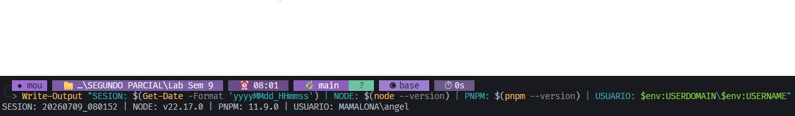
<sub> Ejecución del ancla de sesión en la terminal.</sub>

---

## 1. Desarrollo del Laboratorio

### PARTE 1 — Inicializa el proyecto frontend

#### 1. Versiones del Entorno de Desarrollo (Requisitos)

* **Node.js:** `v22.17.0`
* **pnpm:** `v11.9.0`
* **ethers.js:** `v6.17.0`

<a id="fig-2a"></a>
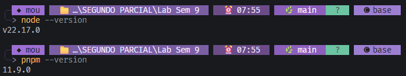
<sub> Verificación de requisitos globales del entorno.</sub>

<a id="fig-2b"></a>
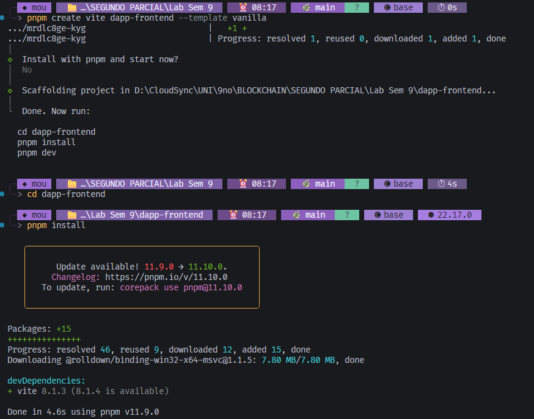
<sub> Estructuración y creación del proyecto Vite con pnpm.</sub>

<a id="fig-2c"></a>
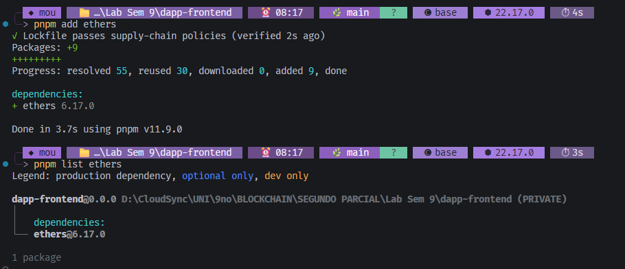
<sub> Instalación y verificación de versión de ethers.js v6.</sub>

#### 2. Preguntas de Investigación de la Parte 1

##### ¿Qué es un "proveedor" (provider) en el contexto de ethers.js?

Un Provider en ethers.js es el objeto que crea la conexión de solo lectura de una aplicación con la blockchain. Su función principal es leer información de la red, por ejemplo: consultar el saldo de una cuenta, leer datos de un contrato, obtener bloques, revisar transacciones o conectarse a un nodo RPC, pero no puede autorizar movimientos de fondos ni cambios de estado por sí mismo. Funciona como “la antena” de una app hacia la blockchain [(ethers.js, s. f.)](#ref-ethers-providers).

##### ¿En qué se diferencia un `Provider` de un `Signer`?

La diferencia central es esta: el Provider lee la blockchain, mientras que el Signer representa una cuenta capaz de autorizar acciones. Un Provider no puede firmar transacciones porque no tiene acceso a una clave privada ni representa directamente la voluntad de una cuenta. Solo consulta información o transmite datos hacia la red. Un Signer, en cambio, sí puede firmar transacciones, porque representa una cuenta de Ethereum. Esa cuenta puede firmar mensajes, firmar transacciones y enviar operaciones que cambian el estado de la blockchain, como transferir ETH o ejecutar una función write de un contrato. [(ethers.js, s. f.)](#ref-ethers-signers).

#### 3. Prueba de funcionamiento de Vite

<a id="fig-3"></a>

<sub> Servidor local de desarrollo de Vite levantado de manera exitosa.</sub>

---

### PARTE 2 — Detecta y conecta MetaMask

#### 1. Conexión de MetaMask e Interfaz de Usuario

* **Dirección de la cuenta conectada:** `0x36f44AA9A671eD0a857A3fEba318124a7c905b7E`
* **ChainId de red mostrado:** `11155111` (Red de pruebas Sepolia)
* **Red inicial de conexión y advertencia:** La conexión inicial se realizó directamente sobre la red de pruebas Sepolia (chainId 11155111), por lo que la interfaz no arrojó ninguna advertencia de red incorrecta.

<a id="fig-4"></a>
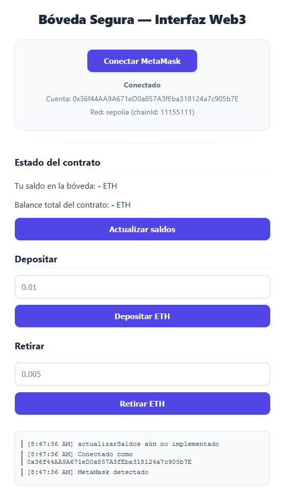
<sub> MetaMask abriendo el diálogo de conexión y cuenta autorizada.</sub>

#### 2. Preguntas de Investigación de la Parte 2

##### ¿Qué es `eth_requestAccounts` y por qué el método `request` del proveedor requiere interacción del usuario (un clic) y no puede llamarse automáticamente al cargar la página? ¿Qué problema de seguridad previene esa restricción?

`eth_requestAccounts` es el método que solicita a la wallet del usuario permiso para compartir sus cuentas Ethereum con una dApp. El método `request` requiere interacción del usuario porque revelar una dirección wallet implica exponer identidad y actividad on-chain. No debe llamarse automáticamente al cargar la página porque eso permitiría a sitios maliciosos rastrear o identificar usuarios sin consentimiento. Esta restricción previene la exposición no autorizada de cuentas y obliga a que la conexión wallet-dApp sea una decisión explícitamente consentida del usuario [(Ethereum Improvement Proposals, 2018)](#ref-eip-1102); [(MetaMask, 2026)](#ref-metamask-requestaccounts).

---

### PARTE 3 — Lee el estado del contrato

#### 1. Consulta de Saldos del Contrato en Sepolia

* **Saldo actual del usuario en la bóveda:** `0.005 ETH`
* **¿Coincide con el saldo depositado en el laboratorio anterior?** Sí, coincide. En la parte 6 del laboratorio anterior se realizó un depósito inicial de 0.01 ETH y un retiro de 0.005 ETH, resultando en un saldo neto de 0.005 ETH, el cual se lee correctamente reflejado en la interfaz.

<a id="fig-5"></a>
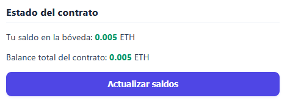
<sub> Interfaz de usuario mostrando saldos actualizados leídos desde el contrato inteligente.</sub>

##### Al hacer clic en "Actualizar saldos", ¿aparece alguna petición en la pestaña Network de F12? ¿A qué URL se dirige?

No, no se registra ninguna petición HTTP en la pestaña Network de F12 de la dApp. Esto se debe a que la consulta de lectura (`eth_call`) se canaliza mediante el proveedor inyectado de MetaMask (`window.ethereum`). Las consultas de lectura son resueltas por la extensión que realiza las peticiones a sus nodos RPC desde su propio proceso en segundo plano, por lo que el tráfico queda aislado de la pestaña de la dApp.

#### 2. Preguntas de Investigación de la Parte 3

##### ¿A través de qué mecanismo obtiene ethers.js el resultado sin enviar una transacción a la blockchain? ¿Qué método RPC de Ethereum se usa por debajo?

Ethers.js obtiene el resultado mediante una llamada de solo lectura al contrato. Es decir, simula la ejecución de la función contra el estado actual de la blockchain, pero sin crear una transacción real, sin gastar gas del usuario y sin modificar el estado del contrato.
Por debajo, el método RPC que normalmente se usa es `eth_call`. Este ejecuta una llamada local en un nodo Ethereum y devuelve el resultado, pero esa ejecución no se incluye en un bloque ni queda registrada como transacción. Por eso sirve para funciones `view` o `pure`, como consultar balances, leer variables públicas o ejecutar funciones de consulta [(ethers.js, s. f.a)](#ref-ethers-providers); [(Ethereum Foundation, s. f.a)](#ref-ethereum-eth-call). Aunque parece que estás “llamando al contrato”, realmente el frontend está pidiendo al nodo: “simula esta llamada y dime qué respondería el contrato”.

##### Refutación o Confirmación de la afirmación: *"Cada vez que el frontend lee el saldo del contrato con `consultarSaldo`, esa lectura queda registrada permanentemente en la blockchain."*

La afirmación es **falsa**. Cuando el frontend lee el saldo usando `consultarSaldo`, ethers.js realiza una llamada de lectura usando `eth_call`. Esta llamada consulta o simula el resultado en un nodo, pero no genera una transacción, no cambia el estado y no queda registrada permanentemente en la blockchain.
Lo que sí queda registrado permanentemente en los bloques de la red son las transacciones que modifican estado (que se envían usando el método `eth_sendRawTransaction`), por ejemplo: depositar, retirar, transferir, aprobar tokens o ejecutar cualquier función que escriba datos en el contrato [(Ethereum Foundation, s. f.a)](#ref-ethereum-eth-call); [(ethers.js, s. f.b)](#ref-ethers-contracts).

---

### PARTE 4 — Envía transacciones firmadas

#### 1. Transacciones de Depósito y Retiro

* **Depósito (0.01 ETH):**
  * Hash de transacción: `0xd0b2e22e963b6bd378fdfeece23bed8fdfee4a40eded23bfee0fbc3d5d299bc3`
  * Número de bloque: `11237072`
  * Gas usado: `33,318`
  * Tiempo aproximado de confirmación: `7 segundos`
* **Retiro (0.005 ETH):**
  * Hash de transacción: `0x00b3d62404a3c06a6f8639a42b925f37446f2020e591d491d3e9059f9f240350`
  * Número de bloque: `11237086`
  * Gas usado: `44,040`
  * Tiempo aproximado de confirmación: `9 segundos`

<a id="fig-6"></a>
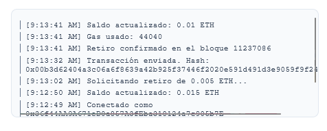
<sub> Log del frontend mostrando los hashes de las transacciones de depósito y retiro confirmadas.</sub>

<a id="fig-7"></a>
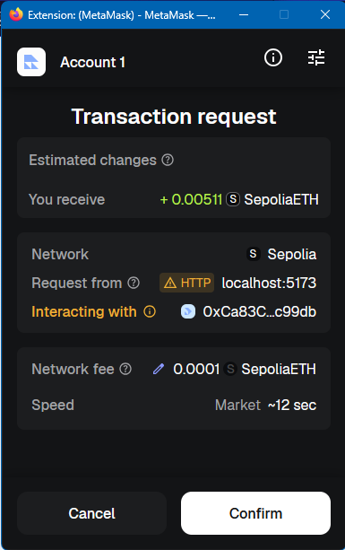
<sub> Pantalla de MetaMask solicitando confirmar la transacción de retiro.</sub>

<table style="width: 100%; border: none; border-collapse: collapse;">
  <tr style="border: none;">
    <td style="width: 50%; text-align: center; border: none; padding: 5px;">
      <a id="fig-8a"></a>
      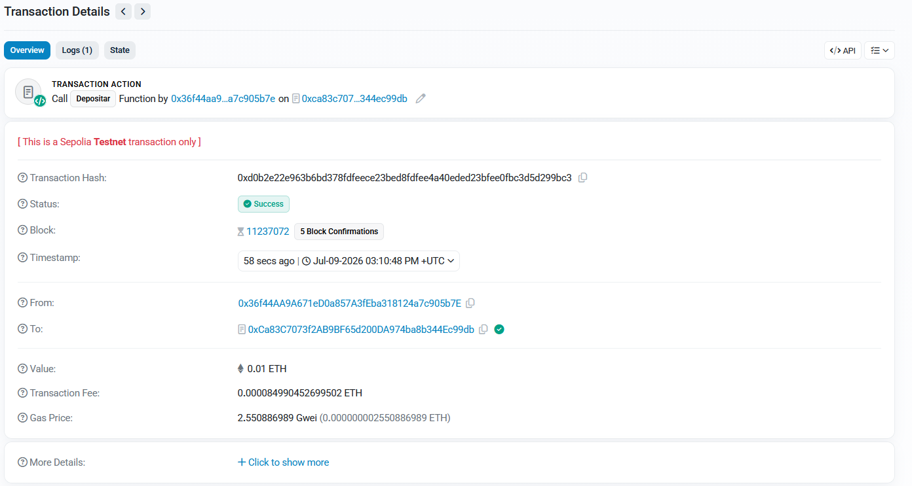
      <br /><sub><strong>Fig. 8a:</strong> Transacción de depósito confirmada en Sepolia Etherscan.</sub>
    </td>
    <td style="width: 50%; text-align: center; border: none; padding: 5px;">
      <a id="fig-8b"></a>
      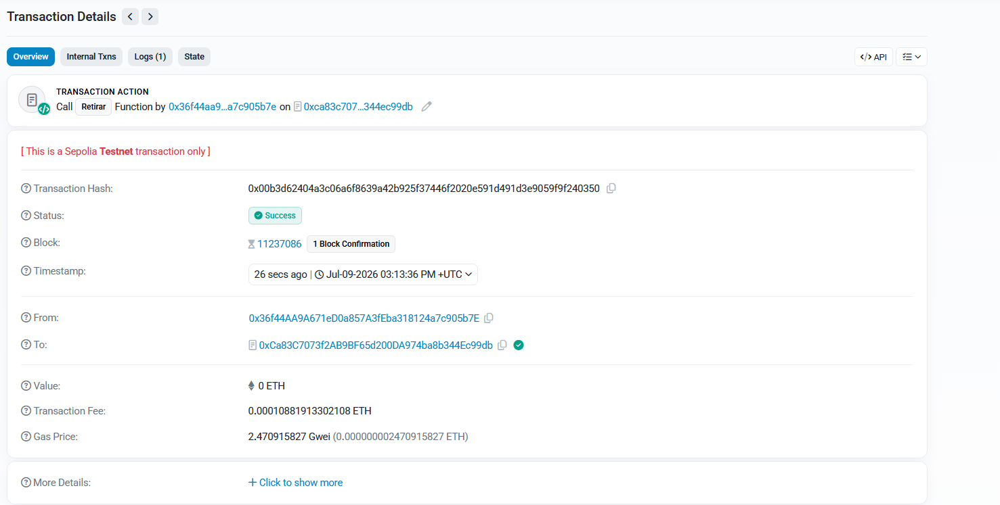
      <br /><sub><strong>Fig. 8b:</strong> Transacción de retiro confirmada en Sepolia Etherscan.</sub>
    </td>
  </tr>
</table>

#### 2. Comparación de Gas

* **Gas de depósito:** `33,318`
* **Gas de retiro:** `44,040`
* **Explicación de la diferencia basada en el contrato inteligente:**

El depósito consumió 33,318 de gas mientras que el retiro consumió 44,040 de gas (aproximadamente un 32% más). Esta variación se fundamenta principalmente en que la función de retiro debe ejecutar una mayor cantidad de validaciones, escrituras en almacenamiento (SSTORE) y llamadas externas en comparación con el depósito:

1. **Mayor cantidad de validaciones y operaciones de estado:** Para realizar un retiro (`retirar()`), el contrato debe validar dos condiciones con `require` (que el monto sea mayor a cero y que el usuario tenga saldo suficiente), realizar restas aritméticas para reducir el saldo del usuario y el total depositado, ejecutar una transferencia de fondos de salida y finalmente emitir el evento. En cambio, en la función `depositar()`, la lógica es más simple y directa, limitándose a validar el valor recibido, sumar los balances y emitir el evento, lo cual requiere menos cómputo inicial y menos escrituras de estado.
2. **Llamadas externas con transferencia de valor:** La función `retirar()` requiere enviar Ether de salida a la billetera del usuario mediante una llamada de bajo nivel (`msg.sender.call{value: monto}("")`), lo cual introduce un costo fijo de gas adicional (para la transferencia de fondos y ejecución) que no existe en `depositar()`, ya que esta última recibe fondos de manera pasiva a través del flujo de la propia transacción entrante.
3. **Modificador de protección contra reentrancia (`sinReentrada`):** El retiro incluye un bloqueo que ejecuta dos operaciones de escritura adicionales sobre variables de estado (cambiar la variable `bloqueado` a `true` al inicio de la función y restaurarla a `false` al finalizar), incrementando el consumo total de gas con operaciones SSTORE costosas que la función de depósito no necesita ejecutar.

---

### PARTE 5 — Maneja eventos del proveedor

#### 1. Prueba de Eventos en MetaMask

* **Mensaje en el log al cambiar de cuenta:** `[9:45:06 AM] Cuenta cambiada a: 0x75b17bb00ea464e7c4b11ccaa187ee3debce4a62` (y su respectiva actualización de saldo a `0.0 ETH`).
* **Comportamiento al cambiar de red:** Al cambiar la red en MetaMask, se dispara el evento `chainChanged`. Debido a que implementamos `window.location.reload()` para evitar inconsistencias en el estado de la dApp, el navegador web se recarga de forma automática e inmediata. Esta recarga de página limpia por completo el historial del log de consola, razón por la cual no queda ningún mensaje persistido en la interfaz después de efectuar el cambio.

<table style="width: 100%; border: none; border-collapse: collapse;">
  <tr style="border: none;">
    <td style="width: 33%; text-align: center; border: none; padding: 5px;">
      <a id="fig-9a"></a>
      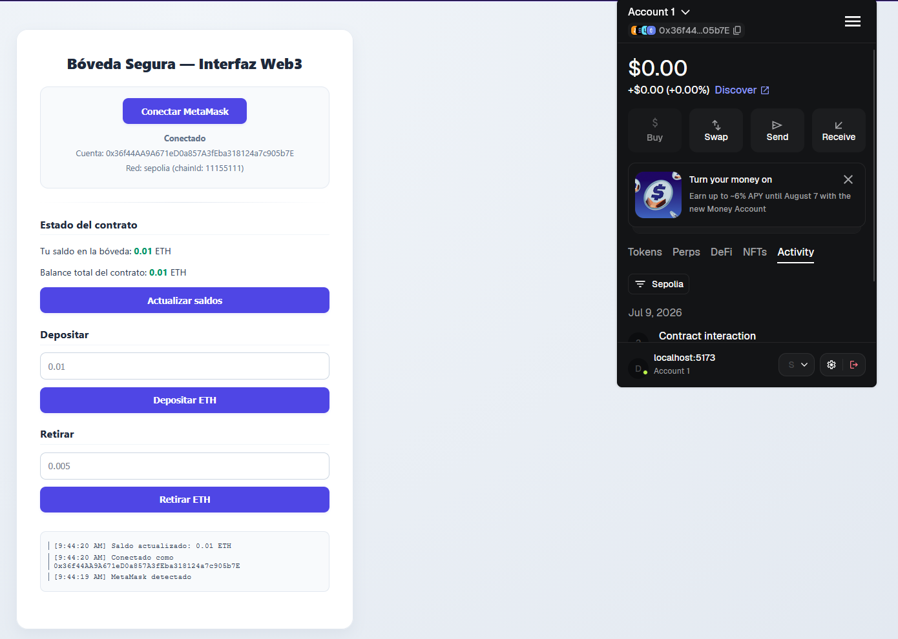
      <br /><sub><strong>Fig. 9a:</strong> Cuenta principal conectada en el frontend.</sub>
    </td>
    <td style="width: 33%; text-align: center; border: none; padding: 5px;">
      <a id="fig-9b"></a>
      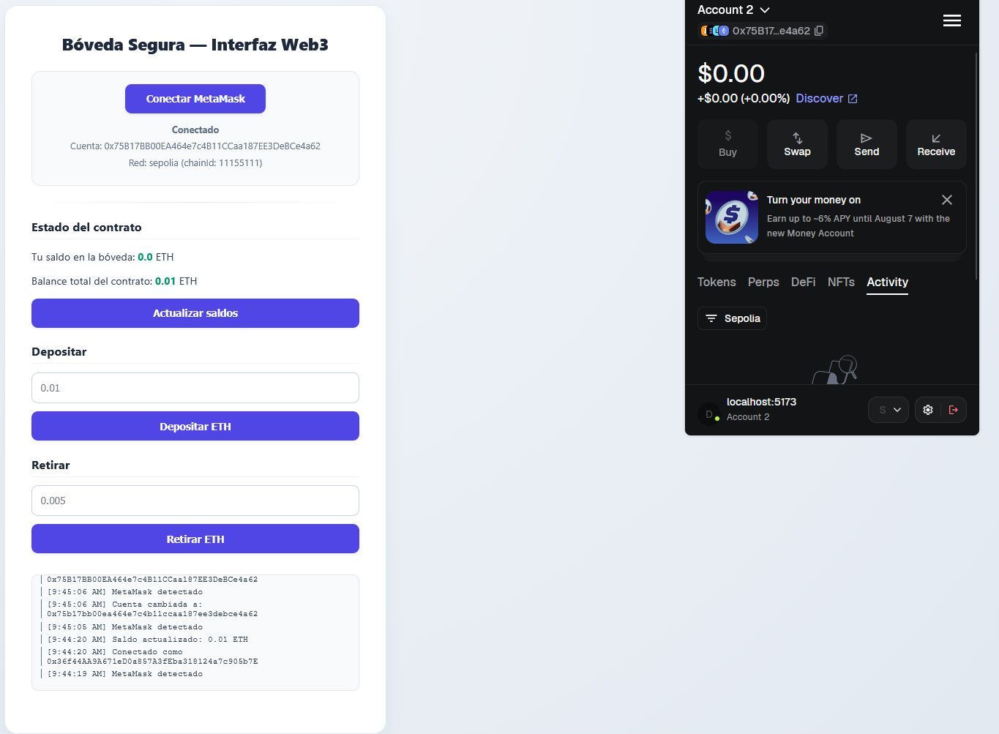
      <br /><sub><strong>Fig. 9b:</strong> Evento accountsChanged al cambiar a cuenta secundaria.</sub>
    </td>
    <td style="width: 34%; text-align: center; border: none; padding: 5px;">
      <a id="fig-9c"></a>
      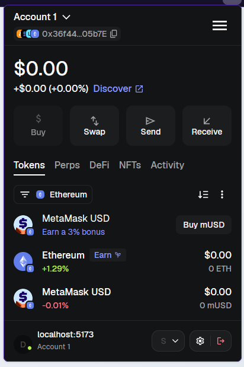
      <br /><sub><strong>Fig. 9c:</strong> Interfaz al solicitar el cambio de red en MetaMask.</sub>
    </td>
  </tr>
</table>

#### 2. Preguntas de Investigación de la Parte 5

##### ¿Por qué la recomendación oficial de MetaMask es recargar la página cuando cambia la red en lugar de solo actualizar el estado?

MetaMask recomienda recargar la página cuando cambia la red porque una dApp puede tener muchos datos dependientes de la chain actual: contratos, chainId, proveedor, saldos, eventos, listeners, direcciones de contrato, cachés y resultados de llamadas anteriores. Si solo actualizas una variable en el estado del frontend, puedes dejar partes de la aplicación trabajando con información de la red anterior.

La recarga fuerza a la aplicación a inicializarse de nuevo con la red correcta. Esto reduce errores peligrosos como leer datos de una red y enviar transacciones en otra, usar direcciones de contratos incorrectas o mostrar saldos que ya no corresponden al entorno conectado.  [(MetaMask, 2026b)](#ref-metamask-networks).

##### ¿Qué problema específico resuelve EIP-6963 que `window.ethereum` no puede resolver cuando el usuario tiene varias wallets instaladas?

EIP-6963 resuelve el problema de descubrir y elegir entre múltiples wallets inyectadas en el navegador. Antes, muchas dApps dependían de `window.ethereum`, pero ese objeto solo ofrecía un punto global de acceso. Cuando el usuario tenía varias wallets instaladas, podía haber conflictos: una wallet podía sobrescribir a otra, la dApp podía detectar solo una, o el usuario no podía elegir claramente cuál quería usar.

EIP-6963 propone un mecanismo estándar donde cada wallet puede anunciarse a la página mediante eventos. Así, la dApp puede mostrar una lista de wallets disponibles y dejar que el usuario elija [(Ethereum Improvement Proposals, 2023)](#ref-eip-6963).

---

### PARTE 6 — Escucha eventos del contrato

#### 1. Suscripción a Eventos de BóvedaSegura

* **¿Apareció el mensaje "EVENTO Deposito"?** Sí.
* **¿En qué momento apareció (antes o después del minado del bloque)?** Apareció de forma simultánea e inmediatamente después de confirmarse el minado del bloque. Esto ocurre porque los eventos en Ethereum se escriben como logs en los recibos de las transacciones únicamente cuando la transacción es procesada y el bloque correspondiente es minado con éxito. Por ende, el proveedor no puede capturar ni propagar el evento hacia el frontend hasta que el bloque sea confirmado.

<a id="fig-10"></a>
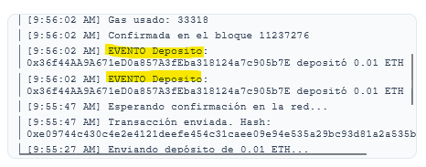
<sub> Log de la interfaz de usuario capturando el evento Deposito emitido de forma asíncrona por el contrato.</sub>

#### 2. Preguntas de Investigación de la Parte 6

##### ¿Cómo se entera tu frontend de que el evento ocurrió? ¿Qué mecanismo usa ethers.js para escuchar eventos?

El frontend se entera de que ocurrió un evento porque ethers.js registra un listener sobre el contrato, por ejemplo `contrato.on("Deposito", callback)`. Cuando una transacción emite ese evento, Ethereum lo guarda como un log. El provider consulta o se suscribe a esos logs y, si coinciden con el ABI del contrato, ethers.js los decodifica y ejecuta el callback del frontend. El mecanismo se basa en los logs de Ethereum, usando métodos RPC como `eth_getLogs` para consultar eventos y filtros como `eth_newFilter` / `eth_getFilterChanges` para detectar cambios [(Ethereum Foundation, s. f.b)](#ref-ethereum-jsonrpc); [(ethers.js, s. f.b)](#ref-ethers-contracts).

---

### PARTE 7 — Reflexión final

##### 1. ¿Por qué el gas de una función no cambia si se llama desde Hardhat, desde el frontend con ethers.js, o desde Etherscan? ¿Qué determina el costo de gas y por qué es independiente de la herramienta?

El gas no lo determina la herramienta que se usa, sino lo que ejecuta la EVM cuando procesa la transacción. Si se llama a la misma función del mismo contrato, con los mismos parámetros y bajo el mismo estado de la blockchain, la ejecución interna es la misma; por eso el gas usado debería ser igual o muy parecido.

Hardhat, ethers.js o Etherscan solo son interfaces para construir, firmar o enviar la transacción. Cambia la forma en que interactúas con el contrato, pero no cambia las instrucciones que ejecuta el contrato dentro de Ethereum [(Ethereum Foundation, 2026a)](#ref-ethereum-gas).

Lo que sí puede cambiar el gas es el estado actual del contrato o la lógica ejecutada. Por ejemplo, no cuesta lo mismo escribir por primera vez en una variable que actualizar una variable existente, ni ejecutar una rama simple que una rama con más validaciones o llamadas externas [(Ethereum Foundation, s. f.c)](#ref-ethereum-evm).

##### 2. Con el hash del depósito en Sepolia Etherscan: ¿Quién pagó el gas de la transacción (el contrato o tu cuenta)? Explica por qué el modelo de Ethereum asigna el costo a quien inicia la transacción.

El gas lo pagó mi cuenta, es decir, la cuenta externa (EOA) que inició y firmó la transacción. El contrato no pagó el gas por recibir el depósito; el contrato solo ejecutó la lógica cuando la transacción llegó a la red.

En Ethereum, una transacción nace desde una cuenta externa, como una wallet de MetaMask. Esa cuenta firma la transacción, define la intención de ejecutar una acción y acepta pagar el costo de ejecución. Por eso, en Etherscan, el campo *From* identifica la cuenta que inició la transacción y el costo de gas se descuenta de esa cuenta [(Ethereum Foundation, s. f.d)](#ref-ethereum-transactions).

El contrato puede recibir ETH, guardar balances o emitir eventos, pero no “decide” iniciar esa transacción por sí mismo. Los contratos reaccionan cuando alguien los llama. Por eso el costo se asigna al iniciador: quien pide a la red ejecutar una acción es quien paga por el trabajo que esa acción provoca [(Ethereum Foundation, 2026a)](#ref-ethereum-gas).

##### 3. Nombra dos ventajas concretas que aportaría wagmi frente a la implementación manual directa de ethers.js v6.

wagmi aporta una capa más cómoda para aplicaciones frontend, especialmente si se usa React. No reemplaza el concepto de provider, signer o contrato, pero reduce mucho código manual que normalmente se tendria que escribir con ethers.js [(wagmi, 2026)](#ref-wagmi-docs).

* **Primera ventaja: manejo más simple de conexión de wallet y cuentas.**
  Con ethers.js manual tienes que detectar `window.ethereum`, pedir cuentas, manejar cambios de red, cambios de cuenta, desconexión y errores. Con wagmi, muchas de esas tareas ya vienen organizadas en hooks como conexión de cuenta, red y wallet. Esto hace que el frontend sea más limpio y menos propenso a errores.
* **Segunda ventaja: caché, reactividad y sincronización del estado.**
  Con ethers.js manual normalmente tú tienes que decidir cuándo volver a consultar datos, cómo guardar estados de carga, cómo manejar errores y cómo refrescar información después de una transacción. wagmi ya está diseñado para manejar lectura de contratos, escritura, estados reactivos, caché y actualización de datos en aplicaciones React [(wagmi, s. f.)](#ref-wagmi-api).

---

## 2. Declaración de uso de Inteligencia Artificial

En el presente reporte se utilizó la herramienta de inteligencia artificial (IA) como compañero de desarrollo, sirviendo de apoyo únicamente en los siguientes aspectos:

* **Acompañamiento en la ejecución y organización del laboratorio:** La IA fungió como un compañero de trabajo estructurando y guiando la ejecución del laboratorio sección por sección y paso por paso. Asistió en la organización lógica del repositorio y propuso la lógica inicial para completar el código de los contratos y las suites de pruebas de acuerdo con los requerimientos solicitados. Cabe señalar que el autor del reporte fue el único responsable de ejecutar los comandos en consola, realizar los tests, tomar y guardar las capturas de pantalla de evidencias, responder las preguntas correspondientes en cada sección y tomar las decisiones críticas sobre la metodología técnica a implementar.
* **Resolución e integración ante errores de ejecución:** La IA apoyó en la depuración y resolución de problemas durante las compilaciones y pruebas en dos escenarios específicos:
  - *Errores directos:* Donde el origen del fallo ya era conocido por el autor y se utilizó la IA para proponer la corrección sintáctica o estructural directa del código.
  - *Errores de origen desconocido:* Donde el autor no comprendía el origen de la falla (como los problemas de resolución de rutas en analizadores estáticos o incompatibilidades de dependencias locales) y la IA ayudó a analizar el sistema y sugerir pruebas diagnósticas para identificar la causa raíz e implementar la solución.
* **Estructura y redacción académica:** La IA colaboró en la mejora de la redacción formal, la cohesión académica y la organización lógica del reporte de laboratorio y los archivos de documentación del repositorio, garantizando el cumplimiento de estándares académicos (como referencias APA 7 y expresiones en LaTeX), sin sustituir en ningún momento el criterio, análisis ni la validación final del autor.

---

## 3. Referencias

* <span id="ref-ethers-providers"></span>ethers.js. (s. f.a). *Documentation: Providers*. [https://docs.ethers.org/v6/single-page/#api_providers](https://docs.ethers.org/v6/single-page/#api_providers)
* <span id="ref-ethers-contracts"></span>ethers.js. (s. f.b). *Contracts*. [https://docs.ethers.org/v6/api/contract/](https://docs.ethers.org/v6/api/contract/)
* <span id="ref-ethers-signers"></span>ethers.js. (s. f.c). *Documentation: Signers*. [https://docs.ethers.org/v6/single-page/#api_signers](https://docs.ethers.org/v6/single-page/#api_signers)
* <span id="ref-eip-1102"></span>Ethereum Improvement Proposals. (2018). *EIP-1102: Opt-in account exposure*. [https://eips.ethereum.org/EIPS/eip-1102](https://eips.ethereum.org/EIPS/eip-1102)
* <span id="ref-eip-6963"></span>Ethereum Improvement Proposals. (2023). *EIP-6963: Multi-Injected Provider Discovery*. [https://eips.ethereum.org/EIPS/eip-6963](https://eips.ethereum.org/EIPS/eip-6963)
* <span id="ref-ethereum-gas"></span>Ethereum Foundation. (2026a). *Gas and fees*. [https://ethereum.org/developers/docs/gas/](https://ethereum.org/developers/docs/gas/)
* <span id="ref-ethereum-eth-call"></span>Ethereum Foundation. (s. f.a). *JSON-RPC API: eth_call*. [https://ethereum.org/developers/docs/apis/json-rpc/#eth_call](https://ethereum.org/developers/docs/apis/json-rpc/#eth_call)
* <span id="ref-ethereum-jsonrpc"></span>Ethereum Foundation. (s. f.b). *JSON-RPC API*. [https://ethereum.org/developers/docs/apis/json-rpc/](https://ethereum.org/developers/docs/apis/json-rpc/)
* <span id="ref-ethereum-evm"></span>Ethereum Foundation. (s. f.c). *Ethereum virtual machine (EVM)*. [https://ethereum.org/developers/docs/evm/](https://ethereum.org/developers/docs/evm/)
* <span id="ref-ethereum-transactions"></span>Ethereum Foundation. (s. f.d). *Transactions*. [https://ethereum.org/developers/docs/transactions/](https://ethereum.org/developers/docs/transactions/)
* <span id="ref-metamask-requestaccounts"></span>MetaMask. (2026a). *eth_requestAccounts*. MetaMask Developer Documentation. [https://docs.metamask.io/metamask-connect/evm/reference/json-rpc-api/eth_requestAccounts/](https://docs.metamask.io/metamask-connect/evm/reference/json-rpc-api/eth_requestAccounts/)
* <span id="ref-metamask-networks"></span>MetaMask. (2026b). *Manage networks*. MetaMask Developer Documentation. [https://docs.metamask.io/metamask-connect/evm/guides/manage-networks/](https://docs.metamask.io/metamask-connect/evm/guides/manage-networks/)
* <span id="ref-wagmi-docs"></span>wagmi. (2026). *Getting started*. [https://wagmi.sh/react/getting-started](https://wagmi.sh/react/getting-started)
* <span id="ref-wagmi-api"></span>wagmi. (s. f.). *React hooks for Ethereum*. [https://wagmi.sh/react/api/hooks](https://wagmi.sh/react/api/hooks)
