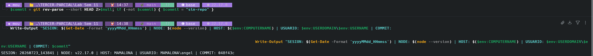
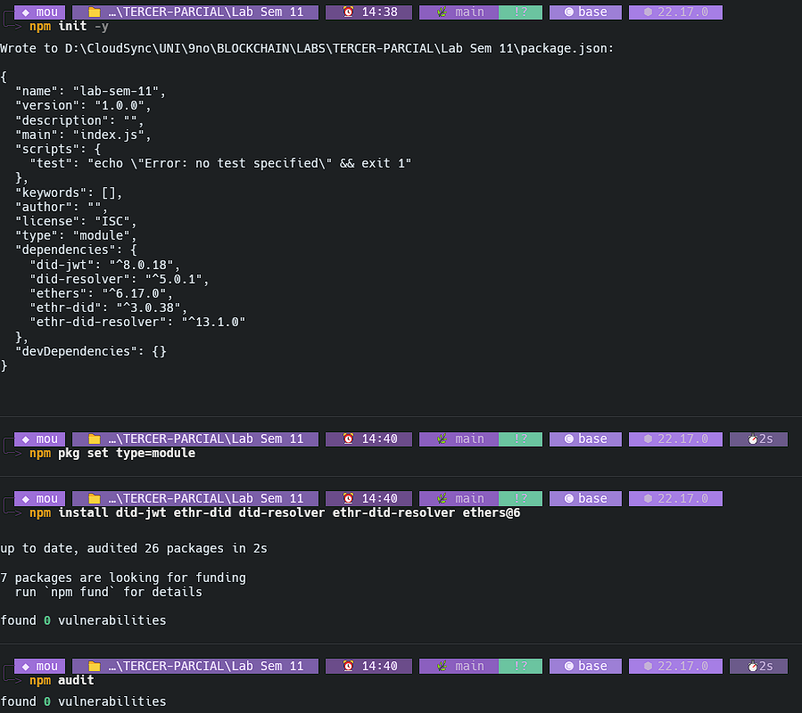
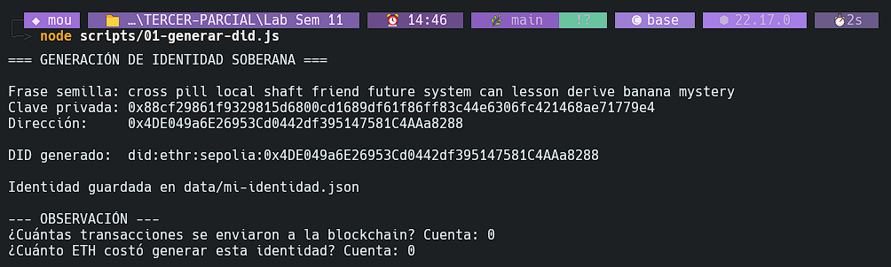
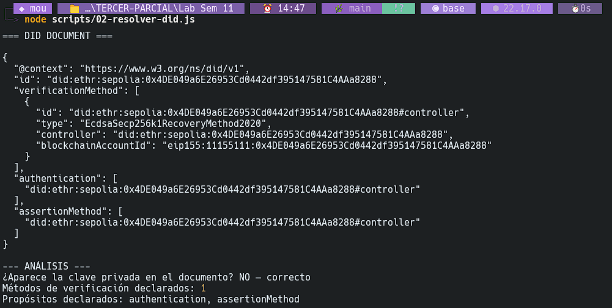
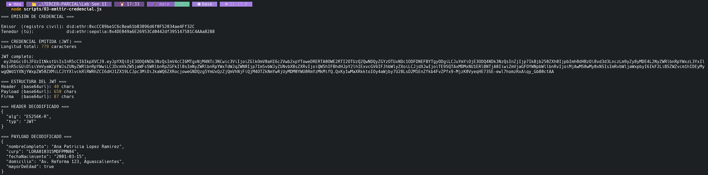
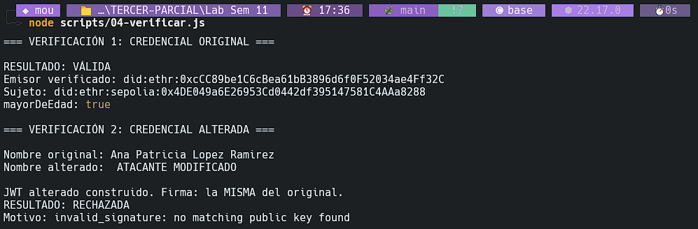
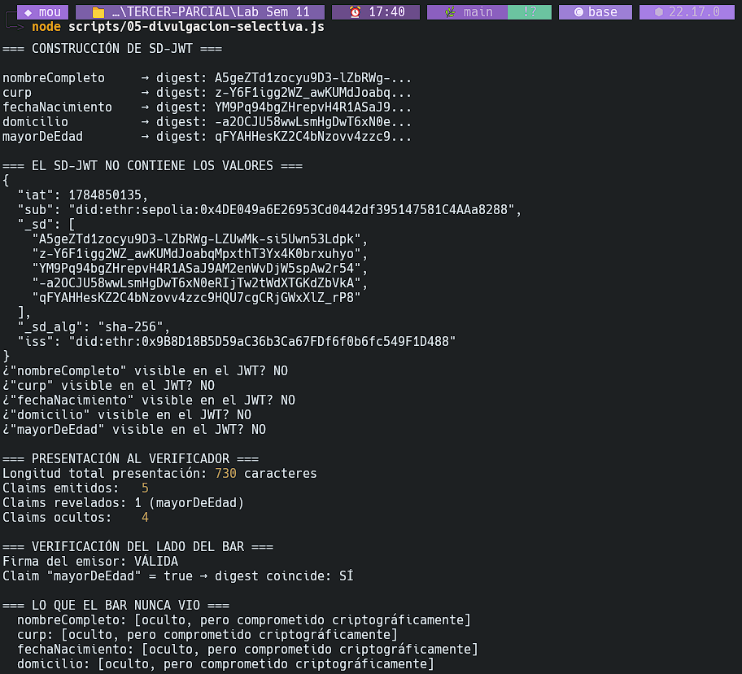
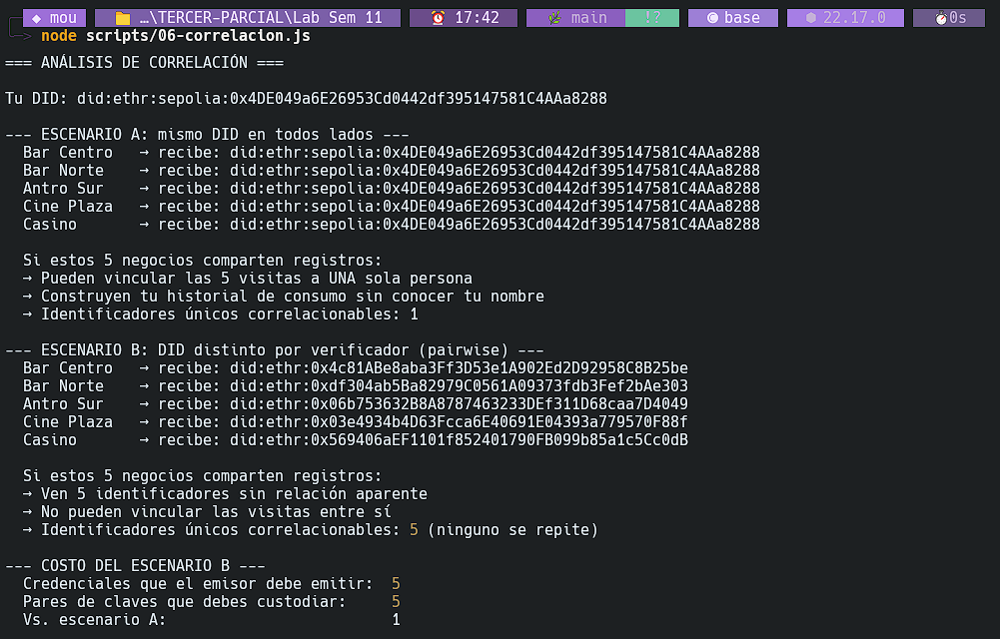
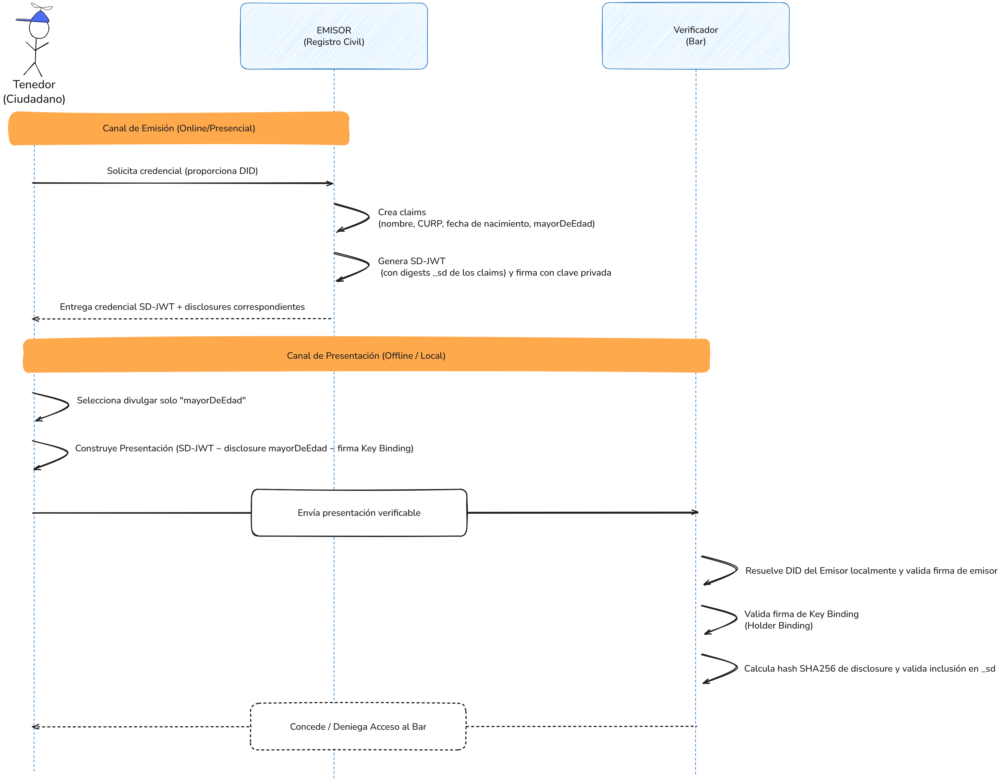
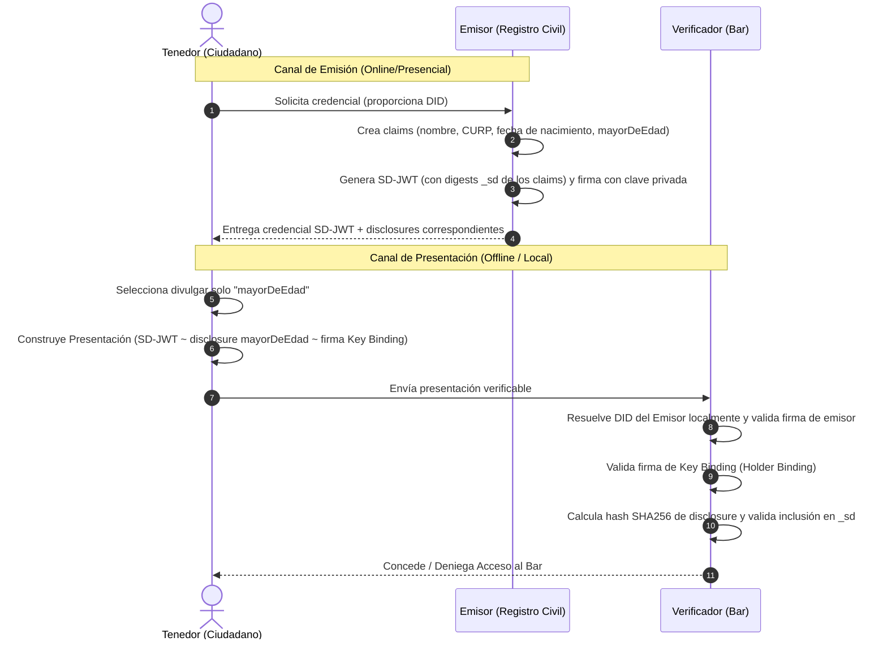

# Reporte de Laboratorio: Identidad Descentralizada (DID)

**Autor:** Ángel Santiago Cruz Rodríguez
**Institución:** Global University
**Carrera:** Ingeniería en Ciberseguridad y Desarrollo de Software
**Curso:** Blockchain y Bases de Datos Distribuidas
**Asesor:** Mr. Omar Velazquez Juarez
**Fecha:** 23 de julio de 2026

---

## Tabla de contenido

* [1. Desarrollo del Laboratorio](#1-desarrollo-del-laboratorio)
  * [PARTE 1 — Prepara el entorno y estudia el modelo](#parte-1--prepara-el-entorno-y-estudia-el-modelo)
  * [PARTE 2 — Genera tu DID](#parte-2--genera-tu-did)
  * [PARTE 3 — Resuelve el DID Document](#parte-3--resuelve-el-did-document)
  * [PARTE 4 — Emite una credencial verificable](#parte-4--emite-una-credencial-verificable)
  * [PARTE 5 — Verifica y detecta manipulación](#parte-5--verifica-y-detecta-manipulacion)
  * [PARTE 6 — Divulgación selectiva: el eje de privacidad](#parte-6--divulgacion-selectiva-el-eje-de-privacidad)
  * [PARTE 7 — Análisis de correlación](#parte-7--analisis-de-correlacion)
  * [PARTE 8 — Diseña el esquema del caso guía](#parte-8--disena-el-esquema-del-caso-guia)
  * [PARTE 9 — Reflexión final](#parte-9--reflexion-final)
* [2. Declaración de uso de Inteligencia Artificial](#2-declaracion-de-uso-de-inteligencia-artificial)
* [3. Referencias](#3-referencias)

## Tabla de figuras

* [Fig. 1: Ejecución del ancla de sesión en la terminal](#fig-1)
* [Fig. 2: Auditoría del entorno e instalación de dependencias](#fig-2)
* [Fig. 3: Generación de la Identidad Soberana (DID ethr)](#fig-3)
* [Fig. 4: Resolución determinista del DID Document](#fig-4)
* [Fig. 5: Emisión de la Credencial Verificable (JWT completo)](#fig-5)
* [Fig. 6: Verificación de la credencial original y detección de manipulación](#fig-6)
* [Fig. 7: Divulgación selectiva mediante SD-JWT](#fig-7)
* [Fig. 8: Simulación de escenarios de correlación de DIDs](#fig-8)
* [Fig. 9: Diagrama de flujo de interacción y arquitectura del caso guía](#fig-9)

---

## Ancla de sesión

```bash
SESION: 20260723_143841 | NODE: v22.17.0 | HOST: MAMALONA | USUARIO: MAMALONA\angel | COMMIT: 048f43c
```

<a id="fig-1"></a>

<sub>Ejecución del ancla de sesión en la terminal local.</sub>

---

## 1. Desarrollo del Laboratorio

### PARTE 1 — Prepara el entorno y estudia el modelo

#### 1. Auditoría del Entorno (`npm install` y `npm audit`)

El entorno de ejecución fue inicializado con Node.js en su versión `v22.17.0`. La instalación de los paquetes requeridos (`did-jwt`, `ethr-did`, `did-resolver`, `ethr-did-resolver`, y `ethers@6`) concluyó con el siguiente resultado:

* **Paquetes instalados:** 26 paquetes añadidos al árbol local.
* **Reporte de vulnerabilidades:** `npm audit` reportó **0 vulnerabilidades** de seguridad detectadas.

<a id="fig-2"></a>

<sub>Ejecución de npm install y npm audit mostrando la instalación limpia y segura.</sub>

#### 2. Fundamentos de DID Core (W3C Recommendation)

De acuerdo con la especificación oficial de **DID Core** publicada por el World Wide Web Consortium (W3C, 2022), un Identificador Descentralizado (DID) consta de tres componentes principales separados por dos puntos (`:`):

1. **Esquema (Scheme):** Siempre es la cadena literal `did`. Define que la URI corresponde a la especificación de un DID (W3C, 2022).
2. **Método DID (DID Method):** Identifica el método específico del DID (como `ethr`, `key`, `ion`, etc.), el cual determina las reglas para escribir, leer, actualizar e invalidar el *DID Document* asociado en un registro descentralizado o mediante algoritmos criptográficos (W3C, 2022).
3. **Identificador Específico del Método (Method-Specific Identifier):** Es un valor alfanumérico único para el método en cuestión que identifica al sujeto. En el método `did:ethr`, este campo suele corresponder a una dirección hexadecimal de una cuenta Ethereum (W3C, 2022).

#### 3. Roles en el Modelo de Credenciales Verificables (VCDM 2.0)

El modelo de datos de credenciales verificables de la W3C en su versión 2.0 (W3C, 2025) define tres roles principales:

1. **Emisor (Issuer):** La entidad que posee la autoridad o los datos para realizar afirmaciones (claims) sobre un sujeto. Crea la credencial verificable (VC), la firma digitalmente con su clave privada y la asocia al identificador del tenedor (W3C, 2025).
2. **Tenedor (Holder):** La entidad (generalmente el sujeto de la credencial) que custodia las credenciales verificables en su billetera digital (wallet) y genera presentaciones verificables (VP) a partir de ellas para entregarlas a un verificador (W3C, 2025).
3. **Verificador (Verifier):** La entidad que solicita o recibe una presentación verificable para evaluar la validez de los claims y las firmas criptográficas de forma independiente (W3C, 2025).

#### 4. Asignación de Roles en el Caso Guía (Verificación del Bar)

Para el escenario propuesto sobre el control de edad en el bar, los roles se distribuyen de la siguiente forma (W3C, 2025):

* **Emisor:** El Registro Civil (institución gubernamental encargada de certificar la identidad de los ciudadanos).
* **Tenedor (Holder):** El cliente del bar (quien desea acceder al establecimiento demostrando que cumple con la edad reglamentaria).
* **Verificador (Verifier):** The bar (específicamente el empleado de la entrada o un lector de acceso que debe constatar la mayoría de edad del cliente).

#### 5. El Punto Central de la Confianza Descentralizada

El verificador puede comprobar la autenticidad e integridad de la credencial **sin contactar al emisor y sin conexión activa a una base de datos centralizada**. Esto es posible gracias a la **criptografía asimétrica de firmas digitales** (Diffie & Hellman, 1976).
Cuando el emisor crea la credencial, calcula un hash del contenido y lo firma utilizando su **clave privada**. Para verificar la credencial, el verificador simplemente toma el identificador (DID) del emisor del campo correspondiente del JWT, resuelve su *DID Document* para obtener su **clave pública** y verifica la firma sobre el payload. Si la firma es matemáticamente válida, garantiza de manera absoluta que el payload no fue alterado (integridad) y que provino exclusivamente de la clave privada del emisor (autenticidad de origen), todo ello mediante cálculos matemáticos locales (Diffie & Hellman, 1976).

---

### PARTE 2 — Genera tu DID

#### 1. Evidencia de Ejecución

La ejecución del script `scripts/01-generar-did.js` produjo el siguiente output en consola, guardando los datos en `mi-identidad.json`:

```text
=== GENERACIÓN DE IDENTIDAD SOBERANA ===

Frase semilla: cross pill local shaft friend future system can lesson derive banana mystery
Clave privada: 0x88cf29861f9329815d6800cd1689df61f86ff83c44e6306fc421468ae71779e4
Dirección:     0x4DE049a6E26953Cd0442df395147581C4AAa8288

DID generado:  did:ethr:sepolia:0x4DE049a6E26953Cd0442df395147581C4AAa8288

Identidad guardada en data/mi-identidad.json

--- OBSERVACIÓN ---
¿Cuántas transacciones se enviaron a la blockchain? Cuenta: 0
¿Cuánto ETH costó generar esta identidad? Cuenta: 0
```

<a id="fig-3"></a>

<sub>Salida del comando de generación de la identidad y guardado local.</sub>

#### 2. Descomposición del DID Generado

| Componente              | Valor en mi DID                                | Significado técnico                                                                           |
| ----------------------- | ---------------------------------------------- | ---------------------------------------------------------------------------------------------- |
| **Esquema**       | `did`                                        | Define el formato de identificador estándar del W3C.                                          |
| **Método**       | `ethr`                                       | Especifica el método de identidad basado en cuentas e infraestructura Ethereum.               |
| **Red**           | `sepolia`                                    | Indica la red de Ethereum configurada para este DID (en este caso, la red de pruebas Sepolia). |
| **Identificador** | `0x4DE049a6E26953Cd0442df395147581C4AAa8288` | Dirección pública Ethereum de control (derivada de la clave pública del sujeto).            |

#### 3. Análisis Técnico

* **Existencia y validez del DID:** El DID no "existe" en un registro centralizado ni en la blockchain en esta etapa. Existe únicamente en el dominio de las matemáticas y la criptografía de curvas elípticas. Es válido porque el identificador corresponde directamente al hash de la clave pública de la wallet. Cualquier persona que reciba un mensaje firmado por la clave privada asociada puede verificar de forma matemática y autónoma que la firma es correcta, convirtiendo la clave en la prueba indiscutible del control de la identidad (W3C, 2022; Decentralized Identity Foundation [DIF], 2021).
* **Pérdida de `mi-identidad.json`:** Si se pierde este archivo y no se resguardó la frase semilla (o mnemonic), el DID se vuelve irrecuperable y no podrá volver a usarse para firmar ni identificarse, ya que la clave privada correspondiente es inaccesible. No obstante, si se guardó la frase semilla (la cual se adhiere al estándar mnemónico industrial de recuperación criptográfica), es posible volver a derivar la misma clave privada, recuperar el control de la identidad y continuar usándola de forma idéntica (BIP-39, 2013).
* **Refutación de la afirmación:** *"Un DID solo es válido si está registrado en la blockchain; por eso se llama identidad descentralizada."*
  * **Refutación:** Esta afirmación es **completamente falsa**. La ejecución del script demostró que es posible generar un DID válido y funcional de forma 100% off-chain sin gastar gas ni enviar transacciones. Existen métodos de DID deterministas como `did:key` o la resolución determinista local en `did:ethr` donde el documento DID se deriva directamente a partir de la representación de la clave pública (W3C, 2022; DIF, 2021). La descentralización no proviene de la obligación de almacenar registros en un bloque de transacciones, sino de transferir la soberanía y la raíz de confianza al usuario mediante criptografía de llaves asimétricas (autocuración criptográfica).

---

### PARTE 3 — Resuelve el DID Document

#### 1. Evidencia de Ejecución

La ejecución del script `scripts/02-resolver-did.js` arrojó el siguiente *DID Document* estructurado en consola:

```text
=== DID DOCUMENT ===

{
  "@context": "https://www.w3.org/ns/did/v1",
  "id": "did:ethr:sepolia:0x4DE049a6E26953Cd0442df395147581C4AAa8288",
  "verificationMethod": [
    {
      "id": "did:ethr:sepolia:0x4DE049a6E26953Cd0442df395147581C4AAa8288#controller",
      "type": "EcdsaSecp256k1RecoveryMethod2020",
      "controller": "did:ethr:sepolia:0x4DE049a6E26953Cd0442df395147581C4AAa8288",
      "blockchainAccountId": "eip155:11155111:0x4DE049a6E26953Cd0442df395147581C4AAa8288"
    }
  ],
  "authentication": [
    "did:ethr:sepolia:0x4DE049a6E26953Cd0442df395147581C4AAa8288#controller"
  ],
  "assertionMethod": [
    "did:ethr:sepolia:0x4DE049a6E26953Cd0442df395147581C4AAa8288#controller"
  ]
}

--- ANÁLISIS ---
¿Aparece la clave privada en el documento? NO — correcto
Métodos de verificación declarados: 1
Propósitos declarados: authentication, assertionMethod
```

<a id="fig-4"></a>

<sub>Resolución offline local y derivación del DID Document del sujeto.</sub>

#### 2. Respuestas al Cuestionario de la Parte 3

* **Separación de `authentication` y `assertionMethod`:** El estándar de la W3C separa estas relaciones de verificación bajo el principio de **privilegio mínimo** y la segregación de funciones (W3C, 2022). El campo `authentication` define qué clave o método puede ser utilizado para autenticar al sujeto del DID (por ejemplo, para loguearse en un sistema). En cambio, `assertionMethod` se limita a las claves con capacidad para emitir declaraciones públicas firmadas (como credenciales verificables). Separar estos conceptos permite que una clave del sujeto se asigne a tareas de emisión de VC sin que el compromiso de esa clave comprometa el control total del DID (W3C, 2022).
* **Ausencia de clave privada para la verificación:** La verificación matemática de firmas en curvas elípticas (como ECDSA secp256k1 en `did:ethr`) no requiere conocer la clave privada del emisor. El emisor firma el hash del mensaje y genera los componentes de la firma criptográfica. El verificador utiliza el algoritmo ECDSA de recuperación de clave pública (`ES256K-R`) combinando el mensaje y la firma para derivar la **clave pública** del firmante (Diffie & Hellman, 1976; DIF, 2021). Posteriormente, traduce esta clave pública a la dirección Ethereum y comprueba si coincide con el campo `blockchainAccountId` declarado en el *DID Document* (DIF, 2021).
* **Propósitos de verificación adicionales de la especificación DID Core:**
  1. `keyAgreement`: Declara los métodos y claves destinados a establecer canales de comunicación cifrados y seguros (como esquemas Diffie-Hellman) con el propietario del DID (W3C, 2022).
  2. `capabilityInvocation`: Declara los métodos de verificación en los que el sujeto confía para autorizar la llamada o ejecución de APIs y recursos protegidos (W3C, 2022).

---

### PARTE 4 — Emite una credencial verificable

#### 1. Evidencia de Ejecución

La ejecución del script `scripts/03-emitir-credencial.js` emitió y decodificó la credencial en formato JWT de la siguiente manera:

```text
=== EMISIÓN DE CREDENCIAL ===

Emisor  (registro civil): did:ethr:0xcCC89be1C6cBea61bB3896d6f0F52034ae4Ff32C
Tenedor (tú):             did:ethr:sepolia:0x4DE049a6E26953Cd0442df395147581C4AAa8288

=== CREDENCIAL EMITIDA (JWT) ===
Longitud total: 779 caracteres

JWT completo:
 eyJhbGciOiJFUzI1NkstUiIsInR5cCI6IkpXVCJ9.eyJpYXQiOjE3ODQ4NDk3NzQsImV4cCI6MTgxNjM4NTc3NCwic3ViIjoiZGlkOmV0aHI6c2Vwb2xpYToweDRERTA0OWE2RTI2OTUzQ2QwNDQyZGYzOTUxNDc1ODFDNEFBYTgyODgiLCJuYmYiOjE3ODQ4NDk3NzQsInZjIjp7IkBjb250ZXh0IjpbImh0dHBzOi8vd3d3LnczLm9yZy8yMDE4L2NyZWRlbnRpYWxzL3YxIl0sInR5cGUiOlsiVmVyaWZpYWJsZUNyZWRlbnRpYWwiLCJDcmVkZW5jaWFsSWRlbnRpZGFkIl0sImNyZWRlbnRpYWxTdWJqZWN0Ijp7Im5vbWJyZUNvbXBsZXRvIjoiQW5hIFBhdHJpY2lhIExvcGV6IFJhbWlyZXoiLCJjdXJwIjoiTE9SQTAxMDMxNU1ERlBNTjA0IiwiZmVjaGFOYWNpbWllbnRvIjoiMjAwMS0wMy0xNSIsImRvbWljaWxpbyI6IkF2LiBSZWZvcm1hIDEyMywgQWd1YXNjYWxpZW50ZXMiLCJtYXlvckRlRWRhZCI6dHJ1ZX19LCJpc3MiOiJkaWQ6ZXRocjoweGNDQzg5YmUxQzZjQmVhNjFiQjM4OTZkNmYwRjUyMDM0YWU0RmYzMkMifQ.QxKy1wMaXRkktoIOy4aWjby7U28LsD2M1EnZfkb4FvZPfx9-MjzK0VyeqHE73SE-ewl7homzRxAiqy_GbB0ctAA

=== ESTRUCTURA DEL JWT ===
Header  (base64url): 40 chars
Payload (base64url): 650 chars
Firma   (base64url): 87 chars

=== PAYLOAD DECODIFICADO ===
{
  "nombreCompleto": "Ana Patricia Lopez Ramirez",
  "curp": "LORA010315MDFPMN04",
  "fechaNacimiento": "2001-03-15",
  "domicilio": "Av. Reforma 123, Aguascalientes",
  "mayorDeEdad": true
}
```

<a id="fig-5"></a>

<sub>Estructura y decodificación del JWT de la credencial completa.</sub>

#### 2. Datos Clave del Script

* **Longitud total del JWT:** 779 caracteres (bytes).
* **DID del emisor:** `did:ethr:0xcCC89be1C6cBea61bB3896d6f0F52034ae4Ff32C`
* **Algoritmo en el header:** `ES256K-R` (ECDSA secp256k1 con recuperación).

> **Decodificación de JWT (Sin Clave):**
> Como se observó en la ejecución del script, el payload de la credencial verificable se decodificó y se leyó **sin necesidad de ingresar ninguna clave criptográfica**. Esto se debe a que el formato JWT codifica sus secciones mediante el estándar **Base64url**, el cual no constituye un método de cifrado para confidencialidad, sino un esquema de codificación para la transmisión segura de caracteres en sistemas URL (Jones et al., 2015). La firma criptográfica al final del token solo garantiza la **integridad y no repudio** del contenido, no su secreto. Cualquier persona en posesión de la cadena JWT puede leer la totalidad de los datos personales expuestos en el payload (Jones et al., 2015).

#### 3. Respuestas al Cuestionario de la Parte 4

* **Campos contenidos en `credentialSubject` (Lectura libre del JWT):**

  1. `nombreCompleto`: "Ana Patricia Lopez Ramirez"
  2. `curp`: "LORA010315MDFPMN04"
  3. `fechaNacimiento`: "2001-03-15"
  4. `domicilio`: "Av. Reforma 123, Aguascalientes"
  5. `mayorDeEdad`: `true`

  * De estos cinco atributos obligatorios descritos bajo la estructura del W3C (W3C, 2025), el bar del caso guía **únicamente necesita procesar el campo `mayorDeEdad`** para autorizar el ingreso al local de forma segura.
* **Filtración de datos personales de más (Revelación innecesaria):** Al presentar la credencial completa en este formato, se revelan de más **exactamente 4 campos de información personal identificable (PII)**: el nombre completo, la CURP, el domicilio físico y la fecha de nacimiento exacta. Esto atenta contra el principio de minimización de datos de las regulaciones modernas de privacidad de la información (W3C, 2025).
* **Significado y protección de `nbf` y `exp` en el estándar JWT:**

  * `nbf` (*Not Before* / No antes de): Define la fecha y hora exacta a partir de la cual el token es válido para ser consumido o procesado (Jones et al., 2015). Aporta protección al evitar el procesamiento prematuro de la credencial antes de su entrada en vigencia.
  * `exp` (*Expiration Time* / Tiempo de expiración): Define el límite temporal de validez del JWT, tras el cual el token debe considerarse automáticamente inválido (Jones et al., 2015). Protege la identidad limitando la ventana de exposición en caso de robo o filtración accidental del token.

---

### PARTE 5 — Verifica y detecta manipulación

#### 1. Evidencia de Ejecución

La ejecución del script `scripts/04-verificar.js` demostró el comportamiento de la verificación ante datos íntegros y modificados:

```text
node scripts/04-verificar.js
=== VERIFICACIÓN 1: CREDENCIAL ORIGINAL ===

RESULTADO: VÁLIDA
Emisor verificado: did:ethr:0xcCC89be1C6cBea61bB3896d6f0F52034ae4Ff32C
Sujeto: did:ethr:sepolia:0x4DE049a6E26953Cd0442df395147581C4AAa8288
mayorDeEdad: true

=== VERIFICACIÓN 2: CREDENCIAL ALTERADA ===

Nombre original: Ana Patricia Lopez Ramirez
Nombre alterado:  ATACANTE MODIFICADO

JWT alterado construido. Firma: la MISMA del original.
RESULTADO: RECHAZADA
Motivo: invalid_signature: no matching public key found
```

<a id="fig-6"></a>

<sub>Pruebas de verificación de firma sobre credencial original y alterada.</sub>

#### 2. Respuestas al Cuestionario de la Parte 5

* **Falla de verificación ante alteración sin cambio de firma:** La firma criptográfica se calcula sobre la representación codificada en Base64url de los datos iniciales que componen el Header y el Payload (Jones et al., 2015). Si un atacante modifica un solo carácter del payload (cambiando el nombre a `'ATACANTE MODIFICADO'`), el hash SHA-256 de los datos entrantes cambiará drásticamente debido al efecto avalancha. Al verificar la firma usando la clave pública, la firma original no corresponderá matemáticamente al hash de los datos alterados, rompiendo la coherencia criptográfica de la firma digital (Diffie & Hellman, 1976).
* **Información requerida para la verificación offline:** El validador únicamente requiere:
  1. La credencial en formato JWT provista por el tenedor (Jones et al., 2015).
  2. La dirección del emisor extraída de su identificador `did:ethr` para resolver de forma local y determinista su *DID Document* y extraer su clave pública de verificación (W3C, 2022; DIF, 2021).
* **Implicación práctica para el bar:** Significa que el bar puede operar con total independencia tecnológica. **No requiere establecer un convenio de TI con el Registro Civil**, ni mantener una conexión activa a bases de datos gubernamentales a través de APIs en tiempo real que podrían comprometer la privacidad de las consultas o presentar caídas del servicio (Diffie & Hellman, 1976).
* **Refutación de la afirmación:** *"Como el JWT es legible por cualquiera, un atacante que intercepte tu credencial puede modificar la fecha de nacimiento y usarla, porque el sistema no puede saber cuál era el valor original."*
  * **Refutación:** Esta afirmación es **completamente falsa**. El JWT es legible (codificado), pero su contenido es matemáticamente inmutable gracias a la firma digital. Cualquier intento de alteración a los claims del payload desencadena inmediatamente una falla de verificación de firma (`invalid_signature`), invalidando la presentación y forzando su rechazo por parte del verificador (Diffie & Hellman, 1976; Jones et al., 2015).

---

### PARTE 6 — Divulgación selectiva: el eje de privacidad

#### 1. Evidencia de Ejecución

La ejecución del script `scripts/05-divulgacion-selectiva.js` implementó con éxito un esquema de divulgación selectiva (SD-JWT):

```text
=== CONSTRUCCIÓN DE SD-JWT ===

nombreCompleto     → digest: A5geZTd1zocyu9D3-lZbRWg-...
curp               → digest: z-Y6F1igg2WZ_awKUMdJoabq...
fechaNacimiento    → digest: YM9Pq94bgZHrepvH4R1ASaJ9...
domicilio          → digest: -a2OCJU58wwLsmHgDwT6xN0e...
mayorDeEdad        → digest: qFYAHHesKZ2C4bNzovv4zzc9...

=== EL SD-JWT NO CONTIENE LOS VALORES ===
{
  "iat": 1784850135,
  "sub": "did:ethr:sepolia:0x4DE049a6E26953Cd0442df395147581C4AAa8288",
  "_sd": [
    "A5geZTd1zocyu9D3-lZbRWg-LZUwMk-si5Uwn53Ldpk",
    "z-Y6F1igg2WZ_awKUMdJoabqMpxthT3Yx4K0brxuhyo",
    "YM9Pq94bgZHrepvH4R1ASaJ9AM2enWvDjW5spAw2r54",
    "-a2OCJU58wwLsmHgDwT6xN0eRIjTw2tWdXTGKdZbVkA",
    "qFYAHHesKZ2C4bNzovv4zzc9HQU7cgCRjGWxXlZ_rP8"
  ],
  "_sd_alg": "sha-256",
  "iss": "did:ethr:0x9B8D18B5D59aC36b3Ca67FDf6f0b6fc549F1D488"
}
¿"nombreCompleto" visible en el JWT? NO
¿"curp" visible en el JWT? NO
¿"fechaNacimiento" visible en el JWT? NO
¿"domicilio" visible en el JWT? NO
¿"mayorDeEdad" visible en el JWT? NO

=== PRESENTACIÓN AL VERIFICADOR ===
Longitud total presentación: 730 caracteres
Claims emitidos:   5
Claims revelados: 1 (mayorDeEdad)
Claims ocultos:    4

=== VERIFICACIÓN DEL LADO DEL BAR ===
Firma del emisor: VÁLIDA
Claim "mayorDeEdad" = true → digest coincide: SÍ

=== LO QUE EL BAR NUNCA VIO ===
  nombreCompleto: [oculto, pero comprometido criptográficamente]
  curp: [oculto, pero comprometido criptográficamente]
  fechaNacimiento: [oculto, pero comprometido criptográficamente]
  domicilio: [oculto, pero comprometido criptográficamente]
```

<a id="fig-7"></a>

<sub>Verificación selectiva en el bar revelando únicamente mayorDeEdad.</sub>

#### 2. Tabla Comparativa de Esquemas

| Esquema                         | Claims revelados                                                                      | Claims ocultos | Longitud (caracteres) | ¿Verificable? |
| ------------------------------- | ------------------------------------------------------------------------------------- | -------------- | --------------------- | -------------- |
| **VC Completa (Parte 4)** | 5 (`nombreCompleto`, `curp`, `fechaNacimiento`, `domicilio`, `mayorDeEdad`) | 0              | 779                   | SÍ            |
| **SD-JWT (Parte 6)**      | 1 (`mayorDeEdad`)                                                                   | 4              | 730                   | SÍ            |

#### 3. Respuestas al Cuestionario de la Parte 6

* **Prevención de invención de valores por el tenedor:** El emisor calcula y firma en el payload del JWT un arreglo de hashes unidireccionales denominado `_sd` (IETF, 2024). El tenedor no puede inventar o alterar una disclosure para cambiar el valor de `mayorDeEdad` a `true` porque al calcular el hash SHA-256 de esa disclosure falsificada, el digest resultante no coincidirá con ninguno de los digests inmutables y firmados criptográficamente por el emisor dentro del cuerpo del JWT (IETF, 2024).
* **El ataque de diccionario / fuerza bruta ante la omisión del `salt`:** Si se omitiera el salt aleatorio de alta entropía (mínimo 128 bits de aleatoriedad) en las disclosures, el hash de un claim booleano como `mayorDeEdad` dependería únicamente del nombre y valor del claim, por ejemplo: `hash(["mayorDeEdad", true])` (IETF, 2024). Dado que solo hay dos posibles valores (`true` o `false`), cualquier atacante o verificador podría realizar un **ataque de diccionario offline** precomputando ambos hashes para conocer de inmediato el valor real de los claims ocultos, anulando la privacidad del protocolo (IETF, 2024).
* **Comparación de los digests en dos ejecuciones sucesivas:** Los digests **no son iguales**. Esto ocurre debido a que el estándar obliga a generar un `salt` aleatorio criptográfico de 16 bytes diferente en cada ejecución (IETF, 2024). A causa del efecto avalancha del algoritmo SHA-256, un solo bit de cambio en el salt altera por completo el digest resultante, evitando que terceros puedan enlazar o correlacionar emisiones sucesivas de la misma credencial (IETF, 2024).

### PARTE 7 — Análisis de correlación

#### 1. Evidencia de Ejecución

La ejecución del script `scripts/06-correlacion.js` arrojó las siguientes trazas de correlación para ambos escenarios:

```text
node scripts/06-correlacion.js
=== ANÁLISIS DE CORRELACIÓN ===

Tu DID: did:ethr:sepolia:0x4DE049a6E26953Cd0442df395147581C4AAa8288

--- ESCENARIO A: mismo DID en todos lados ---
  Bar Centro   → recibe: did:ethr:sepolia:0x4DE049a6E26953Cd0442df395147581C4AAa8288
  Bar Norte    → recibe: did:ethr:sepolia:0x4DE049a6E26953Cd0442df395147581C4AAa8288
  Antro Sur    → recibe: did:ethr:sepolia:0x4DE049a6E26953Cd0442df395147581C4AAa8288
  Cine Plaza   → recibe: did:ethr:sepolia:0x4DE049a6E26953Cd0442df395147581C4AAa8288
  Casino       → recibe: did:ethr:sepolia:0x4DE049a6E26953Cd0442df395147581C4AAa8288

  Si estos 5 negocios comparten registros:
  → Pueden vincular las 5 visitas a UNA sola persona
  → Construyen tu historial de consumo sin conocer tu nombre
  → Identificadores únicos correlacionables: 1

--- ESCENARIO B: DID distinto por verificador (pairwise) ---
  Bar Centro   → recibe: did:ethr:0x4c81ABe8aba3Ff3D53e1A902Ed2D92958C8B25be
  Bar Norte    → recibe: did:ethr:0xdf304ab5Ba82979C0561A09373fdb3Fef2bAe303
  Antro Sur    → recibe: did:ethr:0x06b753632B8A8787463233DEf311D68caa7D4049
  Cine Plaza   → recibe: did:ethr:0x03e4934b4D63Fcca6E40691E04393a779570F88f
  Casino       → recibe: did:ethr:0x569406aEF1101f852401790FB099b85a1c5Cc0dB

  Si estos 5 negocios comparten registros:
  → Ven 5 identificadores sin relación aparente
  → No pueden vincular las visitas entre sí
  → Identificadores únicos correlacionables: 5 (ninguno se repite)

--- COSTO DEL ESCENARIO B ---
  Credenciales que el emisor debe emitir:  5
  Pares de claves que debes custodiar:     5
  Vs. escenario A:                         1
```

<a id="fig-8"></a>

<sub>Salida del script de análisis de correlación y costes para ambos escenarios.</sub>

#### 2. Respuestas al Cuestionario de la Parte 7

* **Anonimato vs. Seudonimato en el escenario A:** El escenario A representa **seudonimato**, no anonimato real (W3C, 2022). Aunque los negocios no conozcan el nombre del tenedor, el uso de un identificador constante (el DID) permite enlazar todas las visitas a un mismo sujeto, perfilando su comportamiento. Si el usuario llega a revelar su nombre real en un comercio (por ejemplo, al pagar con tarjeta de crédito o al registrarse en el casino), todo su historial pasado queda desanonimizado.
* **Reducción de costos mediante Pruebas de Conocimiento Cero (ZKP):** Las credenciales ZKP (como AnonCreds o firmas BBS+) permiten que a partir de **una sola credencial principal** firmada por el emisor, el tenedor genere presentaciones criptográficas de un solo uso de forma completamente no enlazable y aleatorizada (Camenisch & Lysyanskaya, 2004). El verificador puede comprobar matemáticamente la validez de los claims y las firmas sin recibir ningún identificador persistente, lo que elimina la necesidad de custodiar y emitir credenciales individuales (pairwise) por cada negocio.
* **Actividad pública ligada al DID en Ethereum y Análisis de Cadena:** Al usar un DID del método `did:ethr` basado en una cuenta Ethereum real, si el tenedor recibe o envía ETH en Mainnet, todo el registro de transacciones, saldos e interacciones con contratos inteligentes queda expuesto al público. Compañías de **análisis de cadena (chain analysis)** pueden usar técnicas heurísticas y herramientas de rastreo sobre la blockchain pública para identificar el flujo de fondos y asociar la dirección pública a la identidad física del propietario mediante transacciones de entrada/salida a exchanges con KYC (Nakamoto, 2008; DIF, 2021).
* **Refutación de la afirmación:** *"Como el DID no contiene tu nombre, usar el mismo DID con todos los verificadores es seguro para tu privacidad."*
  * **Refutación:** Esta afirmación es **falsa**. Aunque no revele directamente el nombre legal en texto plano, utilizar el mismo DID en múltiples establecimientos permite correlacionar el 100% de las actividades del usuario, creando una huella digital que facilita su desanonimización cruzada multifactorial (W3C, 2022).

---

### PARTE 8 — Diseña el esquema del caso guía

#### 8.1. Diagrama de Flujo del Proceso

El siguiente diagrama ilustra la arquitectura de la solución propuesta. En este flujo, el tenedor interactúa de forma aislada con cada contraparte, de modo que el emisor no tiene conocimiento de los bares visitados ni el verificador tiene acceso a información personal sensible.

<a id="fig-9"></a>

<sub>Diagrama de secuencia de la interacción entre el Ciudadano (Tenedor), el Registro Civil (Emisor) y el Bar (Verificador) utilizando SD-JWT.</sub>

#### 8.2. Especificación de la Credencial

El Registro Civil emitirá una credencial verificable de identidad bajo la siguiente estructura de claims en el payload del SD-JWT:

* **nombreCompleto:** *Selectivo (Siempre Oculto para el Bar).* Datos sensibles innecesarios para el acceso al bar.
* **curp:** *Selectivo (Siempre Oculto para el Bar).* Información gubernamental altamente crítica de carácter nacional que no debe almacenarse en comercios minoristas.
* **fechaNacimiento:** *Selectivo (Siempre Oculto para el Bar).* El bar no necesita conocer la fecha exacta en formato `AAAA-MM-DD`, la cual expone al usuario a robos de identidad.
* **domicilio:** *Selectivo (Siempre Oculto para el Bar).* El domicilio geográfico es sumamente crítico y pone en riesgo la seguridad física del ciudadano.
* **mayorDeEdad:** *Selectivo (Divulgación Selectiva).* Único atributo que debe divulgarse al bar para validar el ingreso regulado por la ley.

#### 8.3. Análisis de Privacidad (Matriz de Amenazas)

| Amenaza                                              | ¿Mitigada por el diseño? | Mecanismo de mitigación                                                                                                                                                                                     |
| ---------------------------------------------------- | -------------------------- | ------------------------------------------------------------------------------------------------------------------------------------------------------------------------------------------------------------ |
| **El bar conoce el domicilio del cliente**     | SÍ                        | Se utiliza SD-JWT para mantener oculto el claim`domicilio`. El bar solo recibe la disclosure y el valor del claim `mayorDeEdad`.                                                                         |
| **El bar altera la credencial**                | SÍ                        | Cualquier intento de modificar el estado del claim`mayorDeEdad` o el contenido del JWT invalida la firma criptográfica del Emisor.                                                                        |
| **Varios bares correlacionan visitas**         | SÍ / PARCIAL              | El uso de DIDs dinámicos (*pairwise DIDs*) o de credenciales basadas en ZKP impide que múltiples bares compartan e identifiquen al usuario a través de un DID constante.                                |
| **El emisor sabe dónde se usa la credencial** | SÍ                        | El proceso de verificación es completamente local y offline. El verificador no realiza llamadas externas al emisor para validar firmas ni consultar estados.                                                |
| **Un tercero reutiliza una credencial robada** | SÍ                        | Mitigado implementando**Holder Binding**. La credencial SD-JWT incluye la clave pública del holder. Al presentarla, el holder firma un desafío temporal con su clave privada, demostrando posesión. |

---

### PARTE 9 — Reflexión final

1. **Análisis de Consumo y Almacenamiento:**
   En el laboratorio, la longitud medida para la VC completa fue de **779 bytes**, mientras que la presentación SD-JWT con divulgación selectiva fue de **730 bytes**, representando un ahorro del **6.28%** en tamaño bruto.
   Si escalamos este escenario a un bar que atiende a **500 clientes por noche**:

   * **Con VC Completa:** El bar almacena $500 \text{ clientes/noche} \times 779 \text{ bytes} \times 365 \text{ días} \approx 142.17 \text{ MB}$ anuales.
   * **Con SD-JWT:** El bar almacena $500 \text{ clientes/noche} \times 730 \text{ bytes} \times 365 \text{ días} \approx 133.22 \text{ MB}$ anuales.
   * **Argumentación de Riesgo:** Aunque el ahorro neto en almacenamiento es pequeño, la diferencia en el **perfil de riesgo** es abismal. Con la VC completa, el bar acumula bases de datos con los nombres completos, CURPs, domicilios y fechas de nacimiento exactas de 182,500 personas. Un incidente de seguridad comprometería gravemente la información confidencial de miles de ciudadanos, exponiendo al bar a multas masivas y demandas legales. Bajo el esquema de SD-JWT, la filtración de la base de datos del bar no revela datos sensibles personales, reduciendo el riesgo operacional y protegiendo a los clientes de usurpaciones de identidad.
2. **Holder Binding (Vinculación de Tenedor):**
   La firma criptográfica del emisor sobre el JWT asegura que los datos contenidos son verídicos e inmutables, pero no valida que quien los presenta sea la persona a la que le pertenecen. Sin una capa adicional, un atacante que intercepte la presentación `sd-credencial.jwt` de un sujeto legítimo podría reenviarla al bar y acceder suplantándolo.
   Para evitar este ataque, es obligatorio implementar **Holder Binding** (IETF, 2024). Esto requiere que el emisor incluya la clave pública del tenedor en el JWT, específicamente dentro del claim `cnf` (*confirmation*) (IETF, 2024). Al presentar la credencial, el cliente firma un desafío efímero (un nonce provisto por el bar y una marca de tiempo) con su clave privada. El verificador realiza localmente una comprobación criptográfica mediante esta demostración de posesión y la clave pública extraída del DID (IETF, 2024). Si ambas firmas coinciden, se comprueba criptográficamente que quien presenta la credencial tiene el control exclusivo sobre la identidad (IETF, 2024).
3. **La Brecha entre el Estándar VCDM 2.0 y las Librerías Actuales:**
   Al consultar el repositorio oficial de la biblioteca `did-jwt-vc`, se observa que su última versión de producción contiene dependencias legacy de contextos eIDAS/W3C de 2018. Su última actualización relevante data de hace varios meses, marcando una brecha de implementación frente a las definiciones estrictas del estándar Verifiable Credentials Data Model v2.0, aprobado formalmente en mayo de 2025 (W3C, 2025).

   * **Riesgo en producción:** Un equipo que implemente identidad descentralizada hoy usando estas librerías asume un alto riesgo de **obsolescencia técnica e interoperabilidad comprometida** frente a validadores adaptados a esquemas estrictos de VCDM 2.0 (W3C, 2025).
   * **Criterio de decisión:** Mi criterio de decisión se fundamenta en la naturaleza del proyecto. Para un producto empresarial crítico, elegiría frameworks modulares robustos como `credo-ts` o `@veramo/core` que ofrezcan soporte directo para estándares modernos, o bien desarrollaría adaptadores propios del estándar directamente. Solo utilizaría librerías legadas en pruebas de concepto de ciclo rápido o prototipos aislados, priorizando siempre la flexibilidad arquitectónica para permitir migraciones futuras sin disrupción.

---

## 2. Declaración de uso de Inteligencia Artificial

En el presente reporte se utilizó la herramienta de inteligencia artificial (IA) como compañero de desarrollo, sirviendo de apoyo únicamente en los siguientes aspectos:

* **Acompañamiento en la ejecución y organización del laboratorio:** La IA fungió como un compañero de trabajo estructurando y guiando la ejecución del laboratorio sección por sección y paso por paso. Cabe señalar que el autor del reporte fue el único responsable de ejecutar los comandos en consola, capturar y guardar las imágenes de evidencias, responder las preguntas del cuestionario y tomar las decisiones críticas sobre la metodología de privacidad a implementar.
* **Resolución e integración ante errores de ejecución:** La IA apoyó en la depuración y resolución de problemas durante las ejecuciones en dos escenarios específicos:
  - *Errores directos:* Donde el origen del fallo ya era conocido por el autor y se utilizó la IA para proponer la corrección sintáctica o estructural del código de los scripts y adaptaciones de rutas locales a la carpeta `data/`.
  - *Errores de origen desconocido:* Donde el autor no comprendía la causa raíz de una falla (como errores en el resolvedor determinista local de `ethr-did` o discrepancias al validar los digests en disclosures) y la IA ayudó a diagnosticar problemas de consistencia criptográfica o de dependencias de npm locales para implementar la solución.
* **Estructura y redacción académica:** La IA colaboró en la mejora de la redacción formal, la cohesión académica y la organización lógica del reporte de laboratorio y los archivos de documentación del repositorio, garantizando el cumplimiento de estándares académicos (como referencias APA 7 y expresiones en LaTeX), sin sustituir en ningún momento el criterio, análisis ni la validación final del autor.

---

## 3. Referencias

* BIP-39. (2013). *Bitcoin Improvement Proposal 39: Mnemonic words for generating deterministic keys*. GitHub. https://github.com/bitcoin/bips/blob/master/bip-0039.mediawiki
* Camenisch, J., & Lysyanskaya, A. (2004). Signature schemes and anonymous credentials on cryptographic groups with bilinear maps. *Cryptology ePrint Archive*. https://eprint.iacr.org/2004/005.pdf
* Decentralized Identity Foundation [DIF]. (2021). *Ethereum DID Method Specification*. identity.foundation. https://identity.foundation/did-ethr/
* Diffie, W., & Hellman, M. (1976). New directions in cryptography. *IEEE Transactions on Information Theory*, 22(6), 644-654.
* W3C. (2022). *Decentralized Identifiers (DIDs) v1.0: Core data model, real-world uses, and templates*. World Wide Web Consortium. https://www.w3.org/TR/did-core/
* W3C. (2025). *Verifiable Credentials Data Model v2.0*. World Wide Web Consortium. https://www.w3.org/TR/vc-data-model-2.0/
* IETF. (2024). *Selective Disclosure for Verifiable Credentials (SD-JWT)*. Internet Engineering Task Force. https://tools.ietf.org/html/draft-ietf-oauth-selective-disclosure-jwt
* Jones, M., Bradley, J., & Sakimura, N. (2015). *JSON Web Token (JWT) (RFC 7519)*. Internet Engineering Task Force. https://tools.ietf.org/html/rfc7519


