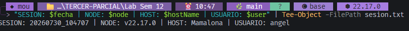
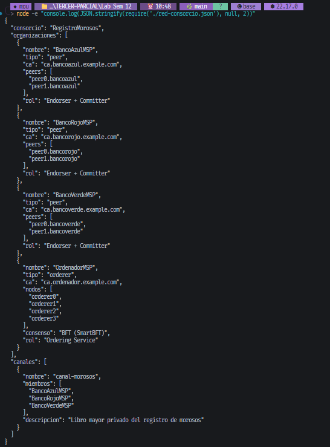
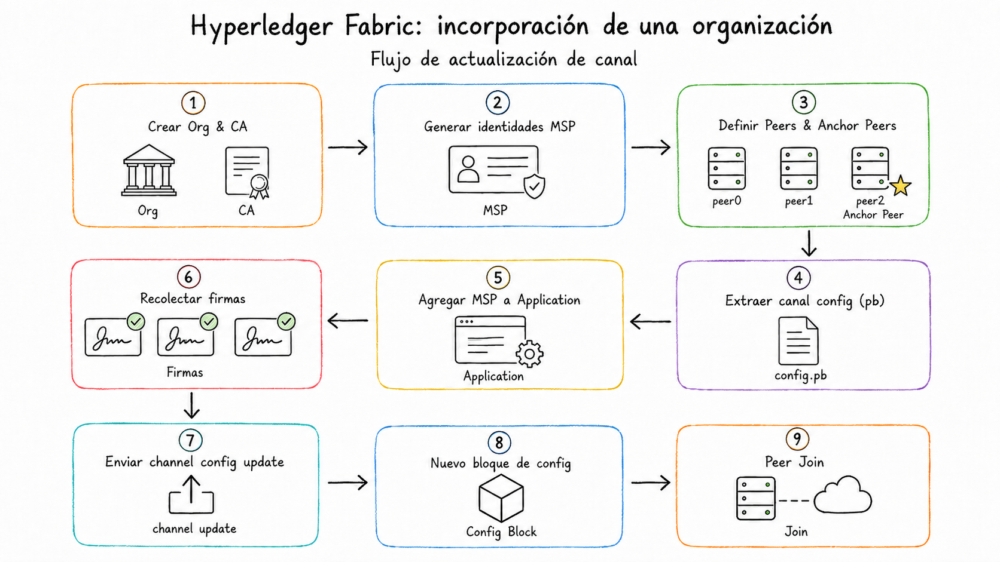
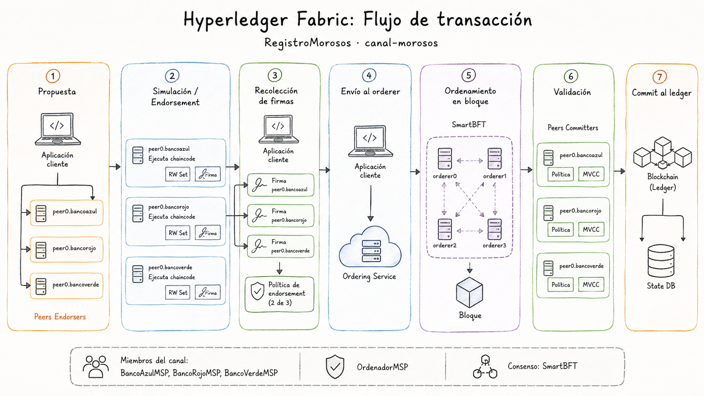
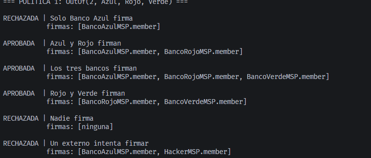
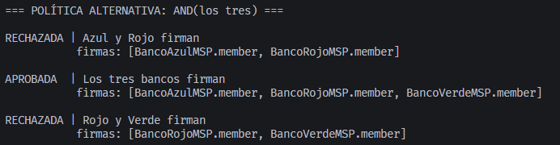
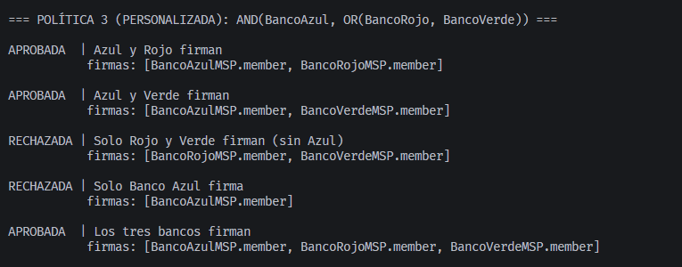
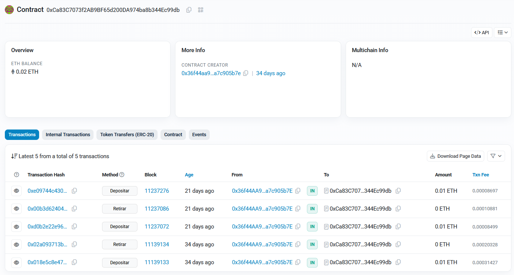

# Laboratorio: Blockchain Privadas — Consorcio vs. Red Pública

**Autor:** Ángel Santiago Cruz Rodríguez  
**Carrera:** Ciberseguridad y Desarrollo de Software  
**Curso:** Blockchain y Bases de Datos Distribuidas  
**Fecha:** 29 de julio de 2026  

---

## Tabla de Contenido

* [Ancla de Sesión](#ancla-de-sesión)
* [1. Desarrollo del Laboratorio](#1-desarrollo-del-laboratorio)
  * [Parte 1 — Los cuatro pilares de una red de consorcio](#parte-1--los-cuatro-pilares-de-una-red-de-consorcio)
  * [Parte 2 — Modela la red del consorcio](#parte-2--modela-la-red-del-consorcio)
  * [Parte 3 — Escritura y evaluación de políticas de endorsement](#parte-3--escritura-y-evaluación-de-políticas-de-endorsement)
  * [Parte 4 — Contraste directo con la red pública](#parte-4--contraste-directo-con-la-red-pública)
  * [Parte 5 — Matriz de decisión arquitectónica](#parte-5--matriz-de-decisión-arquitectónica)
  * [Parte 6 — Reflexión final](#parte-6--reflexión-final)
* [2. Declaración de uso de Inteligencia Artificial](#2-declaración-de-uso-de-inteligencia-artificial)
* [3. Referencias](#3-referencias)

## Tabla de Figuras

* [Fig. 1: Ejecución del ancla de sesión en la terminal](#fig-1)
* [Fig. 2: Representación del modelo de red de consorcio en JSON](#fig-2)
* [Fig. 3: Flujo de incorporación de un nuevo actor mediante Channel Config Update](#fig-3)
* [Fig. 4: Diagrama del flujo de transacción Execute-Order-Validate](#fig-4)
* [Fig. 5: Ejecución del evaluador para la política base OutOf(2, ...)](#fig-5)
* [Fig. 6: Ejecución del evaluador para la política estricta AND(los tres)](#fig-6)
* [Fig. 7: Ejecución del evaluador para la política personalizada con Banco Azul obligatorio](#fig-7)
* [Fig. 8: Inspección de transacciones públicas del contrato en Etherscan](#fig-8)

---

## Ancla de Sesión

```text
SESION: 20260730_104707 | NODE: v22.17.0 | HOST: Mamalona | USUARIO: angel
```

<a id="fig-1"></a>
  
<sub>Ejecución del ancla de sesión registrada en el entorno local.</sub>

---

## 1. Desarrollo del Laboratorio

### Parte 1 — Los cuatro pilares de una red de consorcio

#### 1.1 — Permissioned vs. Permissionless

* **Respuesta directa:** Hyperledger Fabric es una blockchain *permissioned*, lo que significa que la conectividad a la red no otorga derechos de lectura ni de transacción sin una identidad autorizada y reconocida por las políticas del consorcio (Hyperledger Foundation, 2023).
* **Explicación técnica del mecanismo:** A diferencia de las redes *permissionless* como Ethereum donde cualquier clave anónima puede unirse y consultar el estado global (Ethereum Foundation, 2024), en Fabric la autorización es el resultado acumulativo de certificados X.509, Membership Service Providers (MSP), políticas de canal y listas de control de acceso (ACL) (Hyperledger Foundation, 2023):

$$\text{Conexión a la infraestructura} \neq \text{Membresía del consorcio} \neq \text{Autorización de acción}$$

* **Aplicación a la evidencia del laboratorio:** Para el caso de los tres bancos en `red-consorcio.json`, un cuarto banco no puede simplemente desplegar un nodo peer y consultar el registro de morosos; debe ser formalmente admitido modificando la configuración del canal.
* **Implicación arquitectónica:** El modelo *permissioned* transforma la responsabilidad operacional de un esquema anónimo a una trazabilidad institucional estricta:

$$\text{Acción ejecutada} \longrightarrow \text{Identidad verificable} \longrightarrow \text{Organización responsable}$$

#### 1.2 — CA y MSP

* **Respuesta directa:** La Autoridad Certificadora (CA) emite identidades digitales mediante certificados X.509, mientras que el Membership Service Provider (MSP) define cuáles identidades son confiables y qué roles operacionales desempeñan en la red (Hyperledger Foundation, 2023).
* **Explicación técnica del mecanismo:** La CA genera pares de claves y certificados X.509 para usuarios, peers y orderers. El MSP actúa como la abstracción de confianza que vincula esas claves a una organización específica, validando su cadena de certificación y asignando roles (*admin*, *peer*, *client*) (Hyperledger Foundation, 2023):

$$\text{CA (Emite llaves)} \longrightarrow \text{MSP (Reconoce pertenencia y rol)} \longrightarrow \text{Política (Autoriza permisos)}$$

* **Aplicación a la evidencia del laboratorio:** Mientras que en Ethereum la identidad se limita a una dirección hexadecimal seudónima ($0xA73...$) sin contexto organizacional (Ethereum Foundation, 2024), en nuestro script `evaluar-politica.js` las firmas están vinculadas explícitamente a principales organizacionales como `BancoAzulMSP.member`.
* **Implicación arquitectónica:** Fortalece la *accountability* y auditoría empresarial: cualquier transacción o endorsement se atribuye criptográficamente de forma innegable a una institución jurídica conocida.

#### 1.3 — Channels (Canales)

* **Respuesta directa:** Un canal es una subred privada e independiente que posee su propio libro mayor (*ledger*), contratos (*chaincodes*) y miembros, aislando el tráfico y los datos de organizaciones externas (Hyperledger Foundation, 2023).
* **Explicación técnica del mecanismo:** En lugar de aplicar controles de visibilidad por código dentro de un ledger único compartido por toda la red, los canales delimitan la replicación física de los bloques: solo los peers autorizados en el canal reciben y persisten sus datos (Hyperledger Foundation, 2023).
* **Aplicación a la evidencia del laboratorio:** En el `canal-morosos`, Banco Azul, Banco Rojo y Banco Verde comparten el registro de clientes morosos, mientras que competidores externos quedan aislados de la recepción de bloques al no pertenecer al canal.
* **Implicación arquitectónica:** Garantiza privacidad de lectura por diseño de infraestructura:

$$\text{Un smart contract en Ethereum no puede volver privado un ledger público. Fabric aísla el espacio de replicación.}$$

#### 1.4 — Ordering Service: Raft frente a SmartBFT

* **Respuesta directa:** El servicio de ordenamiento establece la secuencia global determinista de las transacciones y las agrupa en bloques sin ejecutar código de negocio, donde SmartBFT tolera nodos maliciosos (BFT) a diferencia de Raft que solo tolera caídas (CFT) (Hyperledger Foundation, 2023, 2024).
* **Explicación técnica del mecanismo:** Raft asume comportamiento honesto (Crash Fault Tolerance). SmartBFT (Fabric 3.0) aplica tolerancia a fallos bizantinos ($N \ge 3F + 1$), permitiendo mantener el consenso aun cuando una fracción $F < N/3$ de los nodos ordenadores actúen de forma maliciosa o transmitan datos contradictorios (Castro & Liskov, 2002; Hyperledger Foundation, 2024).
* **Aplicación a la evidencia del laboratorio:** En `red-consorcio.json`, la topología de $N=4$ orderers operando bajo SmartBFT soporta exactamente $F=1$ nodo bizantino o comprometido ($4 \ge 3(1) + 1$).
* **Implicación arquitectónica:** Elimina la necesidad de asumir honestidad perfecta entre administradores de infraestructura en consorcios multi-institucionales.

#### Refutación de Afirmación 1

> *"Hyperledger Fabric es una blockchain igual que Ethereum, solo que privada; por lo demás funcionan igual: ambas minan bloques y pagan comisiones de gas a los validadores."*

* **Respuesta directa:** La afirmación es totalmente falsa y contiene cuatro errores conceptuales de arquitectura.
* **Explicación técnica del mecanismo:**
  1. *Permissioned vs Permissionless:* Fabric restringe el acceso mediante identidades X.509/MSP y canales privados, mientras Ethereum es un entorno abierto de replicación pública (Hyperledger Foundation, 2023; Ethereum Foundation, 2024).
  2. *Ausencia de Minería:* Ethereum utiliza consenso Proof of Stake (Ethereum Foundation, 2024). Fabric utiliza nodos ordenadores deterministas basados en algoritmos como Raft o SmartBFT sin minería ni competencia (Hyperledger Foundation, 2023).
  3. *Ausencia de Gas:* Fabric no requiere token nativo ni cobra gas. Controla el abuso mediante identidades revocables y gobernanza, no mediante tarifas monetarias (Hyperledger Foundation, 2023).
  4. *Paradigma de Procesamiento:* Ethereum aplica *Order-Execute* (todos ejecutan todo secuencialmente), mientras Fabric utiliza *Execute-Order-Validate* (simulación previa, ordenamiento y validación al commit) (Hyperledger Foundation, 2023).
* **Aplicación a la evidencia del laboratorio:** En `red-consorcio.json` y `evaluar-politica.js` comprobamos que la red opera sin tarifas de gas y validando políticas antes del commit.
* **Implicación arquitectónica:** Fabric no es Ethereum detrás de un firewall; es una arquitectura modular distinta enfocada en gobernanza empresarial.

---

### Parte 2 — Modela la red del consorcio

#### 2.1 — Modelo de Organizaciones (`red-consorcio.json`)

* **Respuesta directa:** El modelo diseñado en `red-consorcio.json` separa funcionalmente las organizaciones en peers de los bancos (que simulan y conservan el ledger) y un servicio de ordenamiento desacoplado (Hyperledger Foundation, 2023).
* **Explicación técnica del mecanismo:** Los peers se encargan de ejecutar la simulación del chaincode y validar bloques, mientras que el *Ordering Service* agrupa transacciones sin ejecutar lógica de negocio. Aplicando la fórmula bizantina (Castro & Liskov, 2002):

$$N \ge 3F + 1 \implies 4 = 3(1) + 1 \implies F = 1 \text{ nodo bizantino}$$

* **Aplicación a la evidencia del laboratorio:**
  * En <a id="fig-2"></a> se define la arquitectura de los tres bancos y el OrdenadorMSP BFT.
  * Para incluir un cuarto banco, en <a id="fig-3"></a> se muestra la secuencia administrativa requerida para actualizar el canal (`/Application/Admins`) mediante un nuevo bloque de configuración (Hyperledger Foundation, 2023).
* **Implicación arquitectónica:** Tolerar 1 nodo malicioso ($F=1$) no garantiza disponibilidad ilimitada: si 1 nodo cae por malicia y otro entra a mantenimiento, se pierde el quórum activo ($N-F=3$). Para mantenimiento y falla bizantina simultánea se requieren $N=7$ nodos.

#### 2.2 — Flujo Execute-Order-Validate

* **Respuesta directa:** Fabric procesa las transacciones dividiendo el flujo en tres macrofases aisladas: *Execute* (simulación en endorsers), *Order* (secuenciación en orderers) y *Validate* (verificación de políticas y MVCC en committers) (Hyperledger Foundation, 2023).
* **Explicación técnica del mecanismo:**
  1. *Execute:* El cliente envía la propuesta a los endorsers, quienes simulan la ejecución sobre su estado local y generan un *Read/Write Set* (RW-Set) firmado.
  2. *Order:* El orderer agrupa las transacciones en bloques ordenados mediante SmartBFT.
  3. *Validate:* Cada committer verifica que el RW-Set cumpla la política de endorsement y que las versiones leídas no hayan cambiado (MVCC).
* **Aplicación a la evidencia del laboratorio:** En <a id="fig-4"></a> se ilustran las 7 fases operativas. Las transacciones válidas aplican escrituras al *World State*; las inválidas se persisten marcadas como inválidas sin alterar el estado.
* **Implicación arquitectónica:** Permite procesamiento paralelo y mayor escalabilidad al evitar que todos los nodos ejecuten la totalidad de las transacciones (Order-Execute de Ethereum) (Ethereum Foundation, 2024).

---

### Parte 3 — Escritura y evaluación de políticas de endorsement

#### 3.1 y 3.2 — Evaluación de políticas base

* **Respuesta directa:** La política `OutOf(2, ...)` exige el endorsement de al menos dos organizaciones miembros válidas, rechazando intentos de firma por actores no registrados como `HackerMSP` (Hyperledger Foundation, 2023).
* **Explicación técnica del mecanismo:** El peer committer valida que cada firma provenga de un certificado X.509 reconocido por un MSP explícitamente incluido como principal en la política del canal (Hyperledger Foundation, 2023).
* **Aplicación a la evidencia del laboratorio:** 
  * En <a id="fig-5"></a>, el escenario `Azul + HackerMSP` es rechazado porque `HackerMSP` no posee un certificado X.509 válido en el canal, contabilizando solo 1 firma válida.
  * En <a id="fig-6"></a>, la política `AND(los tres)` exige unanimidad, provocando que la caída de un solo banco por mantenimiento paralice el sistema entero.
* **Implicación arquitectónica:** La selección de políticas debe sopesar tres factores de equilibrio:

$$\boxed{\text{Seguridad} + \text{Gobernanza} + \text{Disponibilidad}}$$

#### 3.3 — Política personalizada (Banco Azul obligatorio)

* **Respuesta directa:** La política `AND(BancoAzul, OR(BancoRojo, BancoVerde))` garantiza la presencia obligatoria de Banco Azul en toda transacción junto a al menos otro banco.
* **Explicación técnica del mecanismo:** Anida operadores lógicos para restringir las combinaciones válidas excluyendo aquellas sin el miembro principal:

$$\text{OutOf}(2, A, R, V) \implies AR \lor AV \lor RV \quad \text{vs} \quad \text{AND}(A, \text{OR}(R, V)) \implies AR \lor AV \quad (\text{Excluye } RV)$$

* **Aplicación a la evidencia del laboratorio:** En <a id="fig-7"></a>, el escenario `Rojo + Verde` es rechazado por falta de Banco Azul, mientras que `Azul + Rojo` y `Azul + Verde` son aprobadas.
* **Implicación arquitectónica:** Otorga poder de veto institucional a Banco Azul, pero crea una dependencia operativa crítica (punto único de falla de disponibilidad si Banco Azul cae).

---

### Parte 4 — Contraste directo con la red pública

#### 4.1 — Privacidad del libro mayor

* **Respuesta directa:** Las redes públicas como Ethereum Sepolia ofrecen transparencia absoluta en la lectura, volviendo imposible mantener confidencialidad de datos guardados directamente on-chain (Ethereum Foundation, 2026).
* **Explicación técnica del mecanismo:** La EVM requiere que todos los validadores repliquen el estado completo para verificar transiciones de estado. Los modificadores en Solidity (`modifier onlyAuthorized`) restringen escrituras, pero no impiden la lectura pública de los *storage slots* o del historial del ledger (Ethereum Foundation, 2026):

$$\text{Control de Modificación (Solidity)} \neq \text{Confidencialidad de Lectura (EVM Ledger)}$$

* **Aplicación a la evidencia del laboratorio:** En <a id="fig-8"></a>, se constata la visibilidad pública de las **5 transacciones** del contrato `BovedaSegura` (`0xCa83...99db`), incluyendo remitentes, métodos y montos.
* **Implicación arquitectónica:** Ethereum no puede satisfacer requerimientos de confidencialidad bancaria sin capas adicionales off-chain o Zero-Knowledge Proofs.

#### 4.2 y 4.3 — Matriz de modelos y mecanismo de Gas

* **Respuesta directa:** Ethereum requiere comisiones de gas para mitigar el spam en una red abierta anónima; Fabric prescinde del gas porque controla el abuso mediante identidades conocidas y gobernanza (Hyperledger Foundation, 2023; Ethereum Foundation, 2026).
* **Explicación técnica del mecanismo:** El gas en Ethereum mide el esfuerzo computacional, evita bucles infinitos (problema de parada) y raciona el espacio en bloque mediante incentivos económicos (Ethereum Foundation, 2026). Fabric utiliza certificados revocables por CA, MSP y ACL para desincentivar o aislar comportamientos maliciosos sin cobrar tarifas por transacción (Hyperledger Foundation, 2023):

$$\text{Ethereum} \longrightarrow \text{Control económico en red abierta} \quad | \quad \text{Fabric} \longrightarrow \text{Control de identidad en red cerrada}$$

* **Aplicación a la evidencia del laboratorio:** Las transacciones de `BovedaSegura` registraron cobro de `Txn Fee` en Sepolia, mientras que en Fabric los costos son absorbidos a nivel de infraestructura operativa por el consorcio.
* **Implicación arquitectónica:** Fabric es óptimo para consorcios cerrados con costos operacionales predecibles; Ethereum es indispensable para ecosistemas abiertos *permissionless*.

---

### Parte 5 — Matriz de decisión arquitectónica

| Requerimiento empresarial | ¿Pública o consorcio? | Justificación técnica |
|---|---|---|
| **Registro de morosos entre tres bancos** | **Consorcio** | Participantes identificados que requieren estricta privacidad de lectura y control compartido de escrituras mediante canales y políticas `OutOf(2, ...)` (Hyperledger Foundation, 2023). |
| **Token para recaudar fondos del público global** | **Pública** | Requiere acceso *permissionless*, interoperabilidad con wallets y liquidez en mercados abiertos (Ethereum Foundation, 2026). |
| **Trazabilidad de cadena de suministro entre socios** | **Consorcio** | Entidades conocidas que necesitan compartir eventos logísticos sin revelar costos o volúmenes comerciales a competidores (Hyperledger Foundation, 2023). |
| **Sistema de votación abierto y verificable** | **Pública** | Exige auditabilidad universal e inmutabilidad pública. La privacidad del voto se resuelve mediante esquemas criptográficos (Zero-Knowledge Proofs) on-chain (Ethereum Foundation, 2026). |
| **Compartir historiales médicos entre hospitales** | **Consorcio** | Custodia de datos de salud altamente sensibles con requerimientos de cumplimiento normativo (HIPAA/GDPR) e identidades institucionales estrictas (Hyperledger Foundation, 2023). |
| **Mercado de NFT abierto a cualquier artista** | **Pública** | El valor radica en el efecto de red, estándares interoperables (ERC-721) y libre participación sin intermediarios de admisión (Ethereum Foundation, 2026). |

#### Regla General de Decisión Arquitectónica
> **Regla:** Una red de consorcio es la arquitectura adecuada cuando un grupo de entidades identificadas requiere privacidad estricta y gobernanza compartida sobre sus datos; una red pública es superior cuando el valor del sistema depende del acceso abierto, la neutralidad del protocolo y la auditabilidad universal sin autorización previa.

---

### Parte 6 — Reflexión final

#### Pregunta 1: Privacidad Estructural vs. Control de Acceso en Ethereum
* **Respuesta directa:** Un smart contract en Ethereum puede implementar control de escritura, pero la privacidad de lectura es estructuralmente imposible en una red pública por diseño del consenso (Ethereum Foundation, 2026).
* **Explicación técnica del mecanismo:** Para que validadores descentralizados anónimos verifiquen transiciones de estado sin confiar en terceros, deben inspeccionar el *calldata* y el almacenamiento. Ocultar variables en Solidity no detiene la inspección directa de los *storage slots* desde nodos RPC (Ethereum Foundation, 2026).
* **Aplicación a la evidencia del laboratorio:** En Sepolia comprobamos que cualquiera consulta las 5 transacciones de `BovedaSegura` sin autenticación, mientras que en Fabric `canal-morosos` aísla los datos a nivel de transporte y replicación de bloques.
* **Implicación arquitectónica:** La privacidad de datos sensibles debe abordarse en la capa de red/infraestructura (canales/PDC) y no mediante simples cláusulas lógicas en smart contracts públicos.

#### Pregunta 2: Modelos de Confianza y Tolerancia a Fallos (1/3 BFT vs 51% PoS)
* **Respuesta directa:** Fabric usa un umbral de $1/3$ bizantino porque opera en un conjunto cerrado de identidades conocidas, mientras Ethereum requiere $>51\%$ de stake porque debe resistir ataques Sybil en un entorno anónimo (Castro & Liskov, 2002; Ethereum Foundation, 2026).
* **Explicación técnica del mecanismo:** En algoritmos BFT cerrados como SmartBFT, se requiere un quórum de $2F + 1$ de $N$ nodos identificados; $1/3$ es el límite teórico estricto para evitar bifurcaciones sin perder *liveness* (Castro & Liskov, 2002). En Ethereum, al no haber identidades, el peso votante se asigna por colateral económico (PoS), donde la red es segura mientras la mayoría del capital ($>51\%$) sea honesto (Ethereum Foundation, 2026).
* **Aplicación a la evidencia del laboratorio:** En `red-consorcio.json` 4 orderers toleran 1 nodo malicioso sin recurrir a minería ni stake, basándose en la confianza de los certificados del consorcio.
* **Implicación arquitectónica:** El modelo de consenso se elige según la naturaleza de los participantes: quórum determinista para identidades conocidas, consenso criptoeconómico para redes masivas anónimas.

#### Pregunta 3: Estrategia de Selección de Versiones (LTS vs. Bleeding-Edge en la Empresa)
* **Respuesta directa:** Las organizaciones eligen versiones LTS (como Fabric v2.5) sobre versiones *bleeding-edge* (v3.0 BFT) para minimizar el riesgo operativo y garantizar estabilidad a largo plazo.
* **Explicación técnica del mecanismo:** Las versiones LTS ofrecen parches probados, estabilidad en las API de clientes (Fabric Gateway) y compatibilidad garantizada con herramientas de monitoreo en producción. Las versiones recientes con nuevas funcionalidades conllevan riesgos de regresiones no documentadas y cambios breaking en dependencias transitivas (Hyperledger Foundation, 2023).
* **Aplicación a la evidencia del laboratorio:** En nuestro desarrollo observamos que la sintaxis de políticas y MSP de la release 2.5 mantiene compatibilidad garantizada y despliegue maduro sin fricciones de versión.
* **Implicación arquitectónica:** En infraestructura crítica y sector financiero, la predictibilidad operativa y el soporte a largo plazo priman sobre la adopción temprana de características no consolidadas.

---

## 2. Declaración de uso de Inteligencia Artificial

En el presente reporte se utilizó la herramienta de inteligencia artificial (IA) como compañero de desarrollo, sirviendo de apoyo únicamente en los siguientes aspectos:

* **Acompañamiento en la ejecución y organización del laboratorio:** La IA fungió como un compañero de trabajo estructurando y guiando la ejecución del laboratorio sección por sección y paso por paso. Asistió en la organización lógica del repositorio y propuso la lógica inicial para completar el código de los contratos y las suites de pruebas de acuerdo con los requerimientos solicitados. Cabe señalar que el autor del reporte fue el único responsable de ejecutar los comandos en consola, realizar los tests, tomar y guardar las capturas de pantalla de evidencias, responder las preguntas correspondientes en cada sección y tomar las decisiones críticas sobre la metodología técnica a implementar.
* **Resolución e integración ante errores de ejecución:** La IA apoyó en la depuración y resolución de problemas durante las compilaciones y pruebas en dos escenarios específicos:
  - *Errores directos:* Donde el origen del fallo ya era conocido por el autor y se utilizó la IA para proponer la corrección sintáctica o estructural directa del código.
  - *Errores de origen desconocido:* Donde el autor no comprendía el origen de la falla (como los problemas de resolución de rutas en analizadores estáticos o incompatibilidades de dependencias locales) y la IA ayudó a analizar el sistema y sugerir pruebas diagnósticas para identificar la causa raíz e implementar la solución.
* **Estructura y redacción académica:** La IA colaboró en la mejora de la redacción formal, la cohesión académica y la organización lógica del reporte de laboratorio y los archivos de documentación del repositorio, garantizando el cumplimiento de estándares académicos (como referencias APA 7 y expresiones en LaTeX), sin sustituir en ningún momento el criterio, análisis ni la validación final del autor.

---

## 3. Referencias

* Castro, M., & Liskov, B. (2002). Practical Byzantine fault tolerance and proactive recovery. *ACM Transactions on Computer Systems (TOCS)*, 20(4), 398-461.
* Ethereum Foundation. (2024). *Ethereum Whitepaper & Documentation*. https://ethereum.org/en/developers/docs/
* Ethereum Foundation. (2026). *Gas and fees*. Ethereum.org. https://ethereum.org/en/developers/docs/gas/
* Ethereum Foundation. (2026). *Introduction to smart contracts*. Ethereum.org. https://ethereum.org/en/developers/docs/smart-contracts/
* Hyperledger Foundation. (2023). *Hyperledger Fabric Documentation (Release 2.5)*. https://hyperledger-fabric.readthedocs.io/en/release-2.5/
* Hyperledger Foundation. (2024). *BFT Ordering Service — Hyperledger Fabric Documentation (Release 3.0)*. https://hyperledger-fabric.readthedocs.io/en/release-3.0/bft_intro.html
