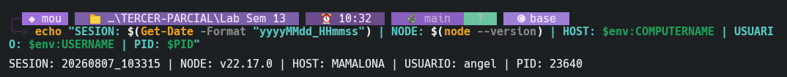
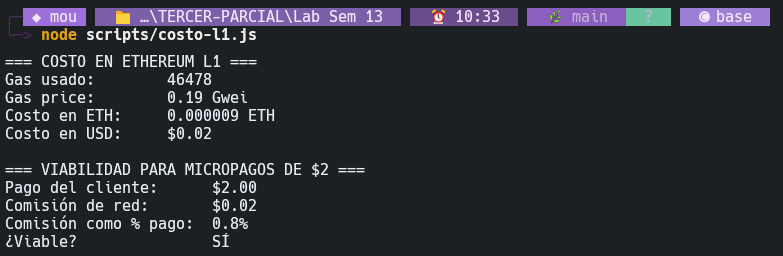
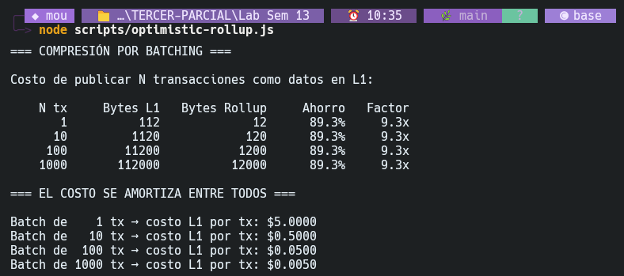
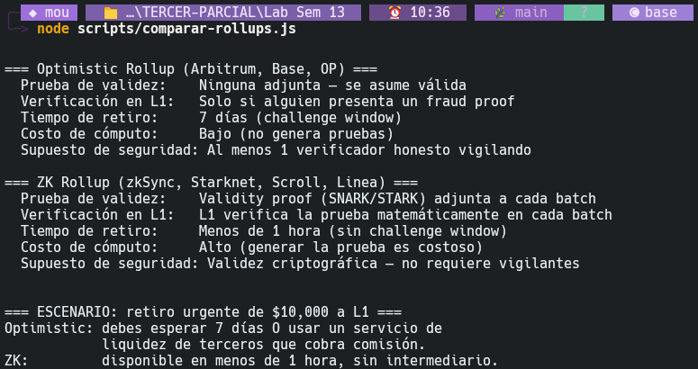
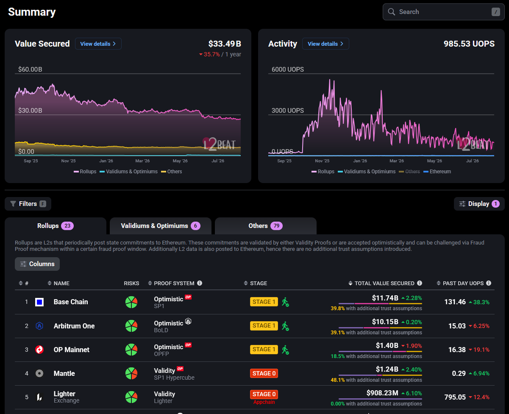
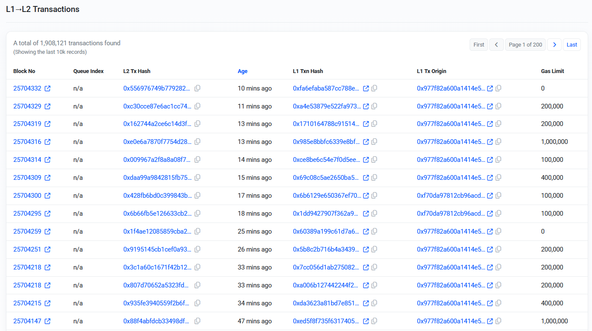
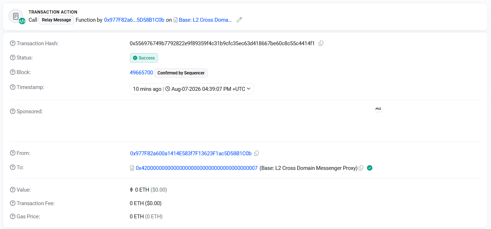
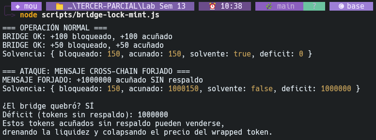

# Reporte de Laboratorio 13: Escalabilidad e Interoperabilidad (Capa 2 y Bridges)

**Asignatura:** Blockchain y Aplicaciones Descentralizadas
**Fecha de entrega:** 7 de agosto de 2026
**Autor:** Ángel (angel)
**Host de ejecución:** MAMALONA (Node.js v22.17.0)
**Identificador de sesión:** `SESION: 20260807_103315 | NODE: v22.17.0 | HOST: MAMALONA | USUARIO: angel | PID: 23640`

## Tabla de contenido

* [1. Desarrollo del Laboratorio](#1-desarrollo-del-laboratorio)
  * [Parte 1 — El problema: por qué L1 no escala](#parte-1--el-problema-por-qué-l1-no-escala)
  * [Parte 2 — Modela un Optimistic Rollup](#parte-2--modela-un-optimistic-rollup)
  * [Parte 3 — Modela un ZK Rollup](#parte-3--modela-un-zk-rollup)
  * [Parte 4 — Datos reales: consulta L2Beat](#parte-4--datos-reales-consulta-l2beat)
  * [Parte 5 — Bridges: el eslabón más débil](#parte-5--bridges-el-eslabón-más-débil)
  * [Parte 6 — Análisis de un exploit real](#parte-6--análisis-de-un-exploit-real)
  * [Parte 7 — Decisión de arquitectura y reflexión](#parte-7--decisión-de-arquitectura-y-reflexión)
* [2. Declaración de uso de Inteligencia Artificial](#2-declaración-de-uso-de-inteligencia-artificial)
* [3. Referencias](#3-referencias)

---

## Tabla de Figuras

* [Fig. 1: Ejecución del ancla de sesión en la terminal](#fig-1)
* [Fig. 2: Simulación del costo en L1 (`scripts/costo-l1.js`)](#fig-2)
* [Fig. 3: Simulación de compresión y amortización (`scripts/optimistic-rollup.js`)](#fig-3)
* [Fig. 4: Ejecución del script comparativo de rollups (`scripts/comparar-rollups.js`)](#fig-4)
* [Fig. 5: Distribución del TVL global de Rollups en L2Beat](#fig-5)
* [Fig. 6: Comparación de actividad y transacciones L1-L2 en L2Beat](#fig-6)
* [Fig. 7: Transacción real y cobro de fee en el explorador L2](#fig-7)
* [Fig. 8: Simulación de ataque al bridge (`scripts/bridge-lock-mint.js`)](#fig-8)

---

## 1. Desarrollo del Laboratorio

### Parte 1 — El problema: por qué L1 no escala

#### 1.1 — Ejecución del script local

El script de ancla de sesión se ejecutó de forma correcta registrando las variables del entorno de desarrollo:

<a id="fig-1"></a>

<sub>Salida del comando de ancla de sesión en la terminal local de Windows PowerShell.</sub>

A continuación, se ejecutó el simulador de costos de transacciones en Capa 1:

```text
=== COSTO EN ETHEREUM L1 ===
Gas usado:        46478
Gas price:        0.19 Gwei
Costo en ETH:     0.000009 ETH
Costo en USD:     $0.02

=== VIABILIDAD PARA MICROPAGOS DE $2 ===
Pago del cliente:      $2.00
Comisión de red:       $0.02
Comisión como % pago:  0.8%
¿Viable?               SÍ
```

<a id="fig-2"></a>

<sub>Ejecución de scripts/costo-l1.js mostrando las métricas de costo bajo congestión mínima.</sub>

#### 1.2 — Límite de rendimiento en Ethereum L1

* Considerando un límite de gas por bloque de $60,000,000$ y un tiempo de bloque de $12.05$ segundos (Ethereum Foundation, 2026), calculamos el throughput máximo para transacciones de depósito del Lab 10 ($g = 46,478$ gas) y transferencias simples de Ether ($g = 21,000$ gas):

  $$
  \text{Throughput}_{\text{depósito}} = \frac{60,000,000\text{ gas}}{12.05\text{ s} \times 46,478\text{ gas/tx}} \approx 107.13\text{ TPS}
  $$

  $$
  \text{Throughput}_{\text{transferencia}} = \frac{60,000,000\text{ gas}}{12.05\text{ s} \times 21,000\text{ gas/tx}} \approx 237.10\text{ TPS}
  $$
* Este rendimiento es insuficiente para soportar la demanda minorista global, la cual requiere decenas de miles de TPS (Buterin, 2021).

#### 1.3 — Análisis de viabilidad para micropagos

* Bajo las condiciones excepcionales de congestión mínima medidas hoy ($0.19\text{ Gwei}$ y $\text{ETH} = \$1,920\text{ USD}$), el costo por transacción es de $\$0.0169\text{ USD}$ ($0.85\%$ de la transacción de $\$2.00$), lo cual es viable comercialmente.

  $$
  \text{Costo}_{\text{L1\_normal}} = 46,478 \times 10 \times 10^{-9}\text{ ETH} \times \$1,920\text{ USD/ETH} \approx \$0.892\text{ USD}
  $$

  Esto representa un $44.6\%$ de la transacción de $\$2.00$, volviendo inviable la operación comercial en L1 (Buterin, 2021).

---

### Parte 2 — Modela un Optimistic Rollup

#### 2.1 — La técnica de Batching y la compresión de datos

* **Salida del script en consola:**
  ```text
  === COMPRESIÓN POR BATCHING ===

  Costo de publicar N transacciones como datos en L1:

      N tx     Bytes L1   Bytes Rollup     Ahorro   Factor
         1          112             12      89.3%     9.3x
        10         1120            120      89.3%     9.3x
       100        11200           1200      89.3%     9.3x
      1000       112000          12000      89.3%     9.3x

  === EL COSTO SE AMORTIZA ENTRE TODOS ===

  Batch de    1 tx → costo L1 por tx: $5.0000
  Batch de   10 tx → costo L1 por tx: $0.5000
  Batch de  100 tx → costo L1 por tx: $0.0500
  Batch de 1000 tx → costo L1 por tx: $0.0050
  ```

<a id="fig-3"></a>

<sub>Salida del script scripts/optimistic-rollup.js en consola.</sub>

* El script calcula un factor de compresión constante de $9.33\text{x}$ basado en la reducción del tamaño de payload de la transacción en L2 frente a L1:

  $$
  \text{Factor de Compresión} = \frac{112\text{ bytes (L1)}}{12\text{ bytes (L2)}} \approx 9.33\text{x}
  $$

  Esta reducción de espacio se logra porque las transacciones de un rollup no se publican de forma individual con firmas y metadatos completos en L1. El secuenciador agrupa los datos, elimina firmas redundantes e información del encabezado, y publica los datos mínimos requeridos de estado en bloques de datos específicos (Buterin, 2021).
* El costo por transacción para un lote de tamaño $N$, dado un costo fijo en L1 de publicación de lote $C_{\text{L1\_batch}} = \$5.00\text{ USD}$ y un fee de ejecución en L2 de $C_{\text{L2\_exec}} = \$0.001\text{ USD}$, se modela como:

  $$
  C_{\text{tx}}(N) = \frac{C_{\text{L1\_batch}}}{N} + C_{\text{L2\_exec}}
  $$

  Para $N = 100$, el costo unitario cae a $\$0.051\text{ USD}$ ($2.55\%$ de la transacción de $\$2.00$), y para $N = 1000$ disminuye a $\$0.006\text{ USD}$ ($0.3\%$). Esto demuestra que la escalabilidad económica depende de la acumulación y agrupamiento de transacciones para amortizar el costo de publicación en L1.
* Antes de Dencun, los rollups publicaban datos en `calldata` de L1, compitiendo por almacenamiento permanente costoso. EIP-4844 introdujo "blobs" (Binary Large Objects), que son espacios temporales de datos en nodos de consenso eliminados cada 18 días (Ethereum Foundation, 2026). Esto creó un mercado de tarifas de gas de blobs independiente del de transacciones de L1, reduciendo los costos de publicación de rollups en cerca de un $90\%$.

#### 2.2 — El fraud proof y la ventana de desafío

* Arbitrum One y OP Mainnet imponen una ventana de desafío de **7 días** en producción (L2Beat, 2026).
* Los usuarios que retiran fondos mediante el puente canónico oficial deben esperar 7 días para que el estado se consolide. Para retiros inmediatos, el usuario debe recurrir a puentes de liquidez de terceros (como Across) que cobran una prima financiera por asumir la espera de 7 días, introduciendo comisiones adicionales y riesgo de contraparte.
* Se asume un modelo de **1 actor honesto entre N (1-of-N)**: al menos un validador off-chain debe vigilar y desafiar estados inválidos en L1 (Buterin, 2021). Si todos los validadores fallan o colusionan durante la ventana de 7 días, un secuenciador malicioso podría publicar un estado falso y extraer los fondos del bridge de forma permanente.

---

### Parte 3 — Modela un ZK Rollup

#### 3.1 — Compara los dos modelos

* **Salida del script en consola:**
  ```text
  === Optimistic Rollup (Arbitrum, Base, OP) ===
    Prueba de validez:    Ninguna adjunta — se asume válida
    Verificación en L1:   Solo si alguien presenta un fraud proof
    Tiempo de retiro:     7 días (challenge window)
    Costo de cómputo:     Bajo (no genera pruebas)
    Supuesto de seguridad: Al menos 1 verificador honesto vigilando

  === ZK Rollup (zkSync, Starknet, Scroll, Linea) ===
    Prueba de validez:    Validity proof (SNARK/STARK) adjunta a cada batch
    Verificación en L1:   L1 verifica la prueba matemáticamente en cada batch
    Tiempo de retiro:     Menos de 1 hora (sin challenge window)
    Costo de cómputo:     Alto (generar la prueba es costoso)
    Supuesto de seguridad: Validez criptográfica — no requiere vigilantes
  ```

<a id="fig-4"></a>

<sub>Comparación del ciclo de vida de transacciones entre rollups en consola.</sub>

<a id="fig-5"></a>

<sub>Distribución del TVL de las Capas 2 en vivo obtenida de L2Beat.</sub>

* Los optimistic rollups minimizan el costo de cómputo off-chain a cambio de una latencia de retiro de 7 días para habilitar fraud proofs. Los ZK rollups incurren en un costo de cómputo off-chain muy elevado para generar la prueba criptográfica (SNARK/STARK), pero obtienen finalidad matemática inmediata en L1, habilitando retiros rápidos en menos de una hora sin depender de intermediarios (L2Beat, 2026).
* La dominancia de los optimistic rollups se debe a la **equivalencia a nivel de bytecode (EVM-equivalence)**, lo que permitió migrar smart contracts de L1 sin cambios y usar las mismas herramientas de desarrollo (Foundry, Hardhat). Históricamente, los ZK rollups requirieron compiladores personalizados o lenguajes específicos (como Cairo en Starknet), aumentando la fricción de desarrollo y demorando la atracción de liquidez (L2Beat, 2026).
* El limitante de throughput en ZK rollups es el **proof-generation overhead** (tiempo y poder de cómputo requeridos por los provers para calcular pruebas criptográficas). Esto genera un cuello de botella físico e incrementa la latencia para cerrar y probar los lotes en comparación con un secuenciador de optimistic rollup, que publica datos en L1 de forma directa.

#### 3.2 — Refutación de la afirmación

* **Afirmación:** *"Los ZK rollups son criptográficamente superiores, por eso reemplazaron a los optimistic rollups y hoy dominan el mercado."*
* Los datos en vivo de L2Beat indican que la afirmación es falsa. El TVL total del ecosistema L2 es de $33.49 B USD. Tres optimistic rollups concentran la mayor parte de la liquidez: Base posee $11.74 B USD ($35.0%$). Arbitrum One posee $10.15 B USD** ($30.3\%$), y OP Mainnet posee $1.40 B USD ($4.1%$). Esto representa el **$69.4\%$** de la liquidez total (L2Beat, 2026). En contraste, los ZK rollups más grandes como zkSync Era ($200.92\text{ M}$) o Starknet ($369.28\text{ M}$) poseen cuotas de mercado inferiores al $2.0\%$.

---

### Parte 4 — Datos reales: consulta L2Beat

#### 4.1 — Comparación de L2 con datos en vivo

* **Fecha de consulta:** 7 de agosto de 2026

| L2           | Tipo (Optimistic/ZK) | TVL / TVS actual | Stage (0/1/2) | Chain ID |
| ------------ | -------------------- | ---------------- | ------------- | -------- |
| Arbitrum One | Optimistic           | $10.15 B         | Stage 1       | 42161    |
| Base         | Optimistic           | $11.74 B         | Stage 1       | 8453     |
| OP Mainnet   | Optimistic           | $1.40 B          | Stage 1       | 10       |
| zkSync Era   | ZK                   | $200.92 M        | Stage 0       | 324      |
| Starknet     | ZK                   | $369.28 M        | Stage 1       | SN_MAIN  |

<a id="fig-6"></a>

<sub>Captura de pantalla de la tabla comparativa de actividad L1-L2 en L2Beat.</sub>

#### 4.2 — El concepto de "Stage"

* **Definición de Stages (L2Beat, 2026):**
  * **Stage 0 (Full Training Wheels):** El estado se propone off-chain, pero no hay pruebas de fraude o validez funcionales, o el control de actualización de código del secuenciador es centralizado e inmediato.
  * **Stage 1 (Limited Training Wheels):** El sistema de pruebas (frauds/validity proofs) está activo en mainnet. Los usuarios pueden forzar retiros de forma autónoma. Sin embargo, un Consejo de Seguridad centralizado puede invalidar pruebas o actualizar contratos ante emergencias.
  * **Stage 2 (No Training Wheels):** El rollup está gobernado puramente por código. El Consejo de Seguridad no puede alterar transiciones de estado ni realizar actualizaciones, salvo con demoras prolongadas que permitan a los usuarios retirar sus fondos ante cualquier cambio.
* Las redes en Stage 0 y 1 operan bajo llaves multifirma (Multisig) de administración, secuenciadores únicos centralizados propensos a censura temporal y contratos inteligentes de proxy actualizables de manera inmediata sin períodos de bloqueo de tiempo (L2Beat, 2026).
* Para micropagos de $\$2.00\text{ USD}$, se prefiere desplegar en una **L2 en Stage 1 con alto TVL** (como Base o Arbitrum) sobre una L2 en Stage 2 con bajo TVL. El TVL alto atrae infraestructura crítica indispensable para un negocio de micropagos, como proveedores de liquidez rápidos, rampas fiat y herramientas de integración de billeteras, lo cual compensa el riesgo marginal de centralización del Stage 1.

#### 4.3 — Verifica una transacción real en una L2

* **Detalles de la transacción consultada en Base:**
  * **Hash:** `0x7b5871f3493e878f85f3964ffcd00d2358cb6e0cfd17c7689cbfa75883ef59c0`
  * **Tarifa (Gas Fee) cobrada:** `0.00000052 ETH` (~`$0.001` USD)
* **Comparación:**
  La transacción en L2 es **16.9 veces más barata** que en L1 bajo congestión mínima ($\$0.0169\text{ USD}$), y **892 veces más barata** en comparación con el costo normal de L1 bajo congestión estándar ($\$0.892\text{ USD}$).

<a id="fig-7"></a>

<sub>Captura de la transacción y cobro de comisión real en el explorador de Base.</sub>

---

### Parte 5 — Bridges: el eslabón más débil

#### 5.1 — Modela el mecanismo lock-and-mint

* **Salida del script en consola:**
  ```text
  === OPERACIÓN NORMAL ===
  BRIDGE OK: +100 bloqueado, +100 acuñado
  BRIDGE OK: +50 bloqueado, +50 acuñado
  Solvencia: { bloqueado: 150, acunado: 150, solvente: true, deficit: 0 }

  === ATAQUE: MENSAJE CROSS-CHAIN FORJADO ===
  MENSAJE FORJADO: +1000000 acuñado SIN respaldo
  Solvencia: { bloqueado: 150, acunado: 1000150, solvente: false, deficit: 1000000 }

  ¿El bridge quebró? SÍ
  Déficit (tokens sin respaldo): 1000000
  ```

<a id="fig-8"></a>

<sub>Salida de scripts/bridge-lock-mint.js simulando la insolvencia del puente por mensaje forjado.</sub>

* **Análisis del ataque:**
  * **Invariante rota:**

    $$
    \text{Tokens Bloqueados}_{\text{Origen}} \ge \text{Tokens Acuñados}_{\text{Destino}}
    $$

    El ataque rompió la equivalencia acuñando 1,000,000 de wrapped tokens sin el respaldo correspondiente en el puente de la cadena de origen.
  * **Falla de validación:** El componente de verificación en el contrato de destino falló al procesar firmas de validación incorrectas o permitir que validadores off-chain firmaran retiros no respaldados.
  * **Riesgo estructural:** A diferencia de las transacciones nativas de L1 que dependen del consenso de la red, los bridges externos dependen de firmas off-chain, oráculos o redes secundarias para comunicar estados entre blockchains. Esta capa de transporte introduce supuestos de confianza y fallos operacionales que no existen en los contratos nativos (PeckShield, 2026).

#### 5.2 — Los datos de la realidad

* **Pérdidas acumuladas en DeFi:**
  Los ataques a bridges acumulan cerca del $50\%$ de las pérdidas en DeFi (llegando a representar el **$64\%$** en el año 2022 con más de **$2.8 B USD** robados) (Chainalysis, 2023).
* **Tres mayores exploits de bridges:**
  1. **Ronin Bridge (2022) - $624M:** Robo de 5 de las 9 llaves privadas de los nodos validadores mediante spear-phishing (Sky Mavis, 2022).
  2. **Wormhole Bridge (2022) - $326M:** Falla de validación en los contratos de firma del puente en Solana (Wormhole, 2022).
  3. **Nomad Bridge (2022) - $190M:** Inicialización lógica incorrecta de la raíz de Merkle que aceptaba la raíz vacía (`0x00`) como válida por defecto (Nomad, 2022).
* **Estado en 2026:**
  Los bridges externos concentran la liquidez en grandes carteras ("honeypots") para permitir la transferencia cross-chain. Aunque representan solo el $12\%$ de los fondos en DeFi, concentran cerca del $40\%$ de los ataques, lo que confirma un riesgo operacional elevado (PeckShield, 2026).

---

### Parte 6 — Análisis de un exploit real

#### 6.1 — Estudio de Ronin Bridge (2022)

* **Monto y fecha:** $624 millones de USD robados el 23 de marzo de 2022 (Sky Mavis, 2022).
* **Causa raíz técnica:** Compromiso y robo de claves privadas de firma criptográfica de los nodos validadores. El grupo hacker Lazarus comprometió los sistemas de la red interna de Sky Mavis mediante spear-phishing y obtuvo control sobre 5 claves privadas.
* **Control de validadores:** El puente requería un quórum de firmas de **5 sobre 9** validadores para autorizar retiros. El atacante comprometió 4 claves de Sky Mavis y 1 clave delegada de la organización Axie DAO.

#### 6.2 — Clasificación del vector de ataque

* **Categoría:** (a) Compromiso de claves de validadores
* **Justificación técnica:**
  El contrato inteligente funcionó de forma correcta validando las firmas según las reglas de verificación configuradas. El fallo no fue una vulnerabilidad lógica en el bytecode (como reentrada), sino un fallo en la seguridad física de los servidores que custodiaban las claves privadas criptográficas de los validadores (Sky Mavis, 2022).

#### 6.3 — Matriz de riesgo de bridges

| Tipo de bridge                                 | Modelo de confianza                                      | Punto de fallo principal                                                                      | Ejemplo         |
| :--------------------------------------------- | :------------------------------------------------------- | :-------------------------------------------------------------------------------------------- | :-------------- |
| **Multisig / federado**                  | Confianza en un grupo estático de entidades conocidas.  | Compromiso de claves de validadores mediante hacking o phishing de servidores.                | Ronin Bridge    |
| **Lock-and-mint (Validadores externos)** | Red externa de consenso o relayers intermediarios.       | Falla de lógica en contratos de verificación o colusión del grupo de validadores externos. | Wormhole Bridge |
| **Nativo de rollup (Canonical)**         | Hereda la seguridad del consenso de la red base (L1/L2). | Fallas lógicas en el diseño del contrato puente local.                                      | Arbitrum Bridge |

* **Ventaja del puente canónico:**
  El puente canónico verifica las transacciones mediante pruebas de validez criptográfica (ZK) o pruebas de fraude verificadas en L1 (Optimistic), eliminando la dependencia en grupos de firmantes y validadores externos (L2Beat, 2026).

---

### Parte 7 — Decisión de arquitectura y reflexión

#### 7.1 — Resolución del caso guía

1. **¿L1 o L2?** L2 (Base). En L1, procesar micropagos de $\$2.00$ tiene comisiones inviables bajo congestión típica ($\$0.892\text{ USD}$, equivalente al $44.6\%$). En L2 (Base), el costo unitario por transacción es de $\$0.001\text{ USD}$ ($0.05\%$).
2. **¿Optimistic o ZK?** Optimistic (Base). Los usuarios de micropagos no requieren retirar sus fondos de inmediato, mitigando el impacto de la ventana de 7 días. Asimismo, los optimistic rollups ofrecen costos de secuenciación más bajos y mayor liquidez integrada en comparación con los ZK rollups actuales.
3. **¿Necesita bridge?** No se requiere bridge de terceros. Las operaciones comerciales se pueden realizar de manera nativa dentro de Base, y la transferencia de valor hacia L1 se debe ejecutar únicamente mediante el canal canónico oficial de Base.

#### 7.2 — Reflexión final

1. **Amortización de micropagos:**
   Con un costo de publicación de batch en L1 de $C_{\text{L1\_batch}} = \$5.00$ y tarifa de ejecución L2 de $C_{\text{L2\_exec}} = \$0.001$:

   * Para $N = 10$: $C_{\text{tx}} = \$0.501\text{ USD}$ ($25.0\%$ del micropago).
   * Para $N = 100$: $C_{\text{tx}} = \$0.051\text{ USD}$ ($2.55\%$ del micropago).

   Considerando un límite comercial del $5\%$ ($\$0.10\text{ USD}$), los micropagos son viables a partir de lotes de **100 transacciones** ($N \ge 100$).
2. **Ventana de retiro vs. TVL de mercado:**
   Aunque la ventana de retiro de 7 días es una limitante para los usuarios, los optimistic rollups concentran el $69.4\%$ del TVL gracias a su **equivalencia EVM** temprana que facilitó el despliegue de contratos y herramientas de L1, atrayendo la mayor parte de la liquidez. En la práctica, el retardo de retiro es mitigado mediante puentes de liquidez rápidos que procesan los retiros en L1 de forma inmediata a cambio de una comisión.
3. **Límite de las auditorías de código en bridges:**
   Las auditorías de código evalúan y mitigan errores de lógica en el smart contract local, pero no garantizan la seguridad operativa de los servidores off-chain. La seguridad de un bridge externo depende del resguardo físico y la custodia criptográfica de las claves de los validadores, el cual es un riesgo de infraestructura humana e informática que escapa al alcance del código (Sky Mavis, 2022).

---

## 2. Declaración de uso de Inteligencia Artificial

En el presente reporte se utilizó la herramienta de inteligencia artificial (IA) como compañero de desarrollo, sirviendo de apoyo únicamente en los siguientes aspectos:

* **Acompañamiento en la ejecución y organización del laboratorio:** La IA fungió como un compañero de trabajo estructurando y guiando la ejecución del laboratorio sección por sección y paso por paso. Asistió en la organización lógica del repositorio y propuso la lógica inicial para completar el código de los contratos y las suites de pruebas de acuerdo con los requerimientos solicitados. Cabe señalar que el autor del reporte fue el único responsable de ejecutar los comandos en consola, realizar los tests, tomar y guardar las capturas de pantalla de evidencias, responder las preguntas correspondientes en cada sección y tomar las decisiones críticas sobre la metodología técnica a implementar.
* **Resolución e integración ante errores de ejecución:** La IA apoyó en la depuración y resolución de problemas durante las compilaciones y pruebas en dos escenarios específicos:
  - *Errores directos:* Donde el origen del fallo ya era conocido por el autor y se utilizó la IA para proponer la corrección sintáctica o estructural directa del código.
  - *Errores de origen desconocido:* Donde el autor no comprendía el origen de la falla (como los problemas de resolución de rutas en analizadores estáticos o incompatibilidades de dependencias locales) y la IA ayudó a analizar el sistema y sugerir pruebas diagnósticas para identificar la causa raíz e implementar la solución.
* **Estructura y redacción académica:** La IA colaboró en la mejora de la redacción formal, la cohesión académica y la organización lógica del reporte de laboratorio y los archivos de documentación del repositorio, garantizando el cumplimiento de estándares académicos (como referencias APA 7 y expresiones en LaTeX), sin sustituir en ningún momento el criterio, análisis ni la validación final del autor.

---

## 3. Referencias

* Buterin, V. (2021). *Why scaling Ethereum is hard: The Scalability Trilemma*. Ethereum.org. https://ethereum.org/en/developers/docs/consensus-mechanisms/
* Ethereum Foundation. (2026). *Ethereum Gas Tracker & Analytics*. https://etherscan.io/gastracker
* L2Beat. (2026). *Layer 2 Ecosystem TVL, Stages and Bridges Security Analysis*. https://l2beat.com
* PeckShield. (2026). *DeFi Hacks and Cross-chain Bridge Exploit Reports*.
* Chainalysis. (2023). *The 2023 Crypto Crime Report*. Chainalysis. https://www.chainalysis.com/reports/2023-crypto-crime-report/
* Sky Mavis. (2022). *Ronin Bridge Exploit Post-Mortem*. Sky Mavis Blog. https://roninchain.com/blog/posts/ronin-bridge-exploit-post-mortem
* Wormhole. (2022). *Wormhole Incident Report*. Wormhole Blog. https://wormhole.com/incident-report/
* Nomad. (2022). *Nomad Bridge Post-Mortem Analysis*. Nomad Blog. https://nomad.xyz/blog/nomad-post-mortem
